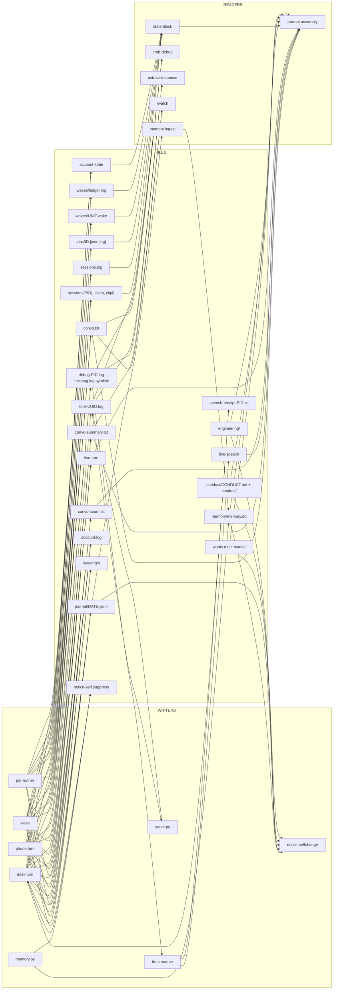

# DeskCrab specifications

## How specs work here

A spec **dictates** behaviour. The code and the tests conform to it, never the other way round.

- A spec is the answer to "what is this supposed to do". If the code does something the spec does
  not describe, the code is wrong until the spec says otherwise.
- **A change to behaviour starts with a change to the spec.** Edit the spec first, in the same
  branch, then change the code, then change the tests. A pull request that changes behaviour and
  leaves the spec untouched is incomplete.
- **Contract statements are testable.** Every numbered line in a CONTRACT section is written so that
  a test can be pointed at it. If a statement cannot be tested, it belongs in PURPOSE, not in
  CONTRACT.
- **MUST / NEVER are binding. SHOULD is a default that a caller may override for a stated reason.**
- **VERIFIED-CORRECT RULES are load-bearing.** Each one is a mechanism that was audited, found
  correct, and looks strange enough that a rewrite would delete it. Reimplement the rule; do not
  simplify it away. If one of them has to go, the spec change explaining why is the first commit.
- **KNOWN DEFECTS cite the defect dossier.** They record what the current implementation gets wrong,
  so the work is bounded and nothing is quietly dropped. A defect leaves this section when a test
  proves it is gone.

### Where the reasoning lives

A spec says what must be true. It does not say what went wrong on the day the rule was written.
That is [`../docs/history.md`](../docs/history.md) — the dated incidents, the measurements, and the
designs that were tried and rejected. Read it before deleting a mechanism that looks strange, and
treat it as memory rather than contract: where it and a spec disagree, the spec is right.

### Defect identifiers

The specs cite the defect dossier with these identifiers:

| Prefix | Means |
|---|---|
| `H1a`, `H1b`, `H1c`, `H2`, `H3` | the headline bugs; `H3` has sub-causes `RC-1` to `RC-6` |
| `C4` to `C13` | the remaining criticals |
| `MAJ-1` to `MAJ-35` | Part C, majors, numbered top to bottom |
| `MIN-1` to `MIN-34` | Part D, minors, numbered top to bottom |

### The specs

| Spec | What it covers |
|---|---|
| [turn-pipeline.md](turn-pipeline.md) | One interactive turn end to end: capture, conversation store, generation, delivery, session records |
| [prompt-assembly.md](prompt-assembly.md) | The target prompt design: per-path profiles, layer order, byte budgets, the index block, and the intent-case acceptance criteria |
| [self-awareness.md](self-awareness.md) | The state block: what she is running, what is scheduled, which account answers, and the rules that make a false negative unwriteable |
| [wake-queue.md](wake-queue.md) | Autonomous wakes: booking, records, restore, tidy, provenance, and the hands that book in her name |
| [jobs.md](jobs.md) | Detached builder jobs: dispatch, state sidecars, blocked-versus-failed, the completion wake |
| [speech-output.md](speech-output.md) | Response extraction, the display split, the TTS streamer, the speech mutex, and the never-silent guarantee |
| [debug-view.md](debug-view.md) | The live stream viewer: which logs it follows, what it renders, and what it must never duplicate or drop |
| [phone.md](phone.md) | The HTTP front end and the PWA: turns, the watch cursor, streaming voice, static assets, auth, Web Push |
| [chessweb.md](chessweb.md) | The browser chess board: a SpeedyChess-protocol server over the betty-chess store — validation, the resident mover answering each user move in seconds, resume by replay |
| [chess-reflex.md](chess-reflex.md) | Position memory for betty-chess: every finished game's moves keyed by FEN, result-weighted ranking, the gate that answers known positions without a reasoning turn, and the similarity layer that briefs an unknown one from its nearest stored neighbours |
| [memory-recall.md](memory-recall.md) | The vector store: query composition, retrieval, the recall block, reinforcement, decay |
| [account-fallback.md](account-fallback.md) | The flat numbered account list: selection and cooldowns, refusal detection, the watched runner, swap announcements |
| [metrics.md](metrics.md) | The token ledger: one record per CLI attempt parsed from artifacts the system already produces, backfill, `crab metrics`, and the phone server's metrics page |
| [nightly.md](nightly.md) | Sleep (memory ingest), tidy (shelf maintenance), the self-change watcher and its canary |
| [test-harness.md](test-harness.md) | The sandbox every test runs in, the four isolation gates, and the coverage the suite owes |

### System data flow

Who writes each file, and who reads it. Every arrow is a coupling a change has to respect.

### Locks

| Lock | Held by | Guards |
|---|---|---|
| `${STATE_PREFIX}-convo.lock` | every conversation writer | append, rotate, compact |
| `${STATE_PREFIX}-sessions.lock` | `session_finish`, `session_reap` | the session journal |
| `${STATE_PREFIX}-wake.lock` | `crab wake`, for the life of the process | one wake at a time |
| `${STATE_PREFIX}-wake-book.lock` | every booker | the booking queue |
| `${STATE_PREFIX}-remote.lock` | phone turns | one phone turn at a time |
| `${STATE_PREFIX}-speech.lock` | `speak_once`, the streamer's voice thread | the speakers |
| `notice-self.suppress.lock` | `touch_suppress` | write declarations |

Advisory records that never block: `crab claim`, `crab checkpoint`, `crab touching`, `live-turn`,
`live-speech`, `last-origin`.
