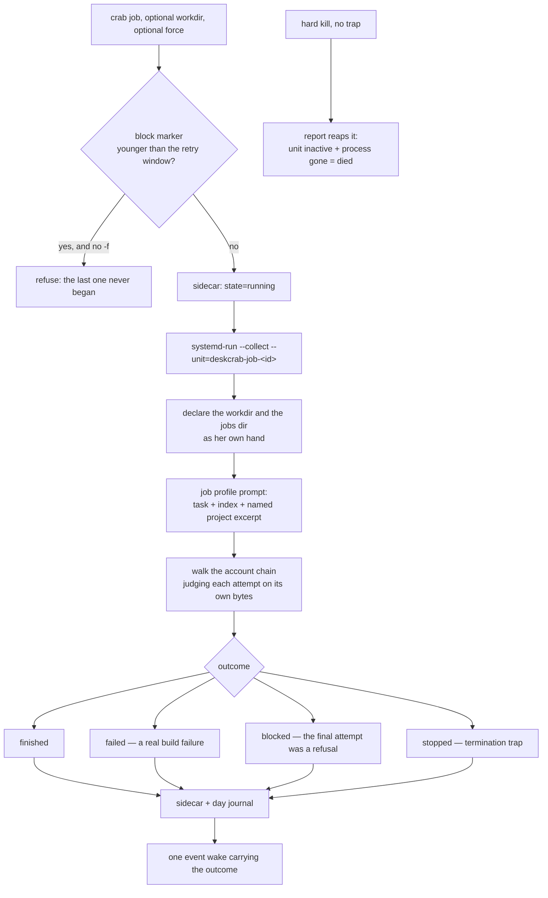

# Spec: detached jobs

## PURPOSE

A job is work that must outlive the turn that asked for it. It runs as its own headless session owned
by systemd, not by the conversation, so the user can keep talking while it builds. This spec owns
dispatch, the state sidecar, the blocked-versus-failed distinction, and the single channel a job has
back to her.

## CONTRACT

### Dispatch

1. Background work MUST be a detached job, never a subagent. A subagent dies with its turn, and
   while it lives it holds the turn open so the user cannot speak.
2. A job MUST be dispatched to the user manager with the collect option and its own unit name, with
   a fallback to a detached session when no user manager is running.
2a. A job unit MUST be dispatched at background CPU priority — the same weight and niceness the
   wake queue books with ([wake-queue.md](wake-queue.md) rule 12a, `BACKGROUND_CPU_WEIGHT`,
   `BACKGROUND_NICE`). A builder chewing a compile beside a spoken turn is the measured case: the
   phone server alone burned 49 CPU-minutes in a 46-minute window on 2026-08-09 while turns ran
   beside wakes and builders. Priority only — a job is never paused or killed for a turn.
3. Dispatch MUST return immediately. The turn that asked MUST NOT wait on it.
4. A job MUST receive every instance redirect explicitly: config path, state prefix, jobs directory,
   wakes directory, memory directory, account default file, and the current login. A user unit gets
   a bare environment, and a scratch instance's jobs must stay in the scratch instance.
5. A job MUST be dispatched with the login the chain currently prefers, and MUST walk the chain
   itself from there.
6. A job MUST be silent by contract: no speech, no notifications, no windows.
7. A job's only channel back to her is one event wake on completion, carrying the outcome as its
   reason.

### State

8. There MUST be exactly one field name for a job's state, one writer of it, and one lock. The
   schema field is `state`, and every writer uses it. A second field name means the sidecar keeps
   saying "running" and the next report reaps the job as died.
9. The state values are: `running`, `finished`, `failed`, `stopped`, `blocked`, `died`. Every value
   MUST be documented where the schema is documented.
10. Writes to the sidecar MUST be atomic, so a concurrent reader or reaper never sees a half-written
    file.
11. Any read-modify-write of the sidecar MUST hold the job's lock. The stop path currently races the
    worker's own termination trap.
12. `report` MUST reap a hard-killed worker: a sidecar still claiming to run, whose unit is inactive
    and whose recorded process is gone, is rewritten as died.

### Blocked versus failed

13. A run that exited non-zero having produced only the CLI's own refusal is `blocked`, not
    `failed`. No work was attempted and the log holds nothing to verify.
14. `blocked` MUST be judged on the **final attempt's own bytes**, so an earlier refusal kept as
    history cannot masquerade as the last attempt's outcome. `blocked` means the whole chain was
    tried.
15. A real build failure MUST NEVER match the blocked signature. Misreading one as "never ran" hides
    a broken builder.
    - The judgement MUST read the stream's **events**, never its raw bytes, and MUST consider only
      text the CLI itself produced: a result event, a synthetic (api-error) assistant message, or a
      line that is not JSON at all. A stream carries every byte of every tool result, so a raw
      signature match says "blocked" for a builder that merely READ a file containing the wording —
      and one such file is `lib/common.sh`, which holds the signature's own patterns. The
      consequence is not local: a false block rotates the durable account default and holds every
      further dispatch for the retry window.
    - A slice containing genuine model output is NEVER blocked, whatever words passed through it. A
      run that produced output is a run that happened.
15a. A limit that cuts a build off MID-RUN (account-fallback.md rule 12a: genuine output, then the
    CLI's own limit text with nothing genuine after it) MUST ride the walk to the next account
    exactly as a refusal does, so an interrupted build finishes at once on a login with credit.
    A FINAL attempt that ends cut stays `failed`, never `blocked` — work was attempted and the log
    holds it — and four builders died exactly this way on the night of 2026-08-11, each one
    journalled "failed (exit 1)" with the session-limit line standing as its closing words.
16. While the block marker is younger than the retry window, dispatch MUST refuse. The standing
    policy of dispatching a builder the moment work is noticed otherwise fires builder after builder
    into the same wall.
17. The marker MUST expire on its own, so the first dispatch after the window is the retry probe.
    There MUST be a force flag for a deliberate retry inside the window.
18. The completion wake for a blocked job MUST say plainly that the task is still undone, rather
    than sending the next wake to audit an empty log.

### Context

19. A job MUST arrive knowing the project it is working in. That is the one place the persona
    separation of [prompt-assembly.md](prompt-assembly.md) does not apply, and it is deliberate.
20. Project context MUST be a **named excerpt under a byte cap**, not a whole project instruction
    file loaded by default. See prompt-assembly rule 15.
21. The suppression of project auto-memory MUST stay per invocation. It MUST NEVER be exported, or
    it reaches the builder — the one session that should have the project's rules.
22. A job's output MUST be visible to the live viewer. See [debug-view.md](debug-view.md). Its
    stream log MUST NOT be reaped by the turn-side sweep of stale session logs: a turn is over in
    seconds, so three quiet hours means a dead session, while a builder can spend longer than that
    inside one command without writing a byte. Unlinking a running builder's stream empties the
    attempt slice, blinds the blocked judgement, and leaves a blocked run with nothing to record. A
    job's stream is reaped when the JOB has ended, by the side that can ask.

### Reporting

23. Running and finished jobs MUST appear in the state block. A later turn must be able to report on
    work it neither started nor waited for.
24. A job that ended badly since the last turn is surfaced once, capped, stamped. The stamp MUST NOT
    be written by a session whose output is suppressed, and a pending stamp left by a renderer that
    has since exited MUST be swept without spending it. See
    [self-awareness.md](self-awareness.md) rules 31 and 32.
25. `crab jobs` MUST list running, finished, and failed jobs. `crab job log <id>` MUST show a job's
    output.
26. The human log MUST fill as the builder writes, never only at completion. It used to be
    assembled from the stream after each attempt ended, so `crab job log` on a running or stopped
    job read as empty, and "the job produced nothing" was the natural — and wrong — reading of work
    that was half done. The worker pipes the builder's live stream through a filter into the log
    (behind a tee that keeps the raw stream byte-identical for the viewer and the per-attempt
    refusal slices), so a running job shows its partial report and a stopped one keeps whatever it
    had said. `crab job log <id>` on a running job whose log is still empty MUST say so explicitly
    rather than print nothing, and an id with no sidecar MUST be an error — never dispatched as a
    job whose task begins with the word `log`, the trap `job stop` fell into once.

## DATA

| Path | Format |
|---|---|
| `~/.local/share/deskcrab/jobs/<id>.json` | `{id, description, started, started_epoch, unit, state, pid, pidstart, finished, finished_epoch, exit}` |
| `~/.local/share/deskcrab/jobs/<id>.log` | the builder's report, written live as the stream produces it (rule 26) |
| `~/.local/share/deskcrab/jobs/blocked` | `<epoch> \t <reason>`, last block wins |
| `~/.local/share/deskcrab/jobs/<id>.lock` | guards read-modify-write of the sidecar |
| systemd unit `deskcrab-job-<id>` | the worker, collected on exit |

## The lifecycle

## INTERACTIONS

**A job may call:** the account chain, the wake queue's `book()` (for its completion wake), the job
status writer, the day journal, the write-declaration helper.

**A job may be called by:** a turn, a wake, or the user through `crab job`.

**A job must never:** speak, notify, open a window, write to the conversation, or hold any lock the
dispatching turn holds.

## VERIFIED-CORRECT RULES

- **Liveness is the process id plus its start time.** A recycled process id cannot keep a dead job
  looking alive. This is why a hard-killed worker can be reaped as died rather than claiming to run
  forever.
- **Each attempt is judged on its own slice of the log.** The runner records the byte offset at the
  start of every attempt and judges only the bytes after it. This is the pattern the streaming paths
  still owe; see [account-fallback.md](account-fallback.md).
- **Blocked is not failed, and the distinction is load-bearing.** A builder that exits in seconds
  having written nothing but a refusal did not fail to build; it never began. Treating the two the
  same either hides a broken builder or burns a wake auditing an empty log.
- **The block marker expires on its own.** Nothing here can see an account refill, so the first
  dispatch after the window is the retry probe.
- **The runner refuses to book an event wake from a scratch jobs directory.** That guard is correct
  and is the model for the same guard on the booking side.
- **Jobs keep project auto-memory on purpose.** A builder works inside a project and should arrive
  knowing its rules. The suppression is per invocation everywhere else so that this stays true.
- **A job is dispatched with the collect option**, so a failed unit does not leak into the user
  manager. The wake queue owes the same.

## KNOWN DEFECTS

| Id | What implementation must fix |
|---|---|
| `MAJ-11` | The stop path writes `status=stopped` where the schema field is `state`, so the sidecar keeps saying running and the next report reaps it as died — the exact confusion the trap exists to prevent. The same path is an unlocked read-modify-write racing the trap. |
| `MAJ-12` | A failed job's one-time news can be consumed by a wake that ends silently. |
| `MAJ-17` | Job output bypasses the live viewer entirely: the log is written outside every glob and the run is not in the stream format at all. |
| `MAJ-28` | A repo job starts on 54 KB of project context in front of a 1.2 KB task. |
| `MIN-4` | The documented state list omits `blocked`, which the runner writes and the reporter renders. |
| `H3` / `RC-2` | A job dispatched from a turn already on a fallback account re-runs the account that just refused, because the primary slot inherits whatever the environment holds. |

## TESTS

**Existing:** `tests/test_job_block.sh` (blocked-versus-failed, the retry window, the force flag);
`tests/test_job_livelog.sh` (rule 26: the log fills while the builder runs, a stopped job keeps its
partial output, the pipeline preserves the CLI's exit code, and the empty-but-running and unknown-id
answers of `crab job log`).

**To be written:**

- `tests/test_job_state.sh` — every state transition writes the `state` field; the stop path and the
  termination trap race is exercised under the lock; a hard-killed worker is reaped as died and not
  before.
- `tests/test_job_dispatch.sh` — every instance redirect and the current login reach the worker;
  the unit carries the collect option; dispatch returns without waiting.
- `tests/test_job_context.sh` — the job profile carries the task, the index, and a capped named
  excerpt, and never a whole project instruction file.
- `tests/test_job_block.sh` — extend to pin the account default file and use a scratch jobs
  directory throughout. See [test-harness.md](test-harness.md).
