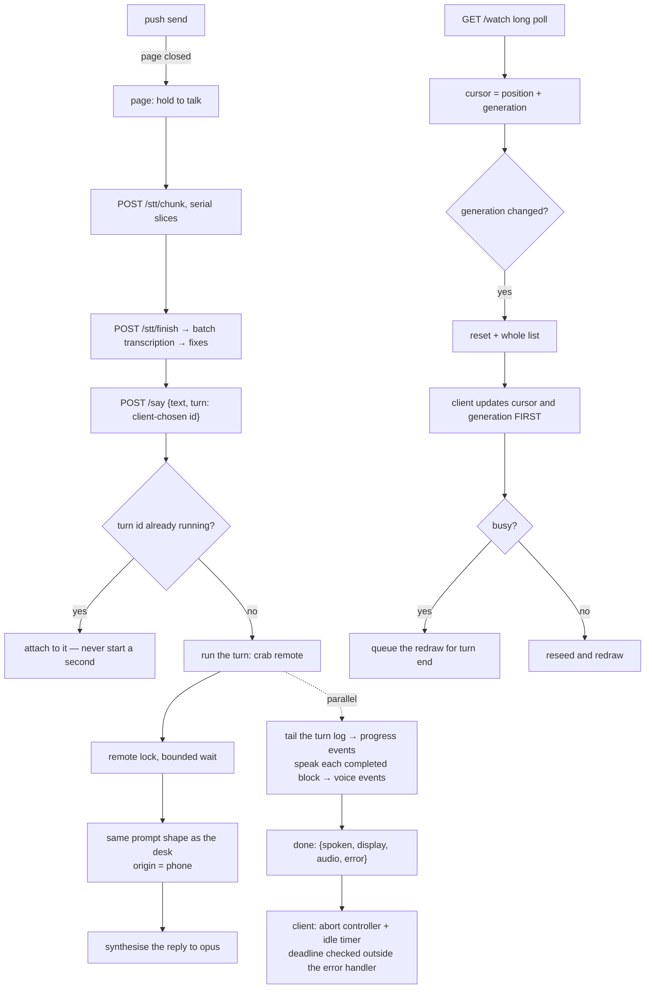

# Spec: phone

## PURPOSE

The phone is a microphone, a speaker, and a screen. The CLI, the prompt, the tools, and the
conversation never leave the machine. This spec owns the HTTP front end, the single-page client, the
turn protocol, the conversation follow, streaming voice, and the push channel that reaches the phone
with the page closed.

## CONTRACT

### Turns

1. A turn MUST be identified by a client-chosen identifier. The same identifier re-posted MUST
   attach to the running turn rather than starting a second one.
2. Phone turns MUST be serialised by a lock with a bounded wait.
3. A phone turn MUST build the same prompt shape as a desk turn, with the origin recorded as phone.
4. A stalled turn MUST NOT wedge the client. The client MUST wrap the streaming fetch in an abort
   controller with an idle-byte timer, and MUST check its deadline outside the error handler. The
   deadline measures progress — time since the last event received, not since the turn began — and
   MUST be enforced while the socket is still delivering: keepalive pings prove the link, not the
   turn, and a stream carrying nothing but pings past the deadline MUST be given up on. A watchdog
   MUST return the page to idle even when the turn path fails to.
5. While a turn is in flight the client refuses to record. That refusal MUST end when the turn ends,
   by any route including abort.
6. A turn's completion payload MUST carry the spoken text, the display content, the audio pointer,
   and an error field. The audio pointer is the never-silent fallback: it MUST carry the turn's own
   reply clip when and only when no streaming voice clip was emitted for the turn, so a client that
   heard the clips is not made to hear the reply again and a client that heard nothing still hears
   the reply once.
   Every turn MUST end in exactly one such completion event, whatever became of
   the run: the turn's timeout MUST kill the whole process tree (killing only the direct child
   leaves a grandchild holding the pipe, and a wait on that pipe is a turn that never ends), and a
   tail on a turn that has outlived every bound on a legitimate run MUST be answered with a failed
   completion rather than kept on keepalives forever.
7. A turn whose every account refused MUST return the refusal in the error field. It MUST NEVER be
   voiced, never synthesised, never entered into the conversation, and MUST be shown beside the
   reply rather than over it.
8. The server MUST refuse to start new turns while draining, with a status the client retries on,
   and MUST keep serving re-attaches until in-flight turns finish.

### Following the conversation

9. Every conversation response MUST carry a generation identity derived from the file's content, so
   an append does not move it and every compaction or archive does.
10. A poll whose generation no longer matches MUST be answered immediately with a reset and the whole
    current list.
11. On a reset, the client MUST update its cursor and generation **before** it defers the redraw.
    Deferring first and updating after leaves it re-asking with the same stale generation forever.
12. A reset that arrives while the client is busy MUST be queued and run when the turn ends, not
    dropped and not retried in a spin.
13. Compaction runs inside every phone turn, and compaction is exactly what changes the generation.
    The busy-reset path is therefore the common case, not the edge case, and MUST be tested as such.
14. Every poll MUST be guarded by an abort with a timeout longer than the poll answer and shorter
    than a dead link, and MUST retry with exponential backoff snapped back on success.
15. A client too old to send a generation MUST still work, with the older behaviour.
16. The turn list MUST count only what the page will draw. Blocks with no text and no display are
    dropped, so the cursor cannot point at an invisible turn.

### Voice and media

17. Streaming voice MUST be emitted per completed block while the turn runs, and MUST NOT emit after
    the completion event. With `PHONE_SENTENCE_STREAM=1` the unit is the sentence instead: the text
    deltas already present in the turn log are chunked by the desk streamer's own chunker — one
    shared implementation (`lib/sentence_stream.py`), never a second one — each sentence becomes a
    clip the moment it completes, and the completed block voices only the tail the deltas had not
    already spoken. The flag defaults to off, and off MUST be byte-for-byte the per-block behaviour.
    In either mode a sentence MUST never be voiced twice and never dropped, the display half MUST
    never reach a clip, and rule 6's completion fallback counts clips identically — the display
    split, the progress events, and the whole-draft mirror pass of
    [speech-output.md](speech-output.md) rule 44 are untouched by the flag.
    The synthesiser join deadline MUST be at least the per-synthesis timeout.
    A synthesis that produces nothing MUST leave a line in the server log, and the synthesiser MUST
    log its own it-never-ran failure too — the standing rule of
    [speech-output.md](speech-output.md) holds on this path as well. A skipped voice event with no
    witness anywhere is how two phone turns went silent on 2026-08-08 and the cause could no longer
    be established from what survived.
18. Audio, image, and media routes MUST honour range requests. Some browsers issue them for audio
    elements and will not play without — and none will seek without.
19. A wake's audio goes to the phone only when the last turn came from the phone and the phone's
    beacon is fresh. Anything short of both conditions falls back to the desk.
20. The audio cursor MUST be seeded when the page loads, so a freshly loaded page never replays old
    audio.
21. Images referenced by the display channel MUST be served from a bounded, expiring registry. An
    unbounded registry in a long-lived process is a leak.

### Transport, auth, and hygiene

22. Serving MUST require a shared secret and MUST bind to loopback by default. Exposing it is a
    separate, deliberate step.
23. Both request methods MUST accept the same authentication forms. Accepting a query key on one
    method and not the other renders a working page on which every turn fails.
24. The secret MUST NEVER be written to a log. It rides in the query string of the installed start
    URL, and the access log is world readable.
25. The session cookie MUST be marked secure when the deployment is over TLS.
26. Static routes MUST send cache validators. Without them an old client silently keeps running
    against a new server, and the server degrades silently for it — a stale page loses the recovery
    paths and the wake audio with no error.
27. A client hanging up mid-poll MUST NOT produce a traceback. Logs MUST be bounded.
28. The health route MUST NOT disclose what is running here to an unauthenticated caller.
29. The server MUST be stdlib only. Optional imports (markdown, the push crypto) MUST degrade to a
    documented status code and MUST NOT affect anything else.

### Push

30. Web Push is the only channel that reaches the phone with the page closed. It MUST be called by
    the code paths that need to reach a closed page, not only by a hand-run command.
31. Subscription MUST be idempotent by endpoint. The page re-posts its subscription on every load.
32. Dead endpoints MUST be pruned when the push service says they are gone.
33. The key pair is generated once and never rotated. Rotation orphans every subscription.

### Handed media and the mute

34. Any hand on this machine MAY hand the phone one audio file to play (`crab play <path>`), by a
    pointer under the state prefix — the same delivery channel as a wake's audio. The pointer MUST
    expire: a hand-off nobody collected does not start playing when a page finally loads later.
35. The media route MUST serve only a file explicitly handed over, MUST re-resolve it at serving
    time, and MUST refuse any path that does not resolve to a file under the user's home directory
    — on the writing side and on the serving side both. Handing the phone a file is never a door
    onto the rest of the filesystem.
36. Handed media MUST get a visible transport on the page — play/pause, seek, and the piece's name —
    with its own dismissal. It plays beside the voice, not through its queue: a reply's clips and
    the music are different channels, and stopping one MUST NOT stop the other.
37. The media cursor MUST be seeded when the page loads, exactly as rule 20 seeds the audio cursor,
    so a freshly loaded page never starts playing a pending hand-off unasked.
38. The top bar MUST carry a mute control. Its state MUST survive a reload, MUST silence everything
    the page can sound — handed media and spoken voice clips alike — and MUST be obvious at a
    glance. Muting silences, it never suppresses: turns, transports, and cursors behave exactly as
    unmuted, so a clip that arrived muted is acknowledged like any other and unmuting never replays
    a backlog.

### Recovery — the button can never stay grey

39. The client MUST remember its in-flight turn (identifier, text, and when) across a reload, and a
    freshly loaded page MUST re-attach to it by re-posting the same identifier — rule 1 makes that
    an attach, never a second run. The re-attach MUST be bounded by age — measured from the turn's
    ORIGINAL post, so a resume carries the remembered clock forward rather than restamping it;
    refreshing the stamp on every resume made the bound measure from the latest reload, and a
    reload storm could pick a dead turn back up forever — and skipped when the visible
    record already carries the exchange. A reload mid-turn used to orphan the turn: it kept running,
    it kept the lock, the re-spoken question queued behind it showing nothing, and the reply landed
    nowhere — that is how a reply failed to transmit on 2026-08-08, and how three reloads piled up
    in four minutes the same evening. Voice clips replayed by the re-attach MUST NOT re-sound the
    already-buffered backlog; clips arriving live after the re-attach play as ever, and rule 6's
    completion audio covers a turn that voiced nothing.
40. Every request the turn path makes MUST be bounded by an abort timeout — the slice uploads, the
    finish, and the batch-transcription fallback included, not only the streaming fetch of rule 4.
    An unbounded transcription fetch held rule 5's refusal until the watchdog, and a refusal held
    for minutes is indistinguishable from forever from a phone.
41. When the page returns to the foreground with a turn in flight and no recent progress, the
    client MUST abort the current attempt and reconnect immediately rather than waiting out
    throttled timers. And when the microphone stream's tracks died while the page was away, the
    next hold MUST re-acquire the microphone rather than record silence into a "too short".
42. A reply that arrives through the conversation watcher ends the turn that is waiting for it.
    This is an ordinary arrival, not a broken one: the mirror pass can rewrite the draft after its
    raw text has streamed, so the stored block no longer matches what the page heard, and
    compaction — a whole model run — sits between the conversation append and the process exit
    that emits the completion event, so on every compaction turn the record carries the answer up
    to a minute before the stream does. The client MUST recognise its own exchange: the assistant
    block whose text matches what streamed, or the first unmarked assistant block after this
    turn's own User block came back through the watcher — a User block that is not this turn's
    question breaks that adjacency (whatever follows answers it), and a marked block (an
    autonomous wake) is never a candidate, which is why every block the watch and context routes
    deliver carries its mark. On recognition the client MUST forget the remembered turn and hand
    the button back, guarded by the turn sequence exactly as the normal end is, so a superseded
    turn can never clear a newer one's state. The turn's stream MUST be aborted if any clip of
    this turn has already sounded, and MUST be left open if none has: the watcher carries no
    audio pointer, so a turn released before its first clip was cut off from the only sound it
    would ever make, and arrived in writing and in silence. A stream left open this way is a
    voice tail — it MUST play the clips and the completion clip that still arrive on it, and MUST
    touch nothing else: no bubble, no button, no status, the record having already settled those.
    Rule 6's never-twice guarantee is kept, because the tail only ever runs where nothing was
    voiced. The recognised block fills
    the live bubble when nothing streamed, carries the display card in either case — the display
    never rides the stream's text events — and is never drawn a second time as a turn from
    elsewhere. It is not re-voiced: the clips the turn produced were already spoken from the
    stream, the watcher carries no audio pointer, and rule 6's never-twice guarantee outweighs a
    voice for the tail case. A reply that arrived silent stays readable with the button back;
    hearing a reply twice to maybe voice a rare silent one is the wrong trade.
43. A queued turn MUST NOT be dead air. Rule 2's lock wait is bounded at ten minutes, and for all
    of it the runner emits nothing: the buffer holds one transcript event, the tail carries only
    keepalives, and the page shows a frozen status until rule 4 gives up on a turn that is in
    fact coming. Measured live on 2026-08-09: a message posted at 00:19:55 waited 203 s behind a
    four-minute turn, the phone sat on "picking the turn back up…" the whole time, and the page
    was hand reloaded four times — the stall as reported. So while a turn has produced nothing
    beyond its own transcript echo, the server MUST emit periodic wait events saying so — and
    saying which kind of wait it is: behind another message of this conversation, or behind
    something else the mind is on. The client MUST render them as one line updated in place
    rather than a growing pile, and MUST count their arrival as progress for rule 4's deadline —
    a turn visibly in line is not a turn gone silent. The wait notes MUST stop at the run's first
    real event and MUST never follow the completion event to a tail.

## DATA

| Path | Role |
|---|---|
| `${STATE_PREFIX}-turn-<uuid>.log` | one phone turn's stream, private so it cannot truncate a desk log |
| `${STATE_PREFIX}-remote.lock` | serialises phone turns |
| `${STATE_PREFIX}-phone-seen` | touched on every authenticated poll; the delivery beacon |
| `${STATE_PREFIX}-wake-audio` | pointer to a wake's synthesised reply |
| `${STATE_PREFIX}-play` | pointer to a handed audio file (`crab play`), expiring |
| `${STATE_PREFIX}-convo.txt` | followed by the poll route |
| `~/.local/share/deskcrab/webpush/` | key pair and subscriptions |
| `~/.local/share/deskcrab/last-origin` | desk or phone, durable |
| TLS material under the configured directory | self-signed by default |

## The phone turn

## INTERACTIONS

**The phone server may call:** the remote turn entry point, the synthesiser, the batch transcriber,
the push sender, and the conversation reader.

**The phone server may be called by:** the client page, by the wake path writing an audio pointer,
and by any hand writing the play pointer (`crab play`).

**The phone server must never:** speak on the desk, open a desktop window, or write a conversation
block itself. The turn it spawns does that.

## VERIFIED-CORRECT RULES

- **Turn idempotency by a client-chosen identifier.** A re-post lands on the running turn, so a
  reconnect during a drain or a flaky link does not double the work.
- **The limit-refusal path on the phone is clean end to end**: never voiced, never conversed, never
  synthesised, and shown beside the reply rather than over it. This is the model the other paths
  should match.
- **The generation identity is hashed from the summary plus the first surviving turn**, so appends
  never move it and every compaction or archive does. A cursor that is a position alone lies across
  a rewrite, and the old snap-down behaviour silently consumed every turn that rode in with one.
- **Each poll is guarded by an abort.** The bounded poll answer is the heartbeat; a plain socket sits
  on a dead link for minutes.
- **The private per-turn log exists so a phone turn cannot truncate the log a desk streamer is
  tailing.**
- **The server unit must set its own path, keep its restart limit disabled, use mixed kill mode, and
  allow room for the drain.** A burst of failed binds otherwise leaves the unit failed and not
  retrying, which is the exact silence it exists to prevent, and the default kill mode kills the
  in-flight turn directly, drain or no drain.
- **A drained restart refuses new turns, serves re-attaches, waits for in-flight turns, then exits.**
- **The wake audio beacon is the same channel that would deliver the audio**, so freshness means
  delivery will actually happen.
- **The server is stdlib only on purpose.** It must start on an offline laptop with nothing
  installed.

## KNOWN DEFECTS

| Id | What implementation must fix |
|---|---|
| `C11` | A reset arriving while busy spins forever at two seconds and renders nothing, because the cursor and generation are updated after the continue. The trigger is structural: compaction runs inside every phone turn. |
| `MAJ-18` | The shared secret is written verbatim into a world-readable log, a hundred and one times. |
| `MAJ-19` | No cache headers on any static route, and the service worker is a bare pass-through, so an old client keeps running against a new server and degrades silently. |
| `MIN-19` | One request method accepts a query key and the other does not; the shipped client sends neither header, so a lost cookie renders a working page on which every turn fails. |
| `MIN-20` | Unhandled broken-pipe errors on every client that hangs up mid-poll: a hundred and seventeen tracebacks, never rotated. |
| `MIN-21` | The session cookie is not marked secure although the deployment is TLS only. |
| `MIN-22` | The image registry grows without bound and never expires, in a process measured at nearly a gigabyte of peak memory. |
| `MIN-23` | The speaker can emit voice events after the completion event, because the join deadline is shorter than the per-synthesis timeout. |
| `MIN-24` | The health route discloses the assistant's name to unauthenticated callers, contradicting the comment two lines below it. |
| `MIN-25` | Audio and image routes ignore range requests. **Resolved:** one range-capable file sender serves the audio, image, and media routes; held by `tests/test_phone_media.sh`. |
| `MIN-26` | Web Push is wired but called by no code. With the page closed the phone receives nothing. |
| `C12` | The hold-to-talk button sat grey past any patience: the transcription fetches had no bound at all (a hang held the refusal until a seventeen-minute watchdog), a reload mid-turn orphaned the running turn behind the lock so the next attempt showed nothing either, and the give-up ladder was tuned in tens of minutes. Three reloads in four minutes on 2026-08-08, reported twice that evening. **Resolved:** rules 39-41 — bounded transcription, re-attach across reload, a foreground kick, and the ladder brought down to single minutes; held by the abnormal-end cases in `tests/phone_client_test.js`. |
| `C13` | A phone turn whose answer reached the conversation file before its stream's completion event left the button grey with the answer already on screen, drawn as a turn from the laptop. Structural, twice over: the mirror pass rewrites the draft after the raw text has streamed, so the stored block no longer matches the own-turn filter; and compaction — a whole model run — sits between the conversation append and the process exit that emits the completion event, so the stream carries nothing but keepalives while the record already holds the reply. Measured live on 2026-08-08: the mirror rewrite logged at 23:42:30, the reply delivered by the watcher by 23:42:55, the page reloaded by hand at 23:43:29, and the completion event not possible before ~23:43:35. **Resolved:** rule 42 — a watcher-delivered reply ends the turn well inside the watchdog window; held by the watcher-release cases in `tests/phone_client_test.js`. |

## TESTS

**Existing:** `tests/test_phone_live.sh`, `tests/test_watch_rewrite.sh` and `tests/test_phone_wedge.sh`
drive the real server over a real socket. Keep that — it caught the cursor bug end to end, and the
wedge test is what proves a timed-out turn still ends in a completion event.
`tests/test_phone_client.sh` (via `tests/phone_client_test.js`) drives the client's two loops against
stubs: the idle abort, the progress deadline — including a stream that delivers nothing but
keepalives, and one whose events outlive the original deadline — and the watchdog that returns the
page to idle when the turn path fails to.
`tests/test_phone_voice_fallback.sh` drives two real turns through one real server, switching a stub
synthesiser between them: a turn whose streaming synthesis died carries its own reply clip in the
completion payload — fetched back down the audio route, not merely pointed at — and names the
failure in the log; a turn that voiced its blocks carries an empty completion audio, so nothing is
heard twice. It was written against the silence of 2026-08-08 and fails on the code that caused it.
`tests/test_phone_media.sh` drives the handed-media path through the real server: a file handed
with `crab play` reaches `/watch` as a play event with its title and a served URL; the media and
audio routes honour ranges; a pointer outside the home directory, an expired pointer, and an
unauthenticated fetch all serve nothing; and delivery is opt-in by the `playseen` parameter's
presence, exactly as wake audio is by `wakeseen`. `tests/phone_client_test.js` also carries the
mute and transport cases: the persisted mute lands on both audio elements and survives a reload,
and a play event shows the transport once and never re-fires on an id already seen. The same file
carries the recovery cases of rules 39-41: a turn that ends in an error, a throw, or a hung
transcription fetch always hands the button back; a remembered turn is re-attached with the same
identifier on the next load, is skipped when the record already shows the exchange or the memory
has aged out, and does not re-sound the replayed clip backlog; and the foreground kick aborts a
stale attempt so the reconnect happens now rather than after a throttled timer. It also carries
rule 42's watcher-release cases: a turn whose stream hangs on keepalives is released the moment
its exchange arrives through the watcher — stream aborted, memory forgotten, button back, well
inside the watchdog window; an empty bubble is filled from the record and the display card
attached either way; a marked block, another exchange's blocks, and an idle page release nothing;
and a reply riding a busy reset's payload is scanned and releases the same way.
`tests/test_phone_stream.sh` drives one synthetic delta stream through two real servers, one per
mode of rule 17's flag: with the flag on, clips are per sentence and in order, the first clip is
emitted before the block completes, the completed event voices only the tail the deltas had not
spoken, a re-emitted message and a duplicated completed event add nothing, and the display half
never reaches the synthesiser; with the flag off, the same stream produces exactly the one-clip-
per-block output of today, and the config plumbing (`PHONE_SENTENCE_STREAM` through `crab serve`
into the server's environment) is asserted in the same file.
`tests/test_phone_queue_wait.sh` drives rule 43 through the real server: a turn parked before its
first output carries wait notes in its stream naming which wait it is (behind this conversation's
previous message, or behind something else), the notes stop once real output flows and never
follow the completion event, and a turn that starts promptly never sees one. The client half
lives in `tests/phone_client_test.js`: wait notes draw one line updated in place with the status
following, and rule 39's resume carries the original clock rather than restamping it.

**To be written:**

- `tests/test_watch_rewrite.sh` — extend with the busy-reset case: a reset arriving mid-turn updates
  the cursor and generation, queues the redraw, and runs it when the turn ends.
- `tests/test_serve_auth.sh` — a wrong secret is refused on both request methods; the right secret
  is accepted in every form the client sends; the secret never appears in the log; the cookie is
  marked secure under TLS.
- `tests/test_serve_static.sh` — cache validators on every static route; range requests on audio and
  images; the health route discloses nothing unauthenticated.
- `tests/test_phone_input.sh` — the chunked upload, the finish, the transcribe and ask routes. Only
  the say route is driven today.
- `tests/test_webpush.py` — the crypto against the published test vector, subscription idempotency,
  pruning of dead endpoints, and the degraded status when the optional dependency is missing.
