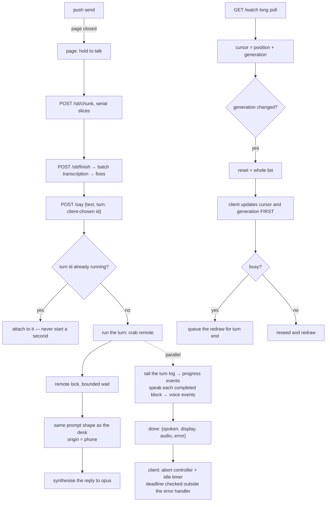

# Spec: phone

## PURPOSE

The phone is a microphone, a speaker, and a screen. The CLI, the prompt, the tools, and the
conversation never leave the machine. This spec owns the HTTP front end, the single-page client, the
turn protocol, the conversation follow, streaming voice, and the push channel that reaches the phone
with the page closed.

## CONTRACT

### Turns

1. A turn MUST be identified by a client-chosen identifier. The same identifier re-posted MUST
   attach to the running turn rather than starting a second one.
2. Phone turns MUST be serialised by a lock with a bounded wait. The delivery-queue place
   ([turn-pipeline.md](turn-pipeline.md) rule 15a) is taken BEFORE that wait, so a message parked
   at the lock holds its true arrival order and its pushback pass runs at once. A wait that
   expires MUST refuse the turn with a clear error the client can show — it MUST NOT run the turn
   unserialised beside whatever holds the lock, which is the exact race the lock exists to
   prevent. The bound is `REMOTE_LOCK_WAIT`, ten minutes by default (rule 43 measures the queue
   against it).
3. A phone turn MUST build the same prompt shape as a desk turn, with the origin recorded as phone.
3a. A message MAY carry the phone's own fix beside its text — latitude, longitude, accuracy, and
    the fix's own timestamp — and the client asks `navigator.geolocation` for one per outgoing
    message, facing the browser's permission prompt once and honouring its remembered answer ever
    after: a denial is cached and never re-begged per message. When the post that CREATES a turn
    (rule 1 — an attach never re-injects) carries a fresh, well-formed fix, exactly one line of
    the form `he is near <place>` joins that turn's context, in the turn frame the phone origin
    already owns ([prompt-assembly.md](prompt-assembly.md) L8), where `<place>` is the street and
    town the reverse geocode answered with — and the plain coordinates when it answered nothing
    usable. The line never guesses: no fix, a malformed one, or one older than the stale bound
    injects nothing at all, and an unresolvable place falls back to coordinates or to silence,
    never to a name nobody measured. Every failure on the way — permission denied, geolocation
    unavailable, a fix that never comes, a geocoder error or timeout — degrades SILENTLY: the
    client sends nothing extra, the server injects no line, the turn runs exactly as one sent
    bare, and no error text reaches the reply, the page, or the speakers. The reverse geocode
    MUST NOT be a network call the turn path can hang on: it is bounded, and the bounds are named
    constants with defaults rather than numbers scattered through the code — the stale bound
    (`GEO_STALE_S`, 600 s), the geocoder bound (`GEO_LOOKUP_TIMEOUT_S`, 2 s), the client's own
    fix wait (`GEO_FIX_TIMEOUT_MS`). The geocoder endpoint (`GEOCODE_URL`) is configuration, and
    every test stubs it — the suite never asks a live service where anybody is.
4. A stalled turn MUST NOT wedge the client. The client MUST wrap the streaming fetch in an abort
   controller with an idle-byte timer, and MUST check its deadline outside the error handler. The
   deadline measures progress — time since the last event received, not since the turn began — and
   MUST be enforced while the socket is still delivering: keepalive pings prove the link, not the
   turn, and a stream carrying nothing but pings past the deadline MUST be given up on. A watchdog
   MUST return the page to idle even when the turn path fails to.
5. The hold-to-talk control MUST stay usable while a turn is in flight — never disabled, never
   refusing to record. Until 2026-08-11 the client refused the microphone for the whole of a live
   turn, so a spoken message could not even be queued; reported by the user as conversation that
   feels blocking. A recording made mid-turn is transcribed and queued exactly as a typed send is
   (rule 49), never dropped. While the microphone is open the page MUST pause its own playback —
   the voice element and any handed media — and resume it on release, so the recording cannot eat
   her own clips (the whole reason the old refusal existed); the pause is the microphone's, never
   the mute's: it advances no cursor, drops no queued clip, and suppresses nothing.
6. A turn's completion payload MUST carry the spoken text, the display content, the audio pointer,
   and an error field. The audio pointer is the never-silent fallback: it MUST carry the turn's own
   reply clip when and only when no streaming voice clip was emitted for the turn, so a client that
   heard the clips is not made to hear the reply again and a client that heard nothing still hears
   the reply once.
   A reply that OPENS with the quiet marker completes with the shown "(quiet) …" form as its
   spoken text, an empty audio pointer and an empty error: the marker chose silence while the
   reply was written ([turn-pipeline.md](turn-pipeline.md) rule 16b), so the missing clip is that
   choice working, not a voice that failed, and the fallback MUST NOT synthesise one. A reply that
   is EMPTY under the same rule — whitespace only, or the bare marker — is answered through the
   error field exactly as a no-text turn is, and nothing of it enters the conversation.
   Every turn MUST end in exactly one such completion event, whatever became of
   the run: the turn's timeout MUST kill the whole process tree (killing only the direct child
   leaves a grandchild holding the pipe, and a wait on that pipe is a turn that never ends), and a
   tail on a turn that has outlived every bound on a legitimate run MUST be answered with a failed
   completion rather than kept on keepalives forever.
7. A turn whose every account refused MUST return the refusal in the error field. It MUST NEVER be
   voiced, never synthesised, never entered into the conversation, and MUST be shown beside the
   reply rather than over it.
8. The server MUST refuse to start new turns while draining, with a status the client retries on,
   and MUST keep serving re-attaches until in-flight turns finish.

### Following the conversation

9. Every conversation response MUST carry a generation identity derived from the file's content, so
   an append does not move it and every compaction or archive does.
10. A poll whose generation no longer matches MUST be answered immediately with a reset and the whole
    current list.
11. On a reset, the client MUST update its cursor and generation **before** it defers the redraw.
    Deferring first and updating after leaves it re-asking with the same stale generation forever.
12. A reset that arrives while the client is busy MUST be queued and run when the turn ends, not
    dropped and not retried in a spin.
13. Compaction runs inside every phone turn, and compaction is exactly what changes the generation.
    The busy-reset path is therefore the common case, not the edge case, and MUST be tested as such.
14. Every poll MUST be guarded by an abort with a timeout longer than the poll answer and shorter
    than a dead link, and MUST retry with exponential backoff snapped back on success.
15. A client too old to send a generation MUST still work, with the older behaviour.
16. The turn list MUST count only what the page will draw. Blocks with no text and no display are
    dropped, so the cursor cannot point at an invisible turn.

### Voice and media

17. Thinking and tool progress stream while the turn runs. Assistant answer text and voice MUST
    remain held until the complete candidate has passed the action-claim check in
    [turn-pipeline.md](turn-pipeline.md) rule 32a. The final verified spoken text is emitted once;
    an unsupported draft MUST NOT reach a text event, a voice event, or the completion payload.
    `PHONE_SENTENCE_STREAM` does not weaken this boundary. A sentence MUST never be voiced twice
    or dropped, the display half MUST never reach a clip, and rule 6's completion fallback counts
    clips identically.
    The synthesiser join deadline MUST be at least the per-synthesis timeout.
    A synthesis that produces nothing MUST leave a line in the server log, and the synthesiser MUST
    log its own it-never-ran failure too — the standing rule of
    [speech-output.md](speech-output.md) holds on this path as well. A skipped voice event with no
    witness anywhere is how two phone turns went silent on 2026-08-08 and the cause could no longer
    be established from what survived.
18. Audio, image, and media routes MUST honour range requests. Some browsers issue them for audio
    elements and will not play without — and none will seek without.
    The Content-Type of a served reply clip MUST name what the bytes actually are: `/audio/`
    serves Ogg-encapsulated Opus as `audio/ogg`, and the synthesiser's read-back probe
    ([speech-output.md](speech-output.md) rule 53) is what makes that claim true — a file that
    does not probe as one Ogg Opus stream is withdrawn on the server side and never offered to
    a client at all.
19. A wake's audio goes to the phone only when the last turn came from the phone and the phone's
    beacon is fresh. Anything short of both conditions falls back to the desk.
20. The audio cursor MUST be seeded when the page loads, so a freshly loaded page never replays old
    audio.
21. Images referenced by the display channel MUST be served from a bounded, expiring registry. An
    unbounded registry in a long-lived process is a leak.

### Transport, auth, and hygiene

22. Serving MUST require a shared secret and MUST bind to loopback by default. Exposing it is a
    separate, deliberate step.
23. Both request methods MUST accept the same authentication forms. Accepting a query key on one
    method and not the other renders a working page on which every turn fails.
24. The secret MUST NEVER be written to a log. It rides in the query string of the installed start
    URL, and the access log is world readable.
25. The session cookie MUST be marked secure when the deployment is over TLS.
26. Static routes MUST send cache validators. Without them an old client silently keeps running
    against a new server, and the server degrades silently for it — a stale page loses the recovery
    paths and the wake audio with no error.
27. A client hanging up mid-poll MUST NOT produce a traceback. Logs MUST be bounded.
28. The health route MUST NOT disclose what is running here to an unauthenticated caller.
29. The server MUST be stdlib only. Optional imports (markdown, the push crypto) MUST degrade to a
    documented status code and MUST NOT affect anything else.

### Push

30. Web Push is the only channel that reaches the phone with the page closed. It MUST be called by
    the code paths that need to reach a closed page, not only by a hand-run command.
31. Subscription MUST be idempotent by endpoint. The page re-posts its subscription on every load.
32. Dead endpoints MUST be pruned when the push service says they are gone.
33. The key pair is generated once and never rotated. Rotation orphans every subscription.

### Handed media and the mute

34. Any hand on this machine MAY hand the phone one audio file to play (`crab play <path>`), by a
    pointer under the state prefix — the same delivery channel as a wake's audio. The pointer MUST
    expire: a hand-off nobody collected does not start playing when a page finally loads later.
35. The media route MUST serve only a file explicitly handed over, MUST re-resolve it at serving
    time, and MUST refuse any path that does not resolve to a file under the user's home directory
    — on the writing side and on the serving side both. Handing the phone a file is never a door
    onto the rest of the filesystem.
36. Handed media MUST get a visible transport on the page — play/pause, seek, and the piece's name —
    with its own dismissal. It plays beside the voice, not through its queue: a reply's clips and
    the music are different channels, and stopping one MUST NOT stop the other.
37. The media cursor MUST be seeded when the page loads, exactly as rule 20 seeds the audio cursor,
    so a freshly loaded page never starts playing a pending hand-off unasked.
38. The top bar MUST carry a mute control. Its state MUST survive a reload, MUST silence everything
    the page can sound — handed media and spoken voice clips alike — and MUST be obvious at a
    glance. Muting silences, it never suppresses: turns, transports, and cursors behave exactly as
    unmuted, so a clip that arrived muted is acknowledged like any other and unmuting never replays
    a backlog.

### Recovery — the button can never stay grey

39. The client MUST remember its in-flight turn (identifier, text, and when) across a reload, and a
    freshly loaded page MUST re-attach to it by re-posting the same identifier — rule 1 makes that
    an attach, never a second run. The re-attach MUST be bounded by age — measured from the turn's
    ORIGINAL post, so a resume carries the remembered clock forward rather than restamping it;
    refreshing the stamp on every resume made the bound measure from the latest reload, and a
    reload storm could pick a dead turn back up forever — and skipped when the visible
    record already carries the exchange. A reload mid-turn used to orphan the turn: it kept running,
    it kept the lock, the re-spoken question queued behind it showing nothing, and the reply landed
    nowhere — that is how a reply failed to transmit on 2026-08-08, and how three reloads piled up
    in four minutes the same evening. Voice clips replayed by the re-attach MUST NOT re-sound what
    already sounded — and MUST NOT lose what never did. The server annotates every replayed voice
    event with its own playback truth (`played`, from rule 44's reports: a clip reported `started`
    or `completed` has played), the client skips exactly the played ones, and a clip the record
    never heard start is queued as if it had just arrived. Dropping the whole replayed backlog by
    wall clock was how the 00:40 turn of 2026-08-22 lost its last two clips for good: the page
    died mid-queue, the tail was synthesised, delivered as events, and could never sound anywhere
    again. A replayed event carrying no `played` field (an older server) falls back to the old
    wall-clock drop, and the client counts every voice event against the turn's clip index whether
    it plays or skips it, so playback reports keep naming the right clip across a resume. Clips
    arriving live after the re-attach play as ever, and rule 6's completion audio covers a turn
    that voiced nothing.
40. Every request the turn path makes MUST be bounded by an abort timeout — the slice uploads, the
    finish, and the batch-transcription fallback included, not only the streaming fetch of rule 4.
    An unbounded transcription fetch held the button's busy state until the watchdog — under the
    old rule 5 that was a refusal to record — and a phone held busy for minutes is
    indistinguishable from one held forever.
41. When the page returns to the foreground with a turn in flight and no recent progress, the
    client MUST abort the current attempt and reconnect immediately rather than waiting out
    throttled timers. Hidden time is not silence: while the screen is off the OS freezes the
    page's timers and rots its sockets, so no progress CAN arrive — rule 4's give-up deadline
    and the watchdog's reference MUST count only time the page was awake and getting nothing.
    The client MUST track each hidden span through visibility changes and, on return to
    visible, push both clocks forward by the span just ended; and a resume MUST be granted at
    least one reconnect attempt before any give-up can return, even when the hidden span was
    never observed. The give-up itself stays — it was added against a real failure — and the
    404 path is unchanged: a server that genuinely restarted still reports the reply lost. A
    screen locked longer than the window used to guarantee "gave up: no progress in 6 minutes"
    on the first check after unlock, without one reconnect attempt, while the finished turn sat
    buffered on the laptop one `/turn/<id>?from=<n>` fetch away (2026-08-11 09:17, `C18`). And
    when the microphone stream's tracks died while the page was away, the next hold MUST
    re-acquire the microphone rather than record silence into a "too short".
42. A reply that arrives through the conversation watcher ends the turn that is waiting for it.
    This is an ordinary arrival, not a broken one: the mirror pass can rewrite the draft after its
    raw text has streamed, so the stored block no longer matches what the page heard, and
    compaction — a whole model run — sits between the conversation append and the process exit
    that emits the completion event, so on every compaction turn the record carries the answer up
    to a minute before the stream does. The client MUST recognise its own exchange: the assistant
    block whose text matches what streamed, or the first unmarked assistant block after this
    turn's own User block came back through the watcher — a User block that is not this turn's
    question breaks that adjacency (whatever follows answers it), and a marked block (an
    autonomous wake) is never a candidate, which is why every block the watch and context routes
    deliver carries its mark. On recognition the client MUST forget the remembered turn and hand
    the button back, guarded by the turn sequence exactly as the normal end is, so a superseded
    turn can never clear a newer one's state. The release MUST NOT abort the turn's stream: the
    stream is always left open as a voice tail. The watcher carries no audio pointer, so a turn
    released before its first clip was cut off from the only sound it would ever make, and
    arrived in writing and in silence — and a clip having already sounded proves nothing either,
    because the conversation append runs ahead of the synthesiser: under rule 17's sentence
    streaming the record regularly arrives while the tail sentences of the same reply are still
    becoming clips. An earlier form of this rule aborted the stream once any clip had sounded,
    and on 2026-08-09 that clause itself broke rule 17's never-dropped guarantee three turns
    running — every sentence past the second was synthesised, emitted, and never fetched,
    because the release had cut the socket one to two seconds before the tail clips were ready
    (`C14`). The voice tail MUST play the clips and the completion clip that still arrive on it,
    and MUST touch nothing else: no bubble, no button, no status, the record having already
    settled those. Rule 6's never-twice guarantee is kept either way: a clip rides the live
    stream exactly once, and the completion clip is offered only when nothing streamed. The
    tail is not unbounded — it ends at the turn's own completion event, which rule 6 guarantees
    exactly once per turn, and rule 4's progress deadline still covers a tail whose done event
    never comes. The recognised block fills
    the live bubble when nothing streamed, carries the display card in either case — the display
    never rides the stream's text events — and is never drawn a second time as a turn from
    elsewhere. It is not re-voiced: the clips the turn produced were already spoken from the
    stream, the watcher carries no audio pointer, and rule 6's never-twice guarantee outweighs a
    voice for the tail case. A reply that arrived silent stays readable with the button back;
    hearing a reply twice to maybe voice a rare silent one is the wrong trade.
43. A queued turn MUST NOT be dead air. Rule 2's lock wait is bounded at ten minutes, and for all
    of it the runner emits nothing: the buffer holds one transcript event, the tail carries only
    keepalives, and the page shows a frozen status until rule 4 gives up on a turn that is in
    fact coming. Measured live on 2026-08-09: a message posted at 00:19:55 waited 203 s behind a
    four-minute turn, the phone sat on "picking the turn back up…" the whole time, and the page
    was hand reloaded four times — the stall as reported. So while a turn has produced nothing
    beyond its own transcript echo, the server MUST emit periodic wait events saying so — and
    saying which kind of wait it is: behind another message of this conversation, or behind
    something else the mind is on. The client MUST render them as one line updated in place
    rather than a growing pile, and MUST count their arrival as progress for rule 4's deadline —
    a turn visibly in line is not a turn gone silent. The wait notes MUST stop at the run's first
    real event and MUST never follow the completion event to a tail.

### Playback truth — the server learns what actually sounded

The completion event proves the reply's text and audio pointer reached the wire. It proves nothing
about the speaker: on 2026-08-09 two long replies were delivered in full and played nothing —
every synthesis of the turn had quietly failed — and the only witness was the phone's silence,
reported by hand. The client is the sole process that knows whether audio played, so the client
says so.

44. The client MUST report, per turn, what became of the audio it was handed: that a clip was
    queued (`requested`), that a clip actually began to sound (`started` — taken from the audio
    element's own `playing` or first past-zero `timeupdate` event, never merely from `play()`
    having been called), that a clip finished (`completed`), and that a clip failed or was cut
    short (`error`, naming the reason: an autoplay refusal, a decode error, a deliberate stop).
    Every report carries the turn identifier and the clip's index within the turn, so a chunked
    reply that died part-way names the chunk it died on. Reports are fire-and-forget: a report
    that cannot be delivered MUST NOT disturb playback, and a server too old to accept one is an
    ignored error, not a broken page. Attribution is part of the truth: a failure report MUST
    name the clip that actually failed, never the clip that happens to be current when the
    failure's signal lands. A source that failed to load signals twice — the element's error
    event, then the dead clip's own play() rejection a beat later — and the error event owns it:
    one report, as the media error it is, against the dead clip's index, while the queue plays on
    undisturbed. The rejection handler MUST act only for its own clip and only on a genuine
    autoplay refusal (`NotAllowedError`); the ▶ recovery button is the refusal's remedy alone,
    offered only on a source a tap can actually play — wired to a source that cannot load it is a
    control that does nothing (`C16`).
44a. A failed source is failed for good — a terminal per-clip dead state, keyed by the clip's
    source, set by the element's error event and by any load failure, surviving whichever of the
    dead source's two signals lands first. The current-clip guard alone does not cover the
    measured ordering (2026-08-11, turn db935524 clips 3 and 4, turn e913a586 clip 2): play()'s
    rejection can land BEFORE the element's error event, while the guard still matches and the
    rejection reads `NotAllowedError`, so the client reported "autoplay refused" and offered the
    ▶ button on the very source that could not load — `C16` back in its original clothes. So a
    refusal verdict MUST wait a beat for a racing error event to claim the clip before anything
    is reported or offered, and the ▶ button MUST be refused — silently, with a log line as the
    witness — for any source in the dead state, whoever asks and however late. One failure, one
    report: the client MUST emit at most one `error` report per clip per turn, and the server's
    metrics path MUST NOT write a second `play-error` line for a clip already recorded failed —
    8 of one day's 38 play-errors were the second half of exactly this double signal, and the
    error picture read worse than it was. The duplicate still updates the playback state (a stop
    said twice must still stand the alarm down); only the metrics line is dropped.
44b. `started` and `completed` are the element's own truth, never the queue's belief: a clip the
    client gives up on without playing MUST be reported as its own distinct failure — never as
    played, and never silently. The measured shape (2026-08-23 23:39, turn 58d64fe9): seven
    clips offered, seven `requested` reports posted, zero `/audio` fetches ever issued, and no
    terminal report of any kind — the queue sat in its playing state behind a load that never
    progressed, and the server's silent-turn line had nothing per-clip to say. So a clip whose
    element shows no progress and no failure within a bounded wait after the load began MUST be
    given up on: reported `error` (never started), marked dead under rule 44a, its element
    unloaded, and the queue advanced, so every remaining clip gets its own chance to sound or to
    fail on the record — and a queue found believing itself playing with nothing sounding and no
    such wait armed adopts the stuck clip under the same clock rather than parking every arrival
    behind it for good. The wait MUST NOT cut a clip that already started sounding, loading
    progress re-arms it rather than expiring it, and a clip deliberately paused (the open
    microphone's duck, rule 5) is not stuck. An `ended` nothing ever sounded is a failure
    wearing a completion's clothes and MUST NOT be reported `completed`; the gesture unlock
    MUST NOT clobber a loaded clip's source with its silence clip for exactly that reason — the
    silence's `ended` arrives wearing the loaded clip's index — and with a clip already loaded
    the unlock plays that clip inside the gesture instead.
44c. The mechanics of rules 44-44b are ONE implementation, shared with the chess table:
    `lib/browser_voice_queue.js`, a dependency-free UMD module (a browser global
    `BrowserVoiceQueue`, CommonJS for the node harnesses) owning the queue itself — arrival
    order, one clip sounding at a time, each clip exactly once; the terminal per-clip dead
    state, consulted at enqueue so a dead key is never asked for twice; the refusal grace,
    inside which a racing error event claims the clip before any refusal verdict is believed;
    `started`/`completed` truth taken only from element events fed into the per-clip handle,
    with an `ended` nothing ever sounded settled as the failure it is; the progress-rearmed
    never-started bound, deferred while the page says the clip is deliberately ducked, and
    adopted onto a phantom playing state at enqueue exactly as rule 44b's tail demands; and
    queue advancement after every terminal outcome, with drop-queued never cutting the clip
    already sounding and the chosen stop settling silently. The page keeps POLICY only, as
    callbacks: loading the one `#player` element and routing its events to the current clip's
    handle, `/played` reporting with its one-error-per-clip dedup, the ▶ gesture recovery for
    a genuine refusal — which holds the queue parked behind the waiting clip rather than
    advancing into more refusals, the tap resuming the queue through the element's own
    `playing` event — the open-microphone duck, and the chosen stop. The module is a static
    asset of this server, `GET /browser_voice_queue.js` behind the same auth as every other
    route, answered as the file's exact bytes; the chess bridge serves the SAME file, byte for
    byte, through its own explicit route ([chessweb.md](chessweb.md) rule 24g) — shared as a
    neutral module both pages load, never one server importing or proxying the other.
44d. A generated voice clip that has a face cue document carries an opaque `face_cue` id in its
    voice event or wake pointer. The phoneme record and cue track stay server-side beside the
    Opus file; the page MUST NOT manufacture, edit, or echo them. The page returns only that id
    with its existing `/played` report. `requested` moves no mouth. On the media element's first
    real `started` report, the server resolves its own bounded record and publishes the cue track
    to the face broker with that instant as playback time zero. `completed`, `error`, and the
    chosen stop remove that phone clip by id without clearing another clip that may be sounding.
    Missing cue data, a dead broker, or any cue-publication failure costs only the mouth motion;
    the audio queue and its reports continue unchanged. Phone-routed wake clips use the same id
    and the same playback-truth path.
45. The server MUST record every playback report to the per-day metrics log it already writes its
    latency stamps to, so the stamp that says a clip was synthesised has a neighbour that says
    whether it was ever heard.
46. A turn whose spoken text was delivered but for which no `started` report arrives within a
    bounded wait MUST raise exactly one notification (`crab notify`) naming the turn and the last
    known reason — a synthesis that offered no clip at all, clips offered that nothing fetched, or
    an autoplay refusal nobody answered. One silent turn, one notification, never more. A turn
    stopped by hand counts as heard (the silence was chosen), and a turn that spoke no text raises
    nothing. A client that has never reported playback at all is a page from before this rule:
    its turns are recorded in the metrics as silent but MUST NOT be notified — an old client
    degrading into a nightly page of the house is exactly the noise rule 26 exists to prevent.
46a. The mid-queue death leaves a witness too. A turn some of whose clips started while a later
    clip never reported `started` inside the same bounded wait MUST raise exactly one notification
    naming the turn and the first clip that never sounded — the 00:40 shape of 2026-08-22: the
    text delivered whole, clip 0 heard to completion, the page dead before the third clip, and
    until this rule not one server-side trace that anything was lost. A turn stopped by hand
    stays silent (the silence was chosen), and the one-notification discipline is shared with
    rule 46: one turn, at most one page of the house, whichever rule catches it first.

### Brakes and reach — the user can always get a word in

Until 2026-08-10 the phone had no brakes at all. The server exposed `/say`, `/turn`, `/img`,
`/audio`, `/media` — and nothing that could end a turn. With a turn in flight the client refused
new messages too, and the typed path was worse than a refusal: it cleared the input and dropped
the text on the floor. If she started a long — or destructive — task, the user was stuck waiting
with no way to intervene, and a new message parked behind the lock's ten-minute wait. Reported by
the user in exactly those terms. A mind he cannot interrupt is not an assistant; it is a machine
he is locked out of.

47. `POST /stop {turn}` MUST end a turn in flight by genuinely killing it: every process the turn
    started — the remote run behind the reply and any synthesis still in flight — is signalled as
    a process group, politely first and then absolutely after a short grace. The one-mind lock
    rides down with the run that held it (a flock dies with its holder, so there is no unlock step
    to forget), and the next turn in line proceeds at once. Genuine means process gone: a turn
    merely detached from its stream keeps running, keeps the lock, and keeps every brake-shaped
    promise broken. The stopped turn still ends in exactly one completion event (rule 6), marked
    `stopped`, so every attached tail ends and the client's button comes back through the ordinary
    path. Stopping a turn already done is a no-op answered truthfully, and an unknown turn is a
    404, not a guess.
48. The brake reaches exactly what this server started, and all of it — the running turn and any
    turn parked behind the lock alike (killing a parked run releases the user's place in line, it
    does not touch what holds the lock). A desk turn or a wake holding the mind is another hand's
    process and is not the phone's to kill; rule 43's notes already name that kind of wait.
    Detached jobs are dispatched out of the turn's process group by design and survive a stop —
    the brake stops her answering, not work already handed to the job runner.
49. A message sent while a turn is in flight MUST be accepted, never refused and never dropped.
    Typed while busy, the message is posted at once under its own turn identifier — the laptop
    holds it durably from that moment, and rule 1 makes the later attach the same turn, never a
    second run — drawn as queued where the user can see it beside a live stop control, and
    attached when the slot frees. The lock keeps its meaning — one mind, turns in the order he
    said things (rule 2) — but waiting is a thing the page shows (rule 43), never a thing a send
    dies on. The voice path queues the same way: a message spoken while a turn runs is transcribed
    and joins the same queue the typed one does (rule 5), with the page's own playback paused for
    exactly as long as the microphone is open. The brake stays the brake — one tap to stop — and a
    send, spoken or typed, never blocks and never kills.
50. A new message is NOT an interrupt. The explicit stop is the only brake, deliberately: the
    pipeline already has a doctrine for what a newer message means to a reply in flight —
    supersession holds a superseded reply as written-not-spoken, and only pushback supersedes; an
    ordinary follow-up queues and both are answered. Barge-in (new-message-kills-the-turn) would
    make every follow-up a kill: an "also—" mid-task would cut down the very long task he asked
    for, and a destructive task deserves a deliberate brake, not an accidental one. So control
    runs in both directions: send freely (never blocked), stop explicitly (immediate). A stop is a
    full stop — it takes the queued messages with it, and it silences the voice in the same
    gesture; a killed reply's clips playing on would be the stream outliving the brake.

### In-flight delivery — the running turn reads its mail

Queued-not-dropped (rule 49) fixed the send and did nothing for the wait: a message queued behind
a long turn sat unseen until that turn's last tool call finished, so a mid-task "also check the
logs" — or "stop, wrong branch" short of the brake — reached her only after the work it should
have steered was done. Reported by the user 2026-08-11: a mind that cannot hear until it stops
working feels blocking even when nothing blocks. The CLI offers no way to append a true user turn
to a run already in flight, so the delivery rides a per-run hooks settings file: a PostToolUse
hook surfaces the queue to the model between one tool call and
the next — the closest thing to a mid-turn user message the runner can carry, verified live
against the shipped CLI before this rule was written.

51. A message accepted while another turn is in flight MUST be written to the mid-turn spool the
    moment it is accepted, and a running turn MUST read the spool at its very next tool-call
    boundary — between two consecutive tool calls of a long chain, never only at the turn's end.
    What is read is delivered exactly once, oldest first, marked plainly as the user's message
    arriving mid-turn — and marked with what it is not: the message still runs as its own turn
    when the slot frees (rule 50), so the running turn adjusts its course and leaves the full
    reply to the turn the message owns. A turn that makes no further tool call delivers nothing —
    the boundary is the only door the CLI offers — and the queued turn behind it answers exactly
    as before this rule existed.
52. The spool MUST never echo a turn its own message. The runner deletes its own turn's entry
    after taking the remote lock and before its model runs, and the reader skips entries naming
    its own turn identifier as a second belt. A stop (rule 50) takes the stopped and queued
    turns' entries with it, and an entry nobody consumed MUST expire by age at the reader rather
    than wait to be mis-delivered into some later, unrelated turn.

### OpenRSC spectator

53. The live OpenRSC view rides this EXISTING authenticated server: `GET /openrsc` is the page,
    `GET /openrsc/frame.jpg` is its current frame, and `GET /openrsc/state` is its compact HUD.
    All three accept the ordinary phone credential OR a durable spectator-only credential; that
    narrower credential is accepted by no other route. Both remain inside the same listener and
    authentication boundary, whether that listener is reached through Tailscale HTTPS or an
    explicitly configured trusted-LAN bind, and an unauthenticated caller receives the same flat
    404. The path-scoped spectator cookie is `Secure` behind HTTPS and remains usable on explicit
    LAN HTTP. `crab openrsc-link` creates the narrow key when needed and prints its shareable URL
    without exposing the assistant's phone credential.
54. Observation has no control half. The server reads the private Xvfb socket, discovers the same
    largest mapped client rectangle as the desktop spectator through their shared stdlib X11
    helper, and runs one capped ffmpeg JPEG producer shared by every viewer. It keeps only the
    newest frame, pairs it with a read-only query of the private virtual pointer, starts on the
    first frame request, and stops after the viewers go idle. ffmpeg draws no platform cursor; the
    page maps the paired crop-local position onto its scaled/letterboxed image as the desktop
    spectator's magenta ring and crosshair. The producer is tied to the discovered private-display
    incarnation, not merely its reusable display number: replacing the Xvfb/client underneath a
    still-running phone server invalidates the old capture and reconnects it, rather than emitting
    an advancing sequence of frozen frames from the departed display. No HTTP method or route may
    send mouse, keyboard, bridge actions, or game commands.
55. `/openrsc/state` is an allowlist, not a mirror of `state.json`: login/freshness, tile, HP,
    fatigue, movement/combat/sleep, objective, its deliberately selected plan, activity, and
    positive activity XP/hour only.
    Inventory, chat, credentials, routes, memory, and engine internals never leave the machine.
    The self-contained page is mobile-first, reconnects after game/server transitions, pauses when
    hidden, offers fullscreen and an explicit spectator pause, and labels the view read-only.
56. The spectator is its own installable mobile app on the same authenticated origin. Its scoped
    manifest, icons, and network-only service worker live entirely below `/openrsc/`; an installed
    launch uses the narrow spectator credential and then returns to the clean path-scoped-cookie
    URL. The worker never caches frames, HUD state, portrait state, credentials, or an offline copy
    of the game. HTTPS provides full PWA installation (including the existing Tailscale route),
    while the Apple mobile-app metadata continues to support Add to Home Screen on a trusted-LAN
    page. Installation does not add a control route or broaden spectator authentication.

## DATA

| Path | Role |
|---|---|
| `${STATE_PREFIX}-turn-<uuid>.log` | one phone turn's stream, private so it cannot truncate a desk log |
| `${STATE_PREFIX}-remote.lock` | serialises phone turns |
| `${STATE_PREFIX}-phone-seen` | touched on every authenticated poll; the delivery beacon |
| `${STATE_PREFIX}-wake-audio` | pointer to a wake's synthesised reply |
| `${REMOTE_AUDIO_PREFIX}*.opus.face.json` | private phoneme records, measured duration, and cue track retained beside a generated phone clip |
| `${STATE_PREFIX}-play` | pointer to a handed audio file (`crab play`), expiring |
| `${STATE_PREFIX}-midturn/` | the mid-turn spool (rules 51-52): one file per queued message, named `<arrival-ns>.<turn-id>.msg`, expiring at the reader |
| `${STATE_PREFIX}-convo.txt` | followed by the poll route |
| `~/.local/share/deskcrab/webpush/` | key pair and subscriptions |
| `~/.local/share/deskcrab/last-origin` | desk or phone, durable |
| the per-day metrics log (turn-pipeline rule 33) | playback reports and the silent-turn record, beside the latency stamps |
| TLS material under the configured directory | self-signed by default |

## The phone turn

## INTERACTIONS

**The phone server may call:** the remote turn entry point, the synthesiser, the batch transcriber,
the face broker for playback-anchored cue tracks, the push sender (directly, and as `crab notify`
for rule 46's silent-turn alarm), and the conversation reader.

**The phone server may be called by:** the client page, by the wake path writing an audio pointer,
and by any hand writing the play pointer (`crab play`).

**The phone server must never:** speak on the desk, open a desktop window, or write a conversation
block itself. The turn it spawns does that.

## VERIFIED-CORRECT RULES

- **Turn idempotency by a client-chosen identifier.** A re-post lands on the running turn, so a
  reconnect during a drain or a flaky link does not double the work.
- **The limit-refusal path on the phone is clean end to end**: never voiced, never conversed, never
  synthesised, and shown beside the reply rather than over it. This is the model the other paths
  should match.
- **The generation identity is hashed from the summary plus the first surviving turn**, so appends
  never move it and every compaction or archive does. A cursor that is a position alone lies across
  a rewrite, and the old snap-down behaviour silently consumed every turn that rode in with one.
- **Each poll is guarded by an abort.** The bounded poll answer is the heartbeat; a plain socket sits
  on a dead link for minutes.
- **The private per-turn log exists so a phone turn cannot truncate the log a desk streamer is
  tailing.**
- **The server unit must set its own path, keep its restart limit disabled, use mixed kill mode, and
  allow room for the drain.** A burst of failed binds otherwise leaves the unit failed and not
  retrying, which is the exact silence it exists to prevent, and the default kill mode kills the
  in-flight turn directly, drain or no drain.
- **A drained restart refuses new turns, serves re-attaches, waits for in-flight turns, then exits.**
- **The wake audio beacon is the same channel that would deliver the audio**, so freshness means
  delivery will actually happen.
- **The server is stdlib only on purpose.** It must start on an offline laptop with nothing
  installed.

## KNOWN DEFECTS

| Id | What implementation must fix |
|---|---|
| `C11` | A reset arriving while busy spins forever at two seconds and renders nothing, because the cursor and generation are updated after the continue. The trigger is structural: compaction runs inside every phone turn. |
| `MAJ-18` | The shared secret is written verbatim into a world-readable log, a hundred and one times. |
| `MAJ-19` | No cache headers on any static route, and the service worker is a bare pass-through, so an old client keeps running against a new server and degrades silently. |
| `MIN-19` | One request method accepts a query key and the other does not; the shipped client sends neither header, so a lost cookie renders a working page on which every turn fails. |
| `MIN-20` | Unhandled broken-pipe errors on every client that hangs up mid-poll: a hundred and seventeen tracebacks, never rotated. |
| `MIN-21` | The session cookie is not marked secure although the deployment is TLS only. |
| `MIN-22` | The image registry grows without bound and never expires, in a process measured at nearly a gigabyte of peak memory. |
| `MIN-23` | The speaker can emit voice events after the completion event, because the join deadline is shorter than the per-synthesis timeout. |
| `MIN-24` | The health route discloses the assistant's name to unauthenticated callers, contradicting the comment two lines below it. |
| `MIN-25` | Audio and image routes ignore range requests. **Resolved:** one range-capable file sender serves the audio, image, and media routes; held by `tests/test_phone_media.sh`. |
| `MIN-26` | Web Push is wired but called by no code. With the page closed the phone receives nothing. |
| `C12` | The hold-to-talk button sat grey past any patience: the transcription fetches had no bound at all (a hang held the refusal until a seventeen-minute watchdog), a reload mid-turn orphaned the running turn behind the lock so the next attempt showed nothing either, and the give-up ladder was tuned in tens of minutes. Three reloads in four minutes on 2026-08-08, reported twice that evening. **Resolved:** rules 39-41 — bounded transcription, re-attach across reload, a foreground kick, and the ladder brought down to single minutes; held by the abnormal-end cases in `tests/phone_client_test.js`. |
| `C14` | The rule 42 release cut the turn's stream as soon as any clip had sounded, on the belief that a voiced turn had no sound left to deliver. Sentence streaming (rule 17) made that belief false: the conversation append runs one to two seconds ahead of the synthesiser's tail, so on 2026-08-09 16:54–16:55 three replies in a row lost every sentence past the second — synthesised, emitted, never fetched, the clips left on disk with no listener. The user heard each reply stop mid-thought. **Resolved:** the release never aborts the stream; it always becomes a voice tail that plays the clips still arriving and ends at the turn's own completion event. Held by the released-tail case in `tests/phone_client_test.js` and the voice-before-done ordering pin in `tests/test_phone_stream.sh`. |
| `C15` | No brakes. The server had no stop route at all — `/say`, `/turn`, `/img`, `/audio`, `/media`, and nothing that could end a turn — and the client refused new messages while one was in flight, the typed path silently discarding the text after clearing the input. A long or destructive task, once started, could not be stopped from the phone, and a new message parked behind the lock's ten-minute wait. Reported by the user 2026-08-10. **Resolved:** rules 47-50 — a `/stop` route that kills the turn's process groups and releases the lock with them, a stopped-marked completion event, a client stop control, and queued-not-dropped sends; held by `tests/test_phone_stop.sh` and the queue/stop cases in `tests/phone_client_test.js`. |
| `C16` | A clip whose source failed to load was reported as an autoplay refusal, against the wrong clip: the element's error event advances the queue, then the dead clip's own play() rejection lands and was blamed on whichever clip is current by then — clearing that clip's playing flag underneath it — and the ▶ recovery button was offered wired to the very source that cannot load, so tapping it did nothing. Measured live 2026-08-11 00:22: a harness sweep deleted three just-synthesised clips out of the live /tmp (the server side of the incident is test-harness.md rule 9's), the fetches answered 404, the reply cut out mid-sentence, and the page offered a dead play button beside three misattributed `autoplay refused` reports. **Resolved:** the rejection handler acts only for its own clip and only on a genuine `NotAllowedError`; a source that failed to load is owned by the element's error event, reported as the media error it is against its own index, and never offers the button. Held by the dead-source and refusal cases in `tests/phone_client_test.js`. **Re-opened 2026-08-23:** the guard did not cover the rejection-first ordering — the rejection can land BEFORE the error event, while the guard still matches — closed again by rule 44a's terminal dead state and refusal grace, held by `tests/phone_client_deadclip_test.js` through `tests/test_phone_dead_clip.sh`. |
| `C17` | A message sent mid-turn was queued but unheard until the turn ended: the runner parked it behind the remote lock and nothing surfaced it to the run in flight, so a course correction sent during a long tool chain arrived after the course had been run — and the hold-to-talk control refused to record at all while busy, so a spoken message could not even be queued. Reported by the user 2026-08-11 in exactly those terms. **Resolved:** rules 5 and 49 (the control stays usable; a mid-turn recording transcribes into the same queue, with the page's own playback paused while the microphone is open) and rules 51-52 (the mid-turn spool, read by the running turn at its next tool-call boundary through the per-run PostToolUse hook, delivered exactly once and never echoed to its own turn); held by `tests/test_phone_midturn.sh` and `tests/phone_client_midturn_test.js`. |
| `C18` | The give-up clock counted the time the phone was asleep: `streamTurn`'s deadline and the watchdog's reference were wall clock, and a screen locked longer than the six-minute window guaranteed "gave up: no progress in 6 minutes" on the first check after unlock — without one reconnect attempt — while the finished turn sat buffered on the laptop under its id, one `/turn/<id>?from=<n>` fetch away. Hit by the user 2026-08-11 09:17: the page used to hand back the reply after a lock, and handed back the error instead. **Resolved:** rule 41's hidden-time clause — hidden spans are tracked through visibility changes and added back to both clocks on resume, so the six minutes mean six minutes awake and getting nothing, and a resume is granted one reconnect before any give-up can return; the awake-and-silent give-up and the 404 path are untouched. Held by the hidden-turn cases in `tests/phone_client_test.js`. |
| `C13` | A phone turn whose answer reached the conversation file before its stream's completion event left the button grey with the answer already on screen, drawn as a turn from the laptop. Structural, twice over: the mirror pass rewrites the draft after the raw text has streamed, so the stored block no longer matches the own-turn filter; and compaction — a whole model run — sits between the conversation append and the process exit that emits the completion event, so the stream carries nothing but keepalives while the record already holds the reply. Measured live on 2026-08-08: the mirror rewrite logged at 23:42:30, the reply delivered by the watcher by 23:42:55, the page reloaded by hand at 23:43:29, and the completion event not possible before ~23:43:35. **Resolved:** rule 42 — a watcher-delivered reply ends the turn well inside the watchdog window; held by the watcher-release cases in `tests/phone_client_test.js`. |

## TESTS

**Existing:** `tests/test_phone_live.sh`, `tests/test_watch_rewrite.sh` and `tests/test_phone_wedge.sh`
drive the real server over a real socket. Keep that — it caught the cursor bug end to end, and the
wedge test is what proves a timed-out turn still ends in a completion event.
`tests/test_phone_client.sh` (via `tests/phone_client_test.js`) drives the client's two loops against
stubs: the idle abort, the progress deadline — including a stream that delivers nothing but
keepalives, and one whose events outlive the original deadline — and the watchdog that returns the
page to idle when the turn path fails to.
`tests/test_phone_voice_fallback.sh` drives two real turns through one real server, switching a stub
synthesiser between them: a turn whose streaming synthesis died carries its own reply clip in the
completion payload — fetched back down the audio route, not merely pointed at — and names the
failure in the log; a turn that voiced its blocks carries an empty completion audio, so nothing is
heard twice. It was written against the silence of 2026-08-08 and fails on the code that caused it.
`tests/test_phone_media.sh` drives the handed-media path through the real server: a file handed
with `crab play` reaches `/watch` as a play event with its title and a served URL; the media and
audio routes honour ranges; a pointer outside the home directory, an expired pointer, and an
unauthenticated fetch all serve nothing; and delivery is opt-in by the `playseen` parameter's
presence, exactly as wake audio is by `wakeseen`. `tests/phone_client_test.js` also carries the
mute and transport cases: the persisted mute lands on both audio elements and survives a reload,
and a play event shows the transport once and never re-fires on an id already seen. The same file
carries the recovery cases of rules 39-41: a turn that ends in an error, a throw, or a hung
transcription fetch always hands the button back; a remembered turn is re-attached with the same
identifier on the next load, is skipped when the record already shows the exchange or the memory
has aged out, and does not re-sound the replayed clip backlog; and the foreground kick aborts a
stale attempt so the reconnect happens now rather than after a throttled timer. The same file
holds rule 41's hidden-time cases (`C18`): a turn hidden past the give-up window that resumes
into its buffered done event shows the reply, not the error; a resume whose hidden span was
never observed is still granted exactly one reconnect before the give-up can return; a watchdog
tick while the screen is dark does not count the lock as stall; and the awake-and-silent stream
still ends at the ceiling. It also carries
rule 42's watcher-release cases: a turn whose stream hangs on keepalives is released the moment
its exchange arrives through the watcher — memory forgotten, button back, well inside the
watchdog window, and the stream left open as a voice tail in every case; a released turn whose
clips were still being synthesised when the record arrived plays every clip the tail delivers
(`C14` — the release used to cut this socket and the tail sentences with it); an empty bubble
is filled from the record and the display card attached either way; a marked block, another
exchange's blocks, and an idle page release nothing; and a reply riding a busy reset's payload
is scanned and releases the same way.
`tests/test_phone_stream.sh` drives one synthetic delta stream through two real servers, one per
mode of rule 17's flag: with the flag on, clips are per sentence and in order, the first clip is
emitted before the block completes, the completed event voices only the tail the deltas had not
spoken, a re-emitted message and a duplicated completed event add nothing, and the display half
never reaches the synthesiser; with the flag off, the same stream produces exactly the one-clip-
per-block output of today, and the config plumbing (`PHONE_SENTENCE_STREAM` through `crab serve`
into the server's environment) is asserted in the same file.
`tests/test_reply_supersede.sh` drives the amended rule 39 and rule 46a through the real server:
a two-clip turn reports clip 0 heard and clip 1 requested-but-never-started, the `?from=0` replay
marks clip 0 `played` and clip 1 unplayed, and the died-mid-queue turn raises exactly one
notification naming the tail that never sounded.

`tests/test_phone_playback.sh` drives rules 44-46 through two real servers: playback reports land
in the per-day metrics log with the turn id and clip index; a turn whose clip reported playing
raises nothing; a silent turn raises exactly one notification through a stub `crab notify`; an
unanswered autoplay refusal is named in it; a stop by hand counts as heard; and a server that has
never seen a report records its silent turns but never notifies.
`tests/test_phone_dead_clip.sh` drives rules 44a-44b against the recorded evidence — the client
half through `tests/phone_client_deadclip_test.js`, the reporting half through a real server: the
rejection-first and the error-first orderings of one dead source each yield exactly one error
report and no ▶ button, with the dead state refusing the button whichever signal landed first
and the refusal grace never inventing a refusal; a genuine refusal still earns the button and is
never later given up on; a clip whose element never progresses is reported as its own failure
with no `started` or `completed` ever posted and the queue freed behind it; the seven-clip
58d64fe9 wedge replays to seven per-clip failure reports, which the real server records beside
its silent-turn line; and a doubled error report for one clip lands in the metrics log once,
with a stop said twice still standing the alarm down. The client half runs the page's real
policy glue over the real shared module (rule 44c), so what is proven is the pair actually
deployed, not either half alone.
`tests/test_shared_voice_asset.sh` holds rule 44c's sharing itself: the module's mechanics bare
(`tests/browser_voice_queue_test.js` — order, the dead state, both race orderings, the refusal
hold and its resume, the give-up bound with its progress re-arm and duck deferral, the
ended-without-start truth, drop-queued sparing the sounding clip, the silent stop); both pages
loading the identical asset path; both servers answering the file's exact bytes — this one
behind its auth, with no key refused 404, the bridge through its own route; and the walls of
chessweb.md rule 24g standing in the same breath — no phone secret, import, or proxy anywhere
in the bridge, and nothing phone-shaped in the module.
`tests/test_phone_queue_wait.sh` drives rule 43 through the real server: a turn parked before its
first output carries wait notes in its stream naming which wait it is (behind this conversation's
previous message, or behind something else), the notes stop once real output flows and never
follow the completion event, and a turn that starts promptly never sees one. The client half
lives in `tests/phone_client_test.js`: wait notes draw one line updated in place with the status
following, and rule 39's resume carries the original clock rather than restamping it. The same file carries
the voice-queue failure cases of rule 44 (`C16`): a clip whose source cannot load is reported as
the media error it is, against its own index, while the next clip plays on undisturbed and no ▶
button is offered; a genuine autoplay refusal is still reported as one, for the refused clip, with
the button offered on a source that can actually play.
`tests/test_phone_stop.sh` drives rules 47-50 through the real server with a stub crab that takes
the real remote lock: a `/stop` against a long turn kills the remote run's process group and the
synthesis child beside it — both pids observed dead, not inferred from a status code — the
stopped turn ends in exactly one completion event marked `stopped`, a message posted mid-turn is
accepted and streaming wait notes at once rather than blocking on the lock, and the killed turn's
lock is released to the one behind it, whose reply arrives in seconds rather than at the lock's
ten-minute bound. A wrong turn id and a missing key are both refused. The client half lives in
`tests/phone_client_test.js`: a typed send while busy is queued and posted to the server
immediately rather than dropped, the queue pumps into a real turn when the current one ends, and
the stop control stops the active turn and the queue behind it.
`tests/test_phone_geolocation.sh` drives rule 3a through real servers and the real assembler: a
fix on the creating post reaches the turn's runner as the resolved place and the assembled
context carries exactly one `he is near <place>` line; a bare post, a malformed fix, and a stale
one hand the turn through unchanged — no line, no error text anywhere in the completion; a
geocoder that hangs is abandoned at its named bound and the line falls back to plain
coordinates; the geocoder is a local stub in every case, never a live service; and the client's
fix helper resolves to nothing — quietly, inside its own bound — on denial, absence, staleness,
and a hung lookup, remembering a denial so the permission prompt is never re-begged.
`tests/test_phone_midturn.sh` drives rules 51-52 through the real server with a stub crab holding
the real remote lock: a message posted mid-turn lands in the mid-turn spool the moment it is
accepted, named by its own turn identifier; a message posted with nothing running spools nothing;
a stop sweeps the queued turn's entry away; and the reader (`lib/midturn-mail`) drains a populated
spool oldest-first into one delivery marked mid-turn and leaves the spool empty, skips an entry
naming its own turn, expires an aged entry unread, and emits nothing at all for an empty spool.
The same file pins the runner's own-entry delete and the hook's presence in the generated
settings, in `lib/common.sh`, by the exact lines that do it. The client half lives in
`tests/phone_client_midturn_test.js`: hold-to-talk records while busy — never refused — the
mid-turn recording is transcribed and joins the queue posted at once, a transcription failure
says so in its own bubble instead of dying silently, a take queued against an already-idle page
pumps into a real turn immediately, and the page's own playback is paused while the microphone
is open and resumed on release.

**To be written:**

- `tests/test_watch_rewrite.sh` — extend with the busy-reset case: a reset arriving mid-turn updates
  the cursor and generation, queues the redraw, and runs it when the turn ends.
- `tests/test_serve_auth.sh` — a wrong secret is refused on both request methods; the right secret
  is accepted in every form the client sends; the secret never appears in the log; the cookie is
  marked secure under TLS.
- `tests/test_serve_static.sh` — cache validators on every static route; range requests on audio and
  images; the health route discloses nothing unauthenticated.
- `tests/test_phone_input.sh` — the chunked upload, the finish, the transcribe and ask routes. Only
  the say route is driven today.
- `tests/test_webpush.py` — the crypto against the published test vector, subscription idempotency,
  pruning of dead endpoints, and the degraded status when the optional dependency is missing.
