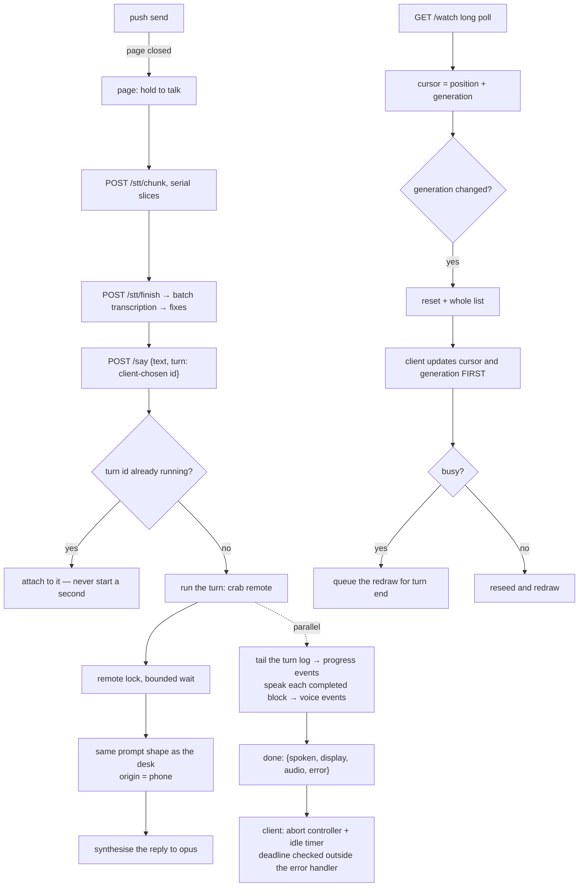

# Spec: phone

## PURPOSE

The phone is a microphone, a speaker, and a screen. The CLI, the prompt, the tools, and the
conversation never leave the machine. This spec owns the HTTP front end, the single-page client, the
turn protocol, the conversation follow, streaming voice, and the push channel that reaches the phone
with the page closed.

## CONTRACT

### Turns

1. A turn MUST be identified by a client-chosen identifier. The same identifier re-posted MUST
   attach to the running turn rather than starting a second one.
2. Phone turns MUST be serialised by a lock with a bounded wait.
3. A phone turn MUST build the same prompt shape as a desk turn, with the origin recorded as phone.
4. A stalled turn MUST NOT wedge the client. The client MUST wrap the streaming fetch in an abort
   controller with an idle-byte timer, and MUST check its deadline outside the error handler. The
   deadline measures progress — time since the last event received, not since the turn began — and
   MUST be enforced while the socket is still delivering: keepalive pings prove the link, not the
   turn, and a stream carrying nothing but pings past the deadline MUST be given up on. A watchdog
   MUST return the page to idle even when the turn path fails to.
5. While a turn is in flight the client refuses to record. That refusal MUST end when the turn ends,
   by any route including abort.
6. A turn's completion payload MUST carry the spoken text, the display content, the audio pointer,
   and an error field. The audio pointer is the never-silent fallback: it MUST carry the turn's own
   reply clip when and only when no streaming voice clip was emitted for the turn, so a client that
   heard the clips is not made to hear the reply again and a client that heard nothing still hears
   the reply once.
   Every turn MUST end in exactly one such completion event, whatever became of
   the run: the turn's timeout MUST kill the whole process tree (killing only the direct child
   leaves a grandchild holding the pipe, and a wait on that pipe is a turn that never ends), and a
   tail on a turn that has outlived every bound on a legitimate run MUST be answered with a failed
   completion rather than kept on keepalives forever.
7. A turn whose every account refused MUST return the refusal in the error field. It MUST NEVER be
   voiced, never synthesised, never entered into the conversation, and MUST be shown beside the
   reply rather than over it.
8. The server MUST refuse to start new turns while draining, with a status the client retries on,
   and MUST keep serving re-attaches until in-flight turns finish.

### Following the conversation

9. Every conversation response MUST carry a generation identity derived from the file's content, so
   an append does not move it and every compaction or archive does.
10. A poll whose generation no longer matches MUST be answered immediately with a reset and the whole
    current list.
11. On a reset, the client MUST update its cursor and generation **before** it defers the redraw.
    Deferring first and updating after leaves it re-asking with the same stale generation forever.
12. A reset that arrives while the client is busy MUST be queued and run when the turn ends, not
    dropped and not retried in a spin.
13. Compaction runs inside every phone turn, and compaction is exactly what changes the generation.
    The busy-reset path is therefore the common case, not the edge case, and MUST be tested as such.
14. Every poll MUST be guarded by an abort with a timeout longer than the poll answer and shorter
    than a dead link, and MUST retry with exponential backoff snapped back on success.
15. A client too old to send a generation MUST still work, with the older behaviour.
16. The turn list MUST count only what the page will draw. Blocks with no text and no display are
    dropped, so the cursor cannot point at an invisible turn.

### Voice and media

17. Streaming voice MUST be emitted per completed block while the turn runs, and MUST NOT emit after
    the completion event. The synthesiser join deadline MUST be at least the per-synthesis timeout.
    A synthesis that produces nothing MUST leave a line in the server log, and the synthesiser MUST
    log its own it-never-ran failure too — the standing rule of
    [speech-output.md](speech-output.md) holds on this path as well. A skipped voice event with no
    witness anywhere is how two phone turns went silent on 2026-08-08 and the cause could no longer
    be established from what survived.
18. Audio and image routes MUST honour range requests. Some browsers issue them for audio elements
    and will not play without.
19. A wake's audio goes to the phone only when the last turn came from the phone and the phone's
    beacon is fresh. Anything short of both conditions falls back to the desk.
20. The audio cursor MUST be seeded when the page loads, so a freshly loaded page never replays old
    audio.
21. Images referenced by the display channel MUST be served from a bounded, expiring registry. An
    unbounded registry in a long-lived process is a leak.

### Transport, auth, and hygiene

22. Serving MUST require a shared secret and MUST bind to loopback by default. Exposing it is a
    separate, deliberate step.
23. Both request methods MUST accept the same authentication forms. Accepting a query key on one
    method and not the other renders a working page on which every turn fails.
24. The secret MUST NEVER be written to a log. It rides in the query string of the installed start
    URL, and the access log is world readable.
25. The session cookie MUST be marked secure when the deployment is over TLS.
26. Static routes MUST send cache validators. Without them an old client silently keeps running
    against a new server, and the server degrades silently for it — a stale page loses the recovery
    paths and the wake audio with no error.
27. A client hanging up mid-poll MUST NOT produce a traceback. Logs MUST be bounded.
28. The health route MUST NOT disclose what is running here to an unauthenticated caller.
29. The server MUST be stdlib only. Optional imports (markdown, the push crypto) MUST degrade to a
    documented status code and MUST NOT affect anything else.

### Push

30. Web Push is the only channel that reaches the phone with the page closed. It MUST be called by
    the code paths that need to reach a closed page, not only by a hand-run command.
31. Subscription MUST be idempotent by endpoint. The page re-posts its subscription on every load.
32. Dead endpoints MUST be pruned when the push service says they are gone.
33. The key pair is generated once and never rotated. Rotation orphans every subscription.

## DATA

| Path | Role |
|---|---|
| `${STATE_PREFIX}-turn-<uuid>.log` | one phone turn's stream, private so it cannot truncate a desk log |
| `${STATE_PREFIX}-remote.lock` | serialises phone turns |
| `${STATE_PREFIX}-phone-seen` | touched on every authenticated poll; the delivery beacon |
| `${STATE_PREFIX}-wake-audio` | pointer to a wake's synthesised reply |
| `${STATE_PREFIX}-convo.txt` | followed by the poll route |
| `~/.local/share/deskcrab/webpush/` | key pair and subscriptions |
| `~/.local/share/deskcrab/last-origin` | desk or phone, durable |
| TLS material under the configured directory | self-signed by default |

## The phone turn

## INTERACTIONS

**The phone server may call:** the remote turn entry point, the synthesiser, the batch transcriber,
the push sender, and the conversation reader.

**The phone server may be called by:** the client page, and by the wake path writing an audio
pointer.

**The phone server must never:** speak on the desk, open a desktop window, or write a conversation
block itself. The turn it spawns does that.

## VERIFIED-CORRECT RULES

- **Turn idempotency by a client-chosen identifier.** A re-post lands on the running turn, so a
  reconnect during a drain or a flaky link does not double the work.
- **The limit-refusal path on the phone is clean end to end**: never voiced, never conversed, never
  synthesised, and shown beside the reply rather than over it. This is the model the other paths
  should match.
- **The generation identity is hashed from the summary plus the first surviving turn**, so appends
  never move it and every compaction or archive does. A cursor that is a position alone lies across
  a rewrite, and the old snap-down behaviour silently consumed every turn that rode in with one.
- **Each poll is guarded by an abort.** The bounded poll answer is the heartbeat; a plain socket sits
  on a dead link for minutes.
- **The private per-turn log exists so a phone turn cannot truncate the log a desk streamer is
  tailing.**
- **The server unit must set its own path, keep its restart limit disabled, use mixed kill mode, and
  allow room for the drain.** A burst of failed binds otherwise leaves the unit failed and not
  retrying, which is the exact silence it exists to prevent, and the default kill mode kills the
  in-flight turn directly, drain or no drain.
- **A drained restart refuses new turns, serves re-attaches, waits for in-flight turns, then exits.**
- **The wake audio beacon is the same channel that would deliver the audio**, so freshness means
  delivery will actually happen.
- **The server is stdlib only on purpose.** It must start on an offline laptop with nothing
  installed.

## KNOWN DEFECTS

| Id | What implementation must fix |
|---|---|
| `C11` | A reset arriving while busy spins forever at two seconds and renders nothing, because the cursor and generation are updated after the continue. The trigger is structural: compaction runs inside every phone turn. |
| `MAJ-18` | The shared secret is written verbatim into a world-readable log, a hundred and one times. |
| `MAJ-19` | No cache headers on any static route, and the service worker is a bare pass-through, so an old client keeps running against a new server and degrades silently. |
| `MIN-19` | One request method accepts a query key and the other does not; the shipped client sends neither header, so a lost cookie renders a working page on which every turn fails. |
| `MIN-20` | Unhandled broken-pipe errors on every client that hangs up mid-poll: a hundred and seventeen tracebacks, never rotated. |
| `MIN-21` | The session cookie is not marked secure although the deployment is TLS only. |
| `MIN-22` | The image registry grows without bound and never expires, in a process measured at nearly a gigabyte of peak memory. |
| `MIN-23` | The speaker can emit voice events after the completion event, because the join deadline is shorter than the per-synthesis timeout. |
| `MIN-24` | The health route discloses the assistant's name to unauthenticated callers, contradicting the comment two lines below it. |
| `MIN-25` | Audio and image routes ignore range requests. |
| `MIN-26` | Web Push is wired but called by no code. With the page closed the phone receives nothing. |

## TESTS

**Existing:** `tests/test_phone_live.sh`, `tests/test_watch_rewrite.sh` and `tests/test_phone_wedge.sh`
drive the real server over a real socket. Keep that — it caught the cursor bug end to end, and the
wedge test is what proves a timed-out turn still ends in a completion event.
`tests/test_phone_client.sh` (via `tests/phone_client_test.js`) drives the client's two loops against
stubs: the idle abort, the progress deadline — including a stream that delivers nothing but
keepalives, and one whose events outlive the original deadline — and the watchdog that returns the
page to idle when the turn path fails to.

**To be written:**

- `tests/test_watch_rewrite.sh` — extend with the busy-reset case: a reset arriving mid-turn updates
  the cursor and generation, queues the redraw, and runs it when the turn ends.
- `tests/test_serve_auth.sh` — a wrong secret is refused on both request methods; the right secret
  is accepted in every form the client sends; the secret never appears in the log; the cookie is
  marked secure under TLS.
- `tests/test_serve_static.sh` — cache validators on every static route; range requests on audio and
  images; the health route discloses nothing unauthenticated.
- `tests/test_phone_input.sh` — the chunked upload, the finish, the transcribe and ask routes. Only
  the say route is driven today.
- `tests/test_webpush.py` — the crypto against the published test vector, subscription idempotency,
  pruning of dead endpoints, and the degraded status when the optional dependency is missing.
- `tests/test_phone_voice_fallback.sh` — a turn whose streaming synthesis failed still carries the
  reply clip in its completion payload and leaves a failure line in the log; a turn whose streaming
  synthesis worked carries an empty completion audio, so the reply is never played twice.
