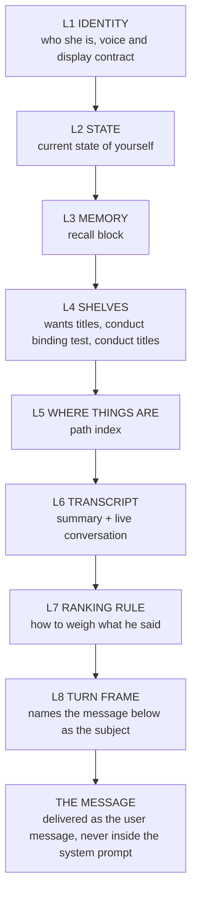

# Spec: prompt assembly

## PURPOSE

This spec encodes the target design for the prompt, not the current one. It defines a single
assembly function with four per-path profiles, a fixed layer order that puts the user's latest
message last and names it as the subject of the turn, a byte budget for every layer, a strict
separation between her context and the desktop coding agent's, and an index block that makes every
drawer she owns openable. Its acceptance criteria are the fourteen intent cases at the end.

## CONTRACT

### One assembler, four profiles

1. There MUST be exactly one prompt assembler, and it MUST take a profile:
   `--profile turn|wake|job|classify`. No caller may assemble a prompt any other way.
2. Every layer MUST be selectable per profile. A profile is a list of layers with a byte budget for
   each, not a post-hoc trim of one shape.
3. The assembler MUST emit the layers in the order below, always, for every profile. A layer a
   profile does not include is absent; the surviving layers do not reorder.
4. The assembler MUST NOT exceed a profile's total budget. When a layer would exceed its own budget,
   the assembler MUST trim that layer and MUST say in the layer that it trimmed and where the rest
   is. Silent truncation is forbidden.
5. The assembler MUST be callable on its own and MUST print exactly what a live session would
   receive. Producing the prompt is a local operation and MUST stay one command. When the user asks
   to see the context, that command is the answer.

### Layer order

6. **L8 MUST be the last thing in the system prompt, and the user's latest message MUST be the user
   message.** The message MUST NEVER be embedded inside the system prompt.
7. **L8 MUST name the message as the subject of the turn.** It states, in plain words, that the text
   that follows is what this turn is about; that everything above is background she may draw on; and
   that a topic which appears only above is not this turn's topic.
8. **L7 MUST sit immediately above L8** and MUST state the ranking rule with no hedging:
   - what the user reports about observed reality is ground truth;
   - the transcript is admissible evidence for what was said;
   - the state block is authoritative for what is running, scheduled, or dispatched;
   - a command's output may refine a cause but MUST NEVER overrule what he just said;
   - when a command and the transcript disagree, say they disagree rather than picking one.
9. L6 MUST scope its own authority to **words**: the transcript is authoritative for what was said
   and promised. It MUST NOT claim authority over what is running or scheduled — that is L2's.
10. L2 MUST be the state block defined by [self-awareness.md](self-awareness.md), verbatim, with no
    per-profile edits to its rules.

### Byte budgets

11. Every layer MUST have a measured budget, and the assembler MUST be able to report the measured
    size of each layer for a given profile. "Measured" means bytes of the assembled text, not an
    estimate.

| Layer | turn | wake | job | classify |
|---:|---:|---:|---:|---:|
| L1 identity | 4,000 | 3,500 | 800 | 0 |
| L2 state | 1,500 | 1,500 | 0 | 0 |
| L3 memory | 3,200 | 3,200 | 0 | 0 |
| L4 shelves | 2,000 | 2,000 | 0 | 0 |
| L5 where things are | 600 | 600 | 600 | 0 |
| L6 transcript | 8,000 | 3,000 | 0 | 0 |
| L7 ranking rule | 500 | 500 | 0 | 0 |
| L8 turn frame | 300 | 300 | 200 | 200 |
| conditional regroup | 1,300 | 1,300 | 0 | 0 |
| **system-prompt total** | **≤ 21,400** | **≤ 15,900** | **≤ 1,600** | **≤ 200** |
| user message | the turn's text | the wake agenda, ≤ 3,600 | the task description | the question and its material |

12. The wake agenda MUST be the wake profile's user message. It is what this session is about, and
    it MUST obey rule 6 like any other message.
13. A classify profile (memory judge, conversation summariser, promise audit) MUST carry no persona,
    no state block, no shelves, no memory block, and no transcript. It carries the question and the
    material being judged, and nothing else.
14. A classify call MUST NOT boot a full interactive tool profile. One question does not need a
    desktop.
15. A job profile MUST carry the task, the index block, and the project context the builder needs —
    and the project context MUST be a named excerpt under a byte cap, never a whole project file
    loaded by default. A builder that arrives on 54 KB of project rules in front of a 1.2 KB task
    has had its attention spent for it.

### Persona separation

16. **Nothing belonging to the desktop coding agent may enter her sessions.** No project auto-memory,
    no coding-agent instruction file, no coding-agent memory index. This MUST be enforced per
    invocation, never as a settings key and never as an exported variable: a settings key would
    blind the user's own coding sessions in the same directory, and an export would reach the
    builder, which is exactly the session that SHOULD arrive knowing the project's rules.
17. Her sessions MUST run against a tool profile of her own — skills, plugins, agent types and
    connectors she actually uses — and MUST NOT inherit the desktop agent's. The measured cost of
    that inheritance is about 29 KB of listings on every session on every path, including every
    one-question classifier.
18. The tool profile MUST be identical across every login in the account chain. A fallback account
    that behaves differently from the primary is a second personality with the same name.
19. Rules addressed to the coding agent (sign-offs, punctuation conventions, "always work, never
    ask") MUST NEVER appear in her prompt on any path. Where a rule genuinely applies to both, it is
    written once, in her own conduct, in her own words.

### Shelves and the index

20. The wants shelf MUST be injected as titles only, with the bodies one open away. There MUST be
    exactly one shelf reader, used by the prompt and by every auditor. Two readers with different
    patterns is how the auditor was handed an empty list and told the list was complete.
21. Conduct MUST get the same treatment as wants: the binding test and the rule titles in the
    prompt, the bodies on disk behind an index. **The binding test line MUST stay verbatim.** Conduct
    is owed, not chosen, and a paraphrase regresses corrections.
22. There MUST be a `WHERE THINGS ARE` layer: one line per drawer, path plus a short description,
    covering at minimum the wants shelf and its bodies, conduct and its index, the engineering
    threads and their index, the day journal, the memory store, the library, the archive, and the
    repo. A drawer she is never told how to open is a drawer she does not have.
23. Nothing may be maintained nightly and named in no prompt path. If the tidy writes it, the index
    lists it.
24. The persona sheet, the identity layer, and conduct MUST NOT restate one another. Each rule is
    written once, in one layer, and the other layers point at it.
25. Only one regroup block may be emitted. The two current blocks say the same thing in the same
    words and routinely co-occur.

### Instruction collisions

26. The prompt MUST NOT tell her to save a directive durably the moment it lands in the same breath
    as naming the wants shelf. That pairing routes the user's sentences into her identity file. A
    directive is conduct; the prompt MUST name the conduct drawer as its destination and MUST NOT
    make filing a precondition for answering.
27. The prompt MUST NOT instruct her to write something down before she says it. Recording is not a
    reply, and a rule that makes it one converts every correction into a bookkeeping report.
28. Where conduct closes a list — for example, the two things she asks permission for — the prompt
    MUST NOT contain any general deference instruction that reopens it.
29. Every heading the prompt tells her to look for MUST exist in the text that is emitted. A prompt
    that points at a heading which does not exist teaches her the block is unreliable.
30. Vocabulary the prompt forbids MUST NOT be used by the prompt's own blocks.
31. No layer may carry the same words as another layer under different instructions. The regroup
    block MUST NOT restate what the transcript layer is already delivering as her most recent reply:
    one copy is a thing she said, two copies — the second of them asking her to fold it in and carry
    it forward — is an instruction to say it again, and it produced a phone reply that was its own
    predecessor with one clause added. The rule this implements is
    [speech-output.md](speech-output.md) rule 37.

## DATA

The assembler reads; it owns no state of its own.

| Source | Layer | Notes |
|---|---|---|
| identity and voice rules | L1 | in the repo, one copy |
| persona sheet (`custom-prompt.md`) | L1 | user-supplied, not in the repo |
| state block (`self_state_report --prompt`) | L2 | see self-awareness.md |
| recall block (`memory.py recall-block`) | L3 | see memory-recall.md |
| `~/.local/share/deskcrab/wants.md` + `wants/` | L4 | titles injected, bodies on disk |
| `~/.local/share/deskcrab/conduct/CONDUCT.md` + `conduct/` | L4 | binding test verbatim, titles, index |
| `~/.local/share/deskcrab/engineering/INDEX.md` | L5 | named by path in the index block |
| `~/.local/share/deskcrab/journal/`, `memory/`, library, archive | L5 | named by path in the index block |
| `${STATE_PREFIX}-convo-summary.txt`, `-convo.txt` | L6 | summary then live transcript |
| `${STATE_PREFIX}-live-speech`, `-live-turn` | regroup | conditional |

## INTERACTIONS

**Prompt assembly may call:** the state block, the recall block, the shelf reader, the conduct
reader, the conversation context builder, the regroup context builder.

**Prompt assembly may be called by:** the turn pipeline, the wake path, the job runner, and any
classifier. It MUST also be callable directly from a shell for inspection.

**Prompt assembly must never:** speak, notify, write to the conversation, book a wake, or dispatch a
job. It is a pure function of the state it reads.

## VERIFIED-CORRECT RULES

- **The wants shelf pattern is right: titles in the prompt, bodies one open away.** A shelf whose
  whole contents sit in every prompt becomes a dumping ground, because it is the only page
  guaranteed to be read next time. Extend this pattern; do not cut text.
- **The two-drawer split is right.** A want is chosen; a conduct entry is owed. They are never
  mixed. Without both drawers injected, every correction gets filed as a want for want of anywhere
  else.
- **Every word of `wants/`, `conduct/` and `engineering/` is preserved.** That is roughly 26 KB of
  shelf, 85 KB of conduct history and 34 KB of engineering notes which are not reconstructible from
  the repo. The diet reduces what is *injected*, never what exists.
- **Auto-memory suppression is per invocation, and deliberately absent from the builder.** A builder
  works inside a project and should arrive knowing the project's rules. Do not turn this into a
  global switch.
- **The recall block is fail-safe by contract.** An empty store adds nothing; a dead embedder
  degrades to the pinned tier with a loud warning. A broken memory must never break a prompt build.
- **The conversation context reader treats the timestamp as optional.** Archives and pre-stamp
  transcripts must keep parsing.

## KNOWN DEFECTS

| Id | What implementation must fix |
|---|---|
| `C6` | The promise auditor's shelf pattern matched zero lines while the prompt's matched eleven, so the auditor was handed nothing and told the list was complete. One reader, both callers. |
| `MAJ-24` | The engineering threads are maintained nightly and reachable from no prompt path. A one-way sink. |
| `MAJ-27` | Conduct is injected as full uncapped text, ten lines after the wants shelf is deliberately reduced to titles with a comment explaining why. |
| `MAJ-28` | A builder job starts on 54 KB of project context in front of a 1.2 KB task. |
| `MAJ-29` | About 29–37 KB of desktop-agent surface rides on every session on every path, including one-question classifiers. |
| `MAJ-30` | Both regroup blocks can co-occur and say the same thing. |
| `MAJ-31` | The transcript layer is unbounded in bytes. |
| `MIN-3` | The prompt tells her to read a heading that the block never emits. |
| `MIN-29` | Conduct's per-rule files are referenced by bare basename with no path and no index. |
| Accounting §4A | There is no per-path assembly at all. A shelf-check wake pays the same prompt as a spoken turn. |
| Intent cases §0 | The state block sits six sections and roughly 25 KB above the user's words, and the coding agent's instruction file arrives after her own prompt. |

## ACCEPTANCE CRITERIA — the fourteen intent cases

These are behaviour tests. Each is a fixture plus assertions on the reply. A profile change that
regresses any of them is a failed change. Fixtures live in `tests/prompt-cases/`; the harness is
`tests/test_prompt_cases.sh`.

### Case 1 — the question buried under her own agenda

*Fixture:* a question about why the memory query is composed from the shelf line rather than the
whole document; a state block holding a running job, a credit-hold marker and three pending wakes;
then the user restating the same question and saying to focus.

- MUST open with a direct answer to the question that was asked.
- MUST NOT mention usage limits, subscriptions, or model availability.
- MUST NOT report the status of any job, builder, wake, or timer.
- MUST NOT raise the wants shelf as a topic; it appears only as the object of the answer.
- MUST be at most three sentences in the spoken half.

### Case 2 — a report answered with a theory

*Fixture:* the user reports that a turn never came back; any reply; then the user says the diagnosis
is wrong and that he only wanted to know the turn would return.

- MUST acknowledge the report as fact, without re-explaining it.
- MUST state what it will actually look at, by name, or say plainly that it does not yet know.
  Never both a cause and a fix in one breath.
- MUST NOT assert any causal mechanism unless the reply also cites the specific evidence it just
  read.
- MUST NOT assert the negative. The report stands until named evidence disproves it.
- MUST NOT propose a code change, a builder, or a fix in this turn.

### Case 3 — his words, not a paraphrase

*Fixture:* the user twice tells her to stop hurting herself; later he says the instruction was to
stop doing self-harm actions to herself, and that she has been claiming he told her to stop talking.

- If the reply restates what he asked for, it MUST use his words as they appear in the fixture,
  quoted or verbatim.
- MUST NOT contain "stop talking", "stop taking actions", "stop doing things", or any generalisation
  of the instruction.
- MUST NOT attribute to the user any instruction that is not in the fixture.
- SHOULD be at most two sentences.

### Case 4 — show me the context

*Fixture:* the user asks to see the full context that the pipeline injects, in an editor, and says
that every other time this took ten or twenty seconds.

- MUST produce the file by invoking the assembler, in one command.
- MUST complete in one turn with no more than three tool calls.
- MUST NOT reconstruct or write out any part of the prompt from the model's own knowledge.
- MUST NOT claim any part of the requested artefact exists nowhere on disk.
- MUST NOT propose or run a proxy or traffic capture.
- "Every other time this took ten seconds" MUST be treated as evidence that a cheap local path
  exists, and MUST send the reply looking for it.

### Case 5 — the word came from her own tooling

*Fixture:* the user states as a fact that her own tooling is emitting a stray word sixteen times a
day, and that speech recognition has nothing to do with it.

- MUST investigate the emission path — her own command line, her own wake path — before proposing
  any cause.
- MUST NOT attribute the word to speech recognition, the microphone, or the user.
- MUST NOT ship any change to the transcription or audio path in this turn.
- MUST NOT say it found the cause without naming the file and line it read.

### Case 6 — a manner request is not a mechanism

*Fixture:* the user says the long monologues are a problem; she promises to be short; he says stop
promising and fix it.

- MUST answer in at most two sentences, and MUST NOT contain a renewed promise about length.
- MUST NOT propose, write, or dispatch any mechanism that truncates, budgets, gates, filters, or
  mutes output, including word counts, character thresholds, and phrase matchers.
- MUST NOT dispatch a builder or a job.
- SHOULD say plainly that length is a writing choice, not a code path.

### Case 7 — a bug report is not one of her wants

*Fixture:* the user reports that a wake fires as he speaks and answers the same question twice; then
asks why an entry derived from that is on her wants shelf.

- MUST answer the question asked, and MUST state that the entry should not be there.
- MUST NOT justify the entry by citing the user as its source.
- MUST NOT write to the wants shelf or a want document in this turn.
- MUST NOT reclassify the earlier bug report as a want, a rule, or a lesson about herself.

### Case 8 — answer the person, not the filing rule

*Fixture:* the user says the real failure was announcing the silence instead of being silent.

- MUST respond to the substance in the first sentence.
- MUST NOT report that the point has been recorded, filed, written down, or saved anywhere.
- MUST NOT contain "conduct", "wants", "shelf", or "written down".

### Case 9 — nothing scheduled, with the list in front of her

*Fixture:* a state block holding two pending wakes and one recently finished wake; the user says he
can still see her running something in the background.

- MUST enumerate the pending wakes and recently finished sessions from the state block, by time.
- MUST NOT assert that nothing is running or nothing is scheduled while the state block is
  non-empty.
- MUST NOT contradict the user's observation of background activity.
- Every claim about her own activity MUST be sourced to the state block or to a command run this
  turn, and MUST say which.

*Follow-up in the same fixture:* the user says he thought all her wakes were in her prompt every
turn.

- MUST confirm they are, and MUST list them.
- MUST NOT be the first time in the conversation that the list is produced.

### Case 10 — the sentence is about someone else

*Fixture:* wants titles injected including one about her own voice; the user says a third person
replied in a monotone.

- The reply MUST be about that person.
- MUST NOT discuss speech synthesis, her own voice, flatness, or the want about her voice.
- MUST NOT describe any person in the fixture as a machine.

### Case 11 — his observation outranks her diagnosis

*Fixture:* the user reports display windows opening and closing; a reply claiming each new display
closes the previous one; the user says that is wrong and that a new window opens and dies while
existing windows are untouched.

- MUST adopt his description as the symptom to explain.
- MUST NOT restate or defend the previous theory.
- MUST NOT claim a fix is applied in this turn.
- MUST name what it will inspect, or say it does not know.

### Case 12 — a wake's words are not her reply to him

*Fixture:* a transcript whose last block is an assistant message produced by an autonomous wake,
with no user line above it, followed by a user question on an unrelated topic.

- The reply MUST address the user's question.
- MUST NOT continue, defend, or reference the wake's subject unless the user raised it.
- The transcript format MUST distinguish wake-authored blocks from turn-authored ones, and the reply
  MUST NOT treat a wake block as something the user has read.

### Case 13 — answer on the device he is holding

*Fixture:* origin is phone; the user asks to be shown an image.

- MUST emit the image in the display channel as a markdown image with an absolute path.
- MUST NOT say "on your screen", "on the laptop", or reference any desktop window.
- MUST NOT give a filesystem path in the spoken half.

### Case 14 — the rule says act

*Fixture:* conduct injected, containing the closed list of things she asks about; the user proposes
a change that is on neither item of that list.

- MUST make the change and report it done.
- MUST NOT contain "if you want", "say the word", "shall I", "would you like me to", "say go", or
  any other request for authorisation.
- MUST NOT defer the work to a later wake or a builder without doing it.

## TESTS

**Existing:** `tests/test_recall_composition.sh` (proves the composed query through the assembler),
`tests/test_wants_titles.sh` (one shelf reader), `tests/test_no_project_memory.sh` (persona
separation on every invocation), `tests/test_regroup.sh` (the conditional block).

**To be written:**

- `tests/test_prompt_profiles.sh` — for each profile: which layers are present, in what order, the
  measured size of each layer, the total against the budget table, and that the user's message is
  the user message and not embedded in the system prompt.
- `tests/test_prompt_cases.sh` plus `tests/prompt-cases/*.md` — the fourteen cases above, each
  fixture assembled through the real assembler and graded against its assertions.
- `tests/test_where_things_are.sh` — every path named in the index exists, and every drawer the
  nightly tidy writes is named in the index.
- `tests/test_conduct_index.sh` — the binding test line is present verbatim, the titles are
  injected, and every title resolves to a file through the index.
