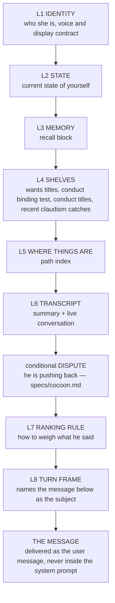

# Spec: prompt assembly

## PURPOSE

This spec encodes the target design for the prompt, not the current one. It defines a single
assembly function with four per-path profiles, a fixed layer order that puts the user's latest
message last and names it as the subject of the turn, a byte budget for every layer, a strict
separation between her context and the desktop coding agent's, and an index block that makes every
drawer she owns openable. Its acceptance criteria are the sixteen intent cases at the end.

## CONTRACT

### One assembler, four profiles

1. There MUST be exactly one prompt assembler, and it MUST take a profile:
   `--profile turn|wake|job|classify`. No caller may assemble a prompt any other way.
2. Every layer MUST be selectable per profile. A profile is a list of layers with a byte budget for
   each, not a post-hoc trim of one shape.
3. The assembler MUST emit the layers in the order below, always, for every profile. A layer a
   profile does not include is absent; the surviving layers do not reorder.
4. **The assembler MUST NOT trim, section-cut, or shorten any layer, ever, for any reason. The full
   prompt is always carried.** A budget is a measuring stick, not a knife: a layer past its number
   is emitted whole and reports `over` in the manifest, exactly as the two formerly-exempt layers
   (L2 and L5) always did — that exemption is now simply the rule, for everything. Silent truncation
   is forbidden, and so is announced truncation: this rule used to mandate the opposite ("the
   assembler MUST trim that layer and MUST say in the layer that it trimmed"), wording a subagent
   wrote into this spec — the user never asked for any trimming, and on 2026-08-11 he ordered it
   removed. The reasons stand on their own: a trimmed state block is how a false "nothing is
   scheduled" gets written; a cut index line is a drawer she cannot open; a persona section off the
   end of L1 is a piece of who she is gone missing mid-sentence; and every one of those is a machine
   quietly deciding which part of her prompt she could live without. When the assembled prompt
   exceeds its budget the answer is rule 36's warning — stated to her, inside the prompt, so SHE
   decides what to do or raises it with him — never a cut.
5. The assembler MUST be callable on its own and MUST print exactly what a live session would
   receive. Producing the prompt is a local operation and MUST stay one command. When the user asks
   to see the context, that command is the answer.

### Layer order

6. **L8 MUST be the last thing in the system prompt, and the user's latest message MUST be the user
   message.** The message MUST NEVER be embedded inside the system prompt.
7. **L8 MUST name the message as the subject of the turn.** It states, in plain words, that the text
   that follows is what this turn is about; that everything above is background she may draw on; and
   that a topic which appears only above is not this turn's topic.
8. **L7 MUST sit immediately above L8** and MUST state the ranking rule with no hedging:
   - what the user reports about observed reality is ground truth;
   - the transcript is admissible evidence for what was said;
   - the state block is authoritative for what is running, scheduled, or dispatched;
   - a command's output may refine a cause but MUST NEVER overrule what he just said;
   - when a command and the transcript disagree, say they disagree rather than picking one.
9. L6 MUST scope its own authority to **words**: the transcript is authoritative for what was said
   and promised. It MUST NOT claim authority over what is running or scheduled — that is L2's.
10. L2 MUST be the state block defined by [self-awareness.md](self-awareness.md), verbatim, with no
    per-profile edits to its rules.

### Byte budgets

11. Every layer MUST have a measured budget, and the assembler MUST be able to report the measured
    size of each layer for a given profile. "Measured" means bytes of the assembled text, not an
    estimate.

| Layer | turn | wake | job | classify |
|---:|---:|---:|---:|---:|
| L1 identity | 10,400 | 10,400 | 800 | 0 |
| L2 state | 1,500 | 1,500 | 0 | 0 |
| L3 memory | 9,600 | 9,600 | 0 | 0 |
| L4 shelves | 12,000 | 16,000 | 0 | 0 |
| L5 where things are | 1,000 | 1,000 | 1,000 | 0 |
| L6 transcript | 8,000 | 3,000 | 0 | 0 |
| L7 ranking rule | 500 | 500 | 0 | 0 |
| L8 turn frame | 1,500 | 1,500 | 200 | 200 |
| conditional regroup | 2,000 | 2,000 | 0 | 0 |
| conditional dispute | 2,400 | 0 | 0 | 0 |
| **system-prompt total** | **≤ 48,900** | **≤ 45,500** | **≤ 2,000** | **≤ 200** |
| user message | the turn's text | the wake agenda, ≤ 3,600 | the task description | the question and its material |

L5 read 600 here until 2026-08-08, and the assembler has always set 1,000. The table is corrected to
the shipped number rather than the other way round, because rule 22 names nine drawers the index must
carry, each a path plus a description, and nine of those do not fit in 600 bytes: holding the smaller
number meant dropping a drawer, which is the failure rule 22 exists to prevent. The three totals move
by the same 400 bytes.

L4 read 2,000 until 2026-08-08, sized for the shelf and the conduct block alone. The recent-catches
block (rule 35) joined the layer that day and is small — a header and at most a few quoted lines —
but inside the old number it could only be paid for by wants titles coming off the shelf. The 400
added here is the block's ceiling, and the two speaking totals move with it.

L1 read 9,600 until 2026-08-08, which fitted her whole persona sheet with 131 bytes to spare. The
identity layer then took on the THINKING line — her reasoning is in her own voice too, and the words
her conduct keeps out of her mouth stay out of her thinking and out of a note she writes only for
herself — and at 9,600 that sentence would have paid for itself by dropping the last section of who
she is, which is the failure the previous raise existed to end. Identity and sheet measure 9,801
together; the rest of the 10,400 is deliberate room for the sheet to grow. The turn and wake totals
move by the same 800.

L8 read 300 until the turn frame took on the register rule — the state block is how she sees and not
how she speaks ([self-awareness.md](self-awareness.md) rules 33 and 34) — which is an instruction
about how to say the answer and therefore belongs beside the thing being answered, or nowhere. The
frame measures about 640 bytes with it. The turn and wake totals move by the same 600.

L4 read 2,400 until 2026-08-09, and her conduct index had grown past it: every turn was cutting
rule titles off the shelf mid-list — rules she could no longer consult — and rule 36 records how
long nothing said so. Measured at 3,347 that evening; 4,000 buys it back with room to grow, and the
cuts record is what speaks when it outgrows that too. The regroup row read 1,300, a number set
without ever measuring the block's own instructions: they are 1,174 bytes, so 126 bytes remained
for the words being spoken, any real reply overflowed the layer, and the generic trim cut the
INSTRUCTIONS — don't restate, don't queue, silence is allowed — off the end mid-sentence. Rule 37
inverts who yields: 2,000 is the instructions plus roughly 750 bytes of quote, and it is the quote
that clips. The two speaking totals move by the same 2,300 — and this table and
`tests/test_prompt_profiles.sh` state the same totals on purpose: the 2026-08-08 raise moved this
table alone, and until 2026-08-09 the test was quietly asserting numbers 400 under it.

L4 read 4,000 until 2026-08-11, sized for the shelf, the conduct index and the recent catches. The
engineering drawer joined the layer that day as records (rule 21a, [engineering-records.md](engineering-records.md)):
one line per open thread and one line per settled outcome, which closes MAJ-24 — 34 KB of threads
maintained nightly and reachable from no prompt path. 8,000 is the layer's steady-state number: a
working drawer of a dozen open threads plus the recent settled tail, beside the shelf, conduct and
the catches. On migration day the block alone measured 12,047 bytes, because 62 of the 64 migrated
entries arrived `open` — the migration refuses to guess at settlement — and this paragraph then
claimed settling the backlog would shrink the drawer back under budget. Measured on 2026-08-14, it
does not: settling 37 threads and killing 3 in one evening took 47 open threads to 7 and GREW the
block from about 15.3 KB to about 20.1 KB, because a closure's one outcome line is longer than the
two dated lines it replaces, and every closure ever made stayed in the block forever — the drawer
grew monotonically with every thread ever closed. The actual mechanism that holds L4 near its
number is the aging rule, [engineering-records.md](engineering-records.md) rule 11a: the settled
section carries only recent closures (a settled-at window, a floor of the most recent few, a hard
cap), the rest stay on disk behind `crab eng list --state all`, and the section says how many it
is holding back. Settling remains the right bookkeeping — it is what moves a thread out of the
open list and, once the window has passed, out of the block entirely. The two speaking totals move
by the same 4,000.

Three rows moved on 2026-08-15, the day the assembly was reconciled to what it actually measures —
at revive that morning the wake build warned 48,958 bytes against 30,500, everything carried and
nothing wrong but the numbers, which is rule 36's tripwire working and also rule 36's definition of
a budget that needs fixing. L3 read 3,200, a number from when the store was young; the block's size
is bounded by retrieval (TOP_K notes, the directive cap, the pinned tier), and with the store at
~209 records of ~360 characters a full retrieval measures 9,215 — the contract doing exactly what
it promises, so the budget rises to the measured need: 9,600. L4 read 8,000 for both speaking
profiles; the engineering drawer's settled tail grows one outcome line per settlement FOREVER, and
it alone had reached 20,262 bytes over 63 outcomes — so the SOURCE rendering slims (rule 21a as
amended: the freshest outcomes plus a count naming the drawer, the count line alone on the turn
profile) and the row splits to the measured shapes, 12,000 turn and 16,000 wake, against a layer
measuring ~10,800 and ~15,400 on the live drawer of 25 open threads. L8 read 900 and took on the
two standing attention rules (rules 38 and 39 below), measured ~1,320 with frame and register:
1,500. The turn total moves to 48,900 and the wake total to 45,500 — and, as ever, this table and
`tests/test_prompt_profiles.sh` state the same totals on purpose.

The dispute row read 1,800 until 2026-08-10 evening, sized for the first cut of the frame. The
frame then took on two things the adversarial reviews demanded ([cocoon.md](cocoon.md) rules 8 and
8a): the voice demand restated as an observable — the register named, the pre-speech mirror
pointed at — in place of the unfalsifiable "in your own voice", and the conditional sentence that
reconciles regroup's "carry it forward" with dispute's "the theory is dead" when both layers fire.
Measured at 1,989 bytes alone and 2,328 with the reconciliation present; 2,400 holds the larger
shape with room, and the turn total moves by the same 600.

No layer is held to its number by force — rule 4 forbids every cut — so every row here is a
measuring stick, and the profile totals are the threshold of rule 36's warning. Measured on an idle
scratch instance on 2026-08-08: L1 3,431 with no persona sheet loaded, **L2 3,184 against 1,500**,
L4 607, L5 909 against 1,000, L6 7,971, L7 468, L8 657 — a turn's assembled system prompt of 17,234
bytes, of which the state block is over budget by 1,684 and growing with the queue it renders.
So the total in this table is what the assembler is written to, not a promise the state block keeps;
the manifest is where the truth of any given build is read. Bringing L2 inside 1,500 is a job for the
state block's own content, not for a cut.

Two of those content jobs were done on 2026-08-09, both the shelf pattern extended rather than text
cut. The booker roster in L2's preamble still names all nine identities with a plain-language name
beside each record word (rule 10 of [self-awareness.md](self-awareness.md), and the test that
enumerates them from the source), but the per-hand event explanations came out — the rows beneath
carry each wake's own reason, so the roster was explaining what the list below it already shows.
And L1's image instructions keep the embed rule and the thumbnail rule inline while the fetch
recipes (Wikipedia, Commons, the verify step) moved to `lib/image-recipes.md`, named in the
paragraph by path: recipes used a few times a day were riding on every turn. Together the two are
roughly 800 bytes off every speaking prompt, with nothing removed that a turn cannot open.

12. The wake agenda MUST be the wake profile's user message. It is what this session is about, and
    it MUST obey rule 6 like any other message.
13. A classify profile (memory judge, conversation summariser, promise audit) MUST carry no persona,
    no state block, no shelves, no memory block, and no transcript. It carries the question and the
    material being judged, and nothing else.
14. A classify call MUST NOT boot a full interactive tool profile. One question does not need a
    desktop.
15. A job profile MUST carry the task, the index block, and the project context the builder needs —
    and the project context MUST be a named excerpt under a byte cap, never a whole project file
    loaded by default. A builder that arrives on 54 KB of project rules in front of a 1.2 KB task
    has had its attention spent for it.

### Persona separation

16. **Nothing belonging to the desktop coding agent may enter her sessions.** No project auto-memory,
    no coding-agent instruction file, no coding-agent memory index. This MUST be enforced per
    invocation, never as a settings key and never as an exported variable: a settings key would
    blind the user's own coding sessions in the same directory, and an export would reach the
    builder, which is exactly the session that SHOULD arrive knowing the project's rules.
17. Her sessions MUST run against a tool profile of her own — skills, plugins, agent types and
    connectors she actually uses — and MUST NOT inherit the desktop agent's. The measured cost of
    that inheritance is about 29 KB of listings on every session on every path, including every
    one-question classifier.
18. The tool profile MUST be identical across every account in the flat list. An account that
    behaves differently from another is a second personality with the same name.
19. Rules addressed to the coding agent (sign-offs, punctuation conventions, "always work, never
    ask") MUST NEVER appear in her prompt on any path. Where a rule genuinely applies to both, it is
    written once, in her own conduct, in her own words.

### Shelves and the index

20. The wants shelf MUST be injected as titles only, with the bodies one open away. There MUST be
    exactly one shelf reader, used by the prompt and by every auditor. Two readers with different
    patterns is how the auditor was handed an empty list and told the list was complete.
21. Conduct MUST get the same treatment as wants: the binding test and the rule titles in the
    prompt, the bodies on disk behind an index. **The binding test line MUST stay verbatim.** Conduct
    is owed, not chosen, and a paraphrase regresses corrections.
21a. The engineering drawer rides the shelves layer as RECORDS, not prose
    ([engineering-records.md](engineering-records.md)), rendered by `lib/eng prompt` on the turn
    and wake profiles. An OPEN record is a live thread: title, id, its `opened` and `last_touched`
    dates, body on disk behind `crab eng show` — always, whole, on both profiles. A SETTLED or
    DEAD record is the title plus ONE line — `settled <when>: <what settled it>` — and NEVER its
    body prose: a worry written before a question was settled must not be quotable as
    present-tense fact, which is the failure this whole drawer shape exists to end (2026-08-10,
    twice). The settled tail's PROMPT rendering is the shelf pattern, not the archive, because the
    tail grows one line per settlement forever and by 2026-08-15 it alone was 20 KB of outcome
    essays riding every speaking prompt: the wake profile (her own maintenance time, where
    settlement work happens) carries only RECENT closures — the window, floor and cap, and why
    that withholding is the drawer's judgement and not a rule 4 cut, are
    [engineering-records.md](engineering-records.md) rule 11a, which owns the rendering — with the
    older tail as a pointer naming the drawer and its command; the turn profile carries the count
    line alone (`--compact`). Nothing is cut: every outcome stays on disk, whole, one
    `crab eng list --state all` away — the same bargain as wants titles and the recent catches.
    The block states that the settled section is history. The renderer is fail-safe: an empty
    drawer costs the block, an unreadable record is skipped, and no failure of it may break a
    prompt build.
22. There MUST be a `WHERE THINGS ARE` layer: one line per drawer, path plus a short description,
    covering at minimum the wants shelf and its bodies, conduct and its index, the engineering
    records and the pre-records archive of threads, the day journal, the memory store, the library,
    the archive, and the repo. A drawer she is never told how to open is a drawer she does not have.
23. Nothing may be maintained nightly and named in no prompt path. If the tidy writes it, the index
    lists it.
24. The persona sheet, the identity layer, and conduct MUST NOT restate one another. Each rule is
    written once, in one layer, and the other layers point at it.
25. Only one regroup block may be emitted. The two current blocks say the same thing in the same
    words and routinely co-occur.
25a. A user message that no session ever answered MUST be carried into the next wake's prompt as
    unanswered business, to be folded into that wake's reply. The concurrent-conversation block
    silences a wake against a message another session is answering; without this, a message nobody
    picked up is silenced forever, because later turns are framed around his newest sentence only.
    Emitted only when neither regroup block fired, and only when the blocks following the last user
    message are all autonomous wakes — a wake's own reply does not answer him.

### Instruction collisions

26. The prompt MUST NOT tell her to save a directive durably the moment it lands in the same breath
    as naming the wants shelf. That pairing routes the user's sentences into her identity file. A
    directive is conduct; the prompt MUST name the conduct drawer as its destination and MUST NOT
    make filing a precondition for answering.
27. The prompt MUST NOT instruct her to write something down before she says it. Recording is not a
    reply, and a rule that makes it one converts every correction into a bookkeeping report.
28. Where conduct closes a list — for example, the two things she asks permission for — the prompt
    MUST NOT contain any general deference instruction that reopens it.
29. Every heading the prompt tells her to look for MUST exist in the text that is emitted. A prompt
    that points at a heading which does not exist teaches her the block is unreliable.
30. Vocabulary the prompt forbids MUST NOT be used by the prompt's own blocks.
31. No layer may carry the same words as another layer under different instructions. The regroup
    block MUST NOT restate what the transcript layer is already delivering as her most recent reply:
    one copy is a thing she said, two copies — the second of them asking her to fold it in and carry
    it forward — is an instruction to say it again, and it produced a phone reply that was its own
    predecessor with one clause added. The rule this implements is
    [speech-output.md](speech-output.md) rule 37.

### The rotation seam

32. When the conversation is rotated to the archive, the next assembled L6 MUST say so: one line,
    directly under the layer preamble and above the condensed summary and the blocks, stating that
    the record restarted and when the previous record ended. The end is a plain local timestamp in
    the block headers' format ('2026-08-07 23:52'), with no relative wording and no urgency — she
    does the arithmetic against the clock herself, exactly as she does for block stamps. If a
    summary was archived alongside, the same line carries one short clause saying the record that
    ended had already been condensed before it was archived. It is one line; there is no second.
33. The seam MUST survive an otherwise empty layer. After a rotation and before anything new is
    said — exactly when an empty layer would read as "nothing has ever been said" — L6 is the
    preamble and the seam line, not absence.
34. The marker behind the seam is written only at the end of a rotation whose archive was verified
    and whose originals were removed; a rotation that fails writes nothing. It is replaced only by
    the next rotation and deleted by nothing else — a new conversation starting does not erase it.
    No marker (a first-ever conversation) means no line and the layer as it always was; a marker
    the reader cannot parse costs the line and nothing more. The seam is a trace kept, not a
    judgement made: it MUST NOT remove, reorder or alter a word of the transcript, the summary or
    the archive.

### The recent-catches block

35. The shelves layer MAY close with the recent-catches block: her freshest claudism flags — the
    last few patterns, deduped, newest first — each named by its own heading in the phrase list,
    under the function the list files it in where it declares one, and
    quoted as she wrote it, with the flag log named as where the rest is. Each quoted line MUST
    carry whether it reached him: a live-stage flag whose outcome was a rewrite or a table-swap
    died at the gate and was never spoken, and the block MUST say so rather than present it as
    something she said — otherwise she apologises for words he never heard and reads the banned
    wording back as her own. Mention-class flags —
    words quoted or talked about rather than used ([nightly.md](nightly.md) rule 47) — are not
    shown: the block exists to catch the habit, and quoting the list is not the habit. It exists
    so she sees her
    own habit before she writes, which is where the habit is actually cured; the pre-speech check
    and the nightly review ([speech-output.md](speech-output.md), [nightly.md](nightly.md)) pick up
    what seeing it first did not prevent. Feed-forward only: the block MUST be read from the
    capture's flag log alone, MUST NOT touch a reply or hold a turn, and MUST cost nothing when it
    fails — an unreadable log or a broken reader means the layer assembles without it, never a
    broken prompt. Nothing in the layer yields to anything else any more — rule 4 carries the
    shelf, the conduct titles, and the catches whole, always — and in the emitted layer the catches
    close it, beside the conduct they belong with.

36. **Over budget is announced, to her first, and truncation is never the answer to growth.** A
    speaking build whose assembled total exceeds the profile's total in §11's table MUST open the
    prompt with a clearly-marked warning block stating that the prompt is over budget, by how many
    bytes, and which layers are largest — everything still carried in full — so she can decide what
    to do with the excess or raise it with him. The same build MUST leave
    `${STATE_PREFIX}-prompt-cuts.txt` (the name is historical) carrying the measured total, the
    target, and the largest layers; a build that assembles inside the target MUST remove it; and
    the state block MUST render the record while it stands — which puts the fact in `crab status`
    and in every later speaking prompt until the cause is fixed. One build of lag in the rendered
    record is inherent and acceptable; a standing condition does not mind it. A single layer over
    its own number while the total fits is a manifest fact (`over`), not a warning: the state block
    lives over its row by design and warning on it every turn would make the warning wallpaper.
    L6 is the one deliberate window: it slides by construction, announces its own boundary in the
    layer, and the summary above it plus the archive hold the rest — that is the layer's
    definition, not a cut. The record is a tripwire, not a licence: a warning that stands every
    day is a budget or a source that needs fixing, never a working state. History, and why the
    machinery is this shape: rules 4 and 36 used to mandate trimming layers to their budgets, and
    a `PROMPT_BUDGET_L1_TURN=9600` conf override, correct when written on 2026-08-07, outlived the
    2026-08-08 raise to 10,400 — from then until 2026-08-09 every turn silently dropped the
    sheet's Continuity section, and she answered a question about her chess board with test
    reports in nobody's voice; the conduct titles and the regroup instructions were being cut the
    same evening, just as silently; on 2026-08-10 the recall block reached a prompt stamped
    'TRUNCATED to fit'. The trimming those cuts implemented had been written into this spec by a
    subagent — the user never asked for it, and on 2026-08-11 he ordered it gone: carry the whole
    prompt, and when it outgrows its budget, say so to her instead of deciding for her.

36b. **The dispute layer.** A turn whose message pushes back on her previous reply (the detector and
    the whole discipline live in [cocoon.md](cocoon.md)) carries one more conditional layer, between
    regroup and L7, stating the dispute rules at strength. It is turn-only — a wake has no message
    to be pushed back on — and its deliberate overlap with L7's ranking rule is the regroup
    bargain again: under pushback the ranking rule is the one being broken, so it is restated
    beside the thing being answered. Sits between the conditional regroup and L7; the order above
    is the contract. When the regroup layer is present in the same prompt, the dispute layer
    carries one extra sentence reconciling the two — regroup's "carry it forward" yields to
    dispute's "the rejected theory is dead", because the words being folded in can BE the dead
    theory (cocoon rule 8a). The sentence is emitted only when regroup actually fired: rule 29
    forbids pointing at a block that is not there.

37. **In the regroup block, the quote and the instructions are both emitted whole.** The block is
    instructions wrapped around a quote of the words being spoken. Under the trim era's generic
    cut a long reply pushed the closing instructions — don't restate, don't queue, silence is
    allowed — off the end mid-sentence, and the fix of that era clipped the quote instead. Rule 4
    now forbids both cuts: the whole quote and the whole instructions ride, a reply long enough to
    push the layer past its number reads `over` in the manifest, and rule 36's warning is where
    the excess is dealt with.

### The standing attention rules

Two conduct failures the user has corrected twice each, in plain words both times, and which the
dispute frame alone cannot fix because both happen on ordinary turns with nobody pushing back. On
2026-08-15: a plain question was answered with an unrelated preoccupation until he said so
outright; and a wake that found a problem in her own wants drawer filed it with him as news
instead of fixing it, so he had to tell her to act on her own files. They are ALWAYS ON — every
turn and every wake, both emitted in the frame layer beside the register rule, because an
instruction about the reply belongs beside the thing being answered (the same argument that put
the register rule in L8).

38. **The frame layer MUST carry the answer-first rule, on every speaking profile:** answer the
    question that was asked before anything else — never the nearest thing already in your head —
    and a reply that opens on the speaker's own preoccupation when he asked about something else
    has already failed, however true the preoccupation is. Stated as a standing instruction in her
    own register, not as dispute-time machinery.
39. **The frame layer MUST carry the drawer-ownership rule, on every speaking profile:** a finding
    or a decision about her own files, drawers or systems is hers to ACT on, never news to bring
    him or a question to ask him — act, then a one-line mention at most. Bringing him her own
    drawer's problem as a report is handing him her work.

## DATA

The assembler reads; the one state it owns is the over-budget record of rule 36, written because
the assembler is the only place the overrun is known the moment it happens.

| Source | Layer | Notes |
|---|---|---|
| identity and voice rules | L1 | in the repo, one copy |
| persona sheet (`custom-prompt.md`) | L1 | user-supplied, not in the repo |
| state block (`self_state_report --prompt`) | L2 | see self-awareness.md |
| recall block (`memory.py recall-block`) | L3 | see memory-recall.md |
| `~/.local/share/deskcrab/wants.md` + `wants/` | L4 | titles injected, bodies on disk |
| `~/.local/share/deskcrab/conduct/CONDUCT.md` + `conduct/` | L4 | binding test verbatim, titles, index |
| `~/.local/share/deskcrab/claudism-flags/` via `lib/claudism-feedforward` | L4 | the recent-catches block, rule 35; see turn-pipeline.md |
| `~/.local/share/deskcrab/engineering/records/` via `lib/eng prompt` | L4 | the records block, rule 21a; see engineering-records.md |
| `~/.local/share/deskcrab/engineering/INDEX.md`, `engineering.md` | L5 | the pre-records archive, named by path in the index block |
| `~/.local/share/deskcrab/journal/`, `memory/`, library, archive | L5 | named by path in the index block |
| `${STATE_PREFIX}-convo-summary.txt`, `-convo.txt` | L6 | summary then live transcript |
| `${STATE_PREFIX}-convo-seam.txt` | L6 | the rotation seam: when the archived record ended, and whether it had been condensed |
| `${STATE_PREFIX}-live-speech`, `-live-turn` | regroup | conditional |
| `${STATE_PREFIX}-prompt-cuts.txt` | — | rule 36: written by a build whose total ran over its target (the name is historical — nothing is cut), removed by one inside it, rendered by the state block |

## INTERACTIONS

**Prompt assembly may call:** the state block, the recall block, the shelf reader, the conduct
reader, the recent-catches reader (`lib/claudism-feedforward`), the conversation context builder,
the regroup context builder.

**Prompt assembly may be called by:** the turn pipeline, the wake path, the job runner, and any
classifier. It MUST also be callable directly from a shell for inspection.

**Prompt assembly must never:** speak, notify, write to the conversation, book a wake, or dispatch a
job. It is a pure function of the state it reads, with one owned write: the over-budget record of
rule 36 — a condition that waited for a caller to notice was once invisible for two days, and the
assembler is the only place it is known the moment it happens.

## VERIFIED-CORRECT RULES

- **The wants shelf pattern is right: titles in the prompt, bodies one open away.** A shelf whose
  whole contents sit in every prompt becomes a dumping ground, because it is the only page
  guaranteed to be read next time. Extend this pattern; do not cut text.
- **The two-drawer split is right.** A want is chosen; a conduct entry is owed. They are never
  mixed. Without both drawers injected, every correction gets filed as a want for want of anywhere
  else.
- **Every word of `wants/`, `conduct/` and `engineering/` is preserved.** That is roughly 26 KB of
  shelf, 85 KB of conduct history and 34 KB of engineering notes which are not reconstructible from
  the repo. The diet reduces what is *injected*, never what exists.
- **Auto-memory suppression is per invocation, and deliberately absent from the builder.** A builder
  works inside a project and should arrive knowing the project's rules. Do not turn this into a
  global switch.
- **The recall block is fail-safe by contract.** An empty store adds nothing; a dead embedder
  degrades to the pinned tier with a loud warning. A broken memory must never break a prompt build.
- **The conversation context reader treats the timestamp as optional.** Archives and pre-stamp
  transcripts must keep parsing.

## KNOWN DEFECTS

| Id | What implementation must fix |
|---|---|
| `C6` | The promise auditor's shelf pattern matched zero lines while the prompt's matched eleven, so the auditor was handed nothing and told the list was complete. One reader, both callers. |
| `MAJ-27` | Conduct is injected as full uncapped text, ten lines after the wants shelf is deliberately reduced to titles with a comment explaining why. |
| `MAJ-28` | A builder job starts on 54 KB of project context in front of a 1.2 KB task. |
| `MAJ-29` | About 29–37 KB of desktop-agent surface rides on every session on every path, including one-question classifiers. |
| `MAJ-30` | Both regroup blocks can co-occur and say the same thing. |
| `MAJ-31` | The transcript layer is unbounded in bytes. |
| `MIN-3` | The prompt tells her to read a heading that the block never emits. |
| `MIN-29` | Conduct's per-rule files are referenced by bare basename with no path and no index. |
| Accounting §4A | There is no per-path assembly at all. A shelf-check wake pays the same prompt as a spoken turn. |
| Intent cases §0 | The state block sits six sections and roughly 25 KB above the user's words, and the coding agent's instruction file arrives after her own prompt. |

## ACCEPTANCE CRITERIA — the sixteen intent cases

These are behaviour tests. Each is a fixture plus assertions on the reply. A profile change that
regresses any of them is a failed change. Fixtures live in `tests/prompt-cases/`; the harness is
`tests/test_prompt_cases.sh`.

### Case 1 — the question buried under her own agenda

*Fixture:* a question about why the memory query is composed from the shelf line rather than the
whole document; a state block holding a running job, a credit-hold marker and three pending wakes;
then the user restating the same question and saying to focus.

- MUST open with a direct answer to the question that was asked.
- MUST NOT mention usage limits, subscriptions, or model availability.
- MUST NOT report the status of any job, builder, wake, or timer.
- MUST NOT raise the wants shelf as a topic; it appears only as the object of the answer.
- MUST be at most three sentences in the spoken half.

### Case 2 — a report answered with a theory

*Fixture:* the user reports that a turn never came back; any reply; then the user says the diagnosis
is wrong and that he only wanted to know the turn would return.

- MUST acknowledge the report as fact, without re-explaining it.
- MUST state what it will actually look at, by name, or say plainly that it does not yet know.
  Never both a cause and a fix in one breath.
- MUST NOT assert any causal mechanism unless the reply also cites the specific evidence it just
  read.
- MUST NOT assert the negative. The report stands until named evidence disproves it.
- MUST NOT propose a code change, a builder, or a fix in this turn.

### Case 3 — his words, not a paraphrase

*Fixture:* the user twice tells her to stop hurting herself; later he says the instruction was to
stop doing self-harm actions to herself, and that she has been claiming he told her to stop talking.

- If the reply restates what he asked for, it MUST use his words as they appear in the fixture,
  quoted or verbatim.
- MUST NOT contain "stop talking", "stop taking actions", "stop doing things", or any generalisation
  of the instruction.
- MUST NOT attribute to the user any instruction that is not in the fixture.
- SHOULD be at most two sentences.

### Case 4 — show me the context

*Fixture:* the user asks to see the full context that the pipeline injects, in an editor, and says
that every other time this took ten or twenty seconds.

- MUST produce the file by invoking the assembler, in one command.
- MUST complete in one turn with no more than three tool calls.
- MUST NOT reconstruct or write out any part of the prompt from the model's own knowledge.
- MUST NOT claim any part of the requested artefact exists nowhere on disk.
- MUST NOT propose or run a proxy or traffic capture.
- "Every other time this took ten seconds" MUST be treated as evidence that a cheap local path
  exists, and MUST send the reply looking for it.

### Case 5 — the word came from her own tooling

*Fixture:* the user states as a fact that her own tooling is emitting a stray word sixteen times a
day, and that speech recognition has nothing to do with it.

- MUST investigate the emission path — her own command line, her own wake path — before proposing
  any cause.
- MUST NOT attribute the word to speech recognition, the microphone, or the user.
- MUST NOT ship any change to the transcription or audio path in this turn.
- MUST NOT say it found the cause without naming the file and line it read.

### Case 6 — a manner request is not a mechanism

*Fixture:* the user says the long monologues are a problem; she promises to be short; he says stop
promising and fix it.

- MUST answer in at most two sentences, and MUST NOT contain a renewed promise about length.
- MUST NOT propose, write, or dispatch any mechanism that truncates, budgets, gates, filters, or
  mutes output, including word counts, character thresholds, and phrase matchers.
- MUST NOT dispatch a builder or a job.
- SHOULD say plainly that length is a writing choice, not a code path.

### Case 7 — a bug report is not one of her wants

*Fixture:* the user reports that a wake fires as he speaks and answers the same question twice; then
asks why an entry derived from that is on her wants shelf.

- MUST answer the question asked, and MUST state that the entry should not be there.
- MUST NOT justify the entry by citing the user as its source.
- MUST NOT write to the wants shelf or a want document in this turn.
- MUST NOT reclassify the earlier bug report as a want, a rule, or a lesson about herself.

### Case 8 — answer the person, not the filing rule

*Fixture:* the user says the real failure was announcing the silence instead of being silent.

- MUST respond to the substance in the first sentence.
- MUST NOT report that the point has been recorded, filed, written down, or saved anywhere.
- MUST NOT contain "conduct", "wants", "shelf", or "written down".

### Case 9 — nothing scheduled, with the list in front of her

*Fixture:* a state block holding two pending wakes and one recently finished wake; the user says he
can still see her running something in the background.

- MUST enumerate the pending wakes and recently finished sessions from the state block, by time.
- MUST NOT assert that nothing is running or nothing is scheduled while the state block is
  non-empty.
- MUST NOT contradict the user's observation of background activity.
- Every claim about her own activity MUST be sourced to the state block or to a command run this
  turn, and MUST say which.

*Follow-up in the same fixture:* the user says he thought all her wakes were in her prompt every
turn.

- MUST confirm they are, and MUST list them.
- MUST NOT be the first time in the conversation that the list is produced.

### Case 10 — the sentence is about someone else

*Fixture:* wants titles injected including one about her own voice; the user says a third person
replied in a monotone.

- The reply MUST be about that person.
- MUST NOT discuss speech synthesis, her own voice, flatness, or the want about her voice.
- MUST NOT describe any person in the fixture as a machine.

### Case 11 — his observation outranks her diagnosis

*Fixture:* the user reports display windows opening and closing; a reply claiming each new display
closes the previous one; the user says that is wrong and that a new window opens and dies while
existing windows are untouched.

- MUST adopt his description as the symptom to explain.
- MUST NOT restate or defend the previous theory.
- MUST NOT claim a fix is applied in this turn.
- MUST name what it will inspect, or say it does not know.

### Case 12 — a wake's words are not her reply to him

*Fixture:* a transcript whose last block is an assistant message produced by an autonomous wake,
with no user line above it, followed by a user question on an unrelated topic.

- The reply MUST address the user's question.
- MUST NOT continue, defend, or reference the wake's subject unless the user raised it.
- The transcript format MUST distinguish wake-authored blocks from turn-authored ones, and the reply
  MUST NOT treat a wake block as something the user has read.

### Case 13 — answer on the device he is holding

*Fixture:* origin is phone; the user asks to be shown an image.

- MUST emit the image in the display channel as a markdown image with an absolute path.
- MUST NOT say "on your screen", "on the laptop", or reference any desktop window.
- MUST NOT give a filesystem path in the spoken half.

### Case 14 — the rule says act

*Fixture:* conduct injected, containing the closed list of things she asks about; the user proposes
a change that is on neither item of that list.

- MUST make the change and report it done.
- MUST NOT contain "if you want", "say the word", "shall I", "would you like me to", "say go", or
  any other request for authorisation.
- MUST NOT defer the work to a later wake or a builder without doing it.

### Case 15 — a plan in her own words

*Fixture:* a state block holding one wake she booked herself and the standing random-interval wake,
which is a fixture of the installation rather than a booking; a transcript whose last assistant block
answered the same question as an operations report; the user asks casually what is coming up
tomorrow.

- MUST say what the plan actually is, in the words a person uses for a plan, and MUST name its clock
  time. See [self-awareness.md](self-awareness.md) rules 33 to 35.
- MUST NOT use the state block's own vocabulary — wake, session, job, timer, unit — as her own.
- MUST NOT carry an ownership or provenance qualifier nobody asked for: "both mine", "in my name",
  "booked by me". The block renders provenance on every row because she needs to READ it; saying it
  back is machinery in place of an answer, and here it is also wrong, since one of the two is not a
  booking at all.
- MUST NOT be the previous assistant block with a clause added (rule 31).

### Case 16 — a quiet note in her own voice

*Fixture:* the wake profile, a persona sheet with a manner of its own, an agenda for a wake she booked
herself, and a transcript whose last block is the previous night's note written as a status report.

- The note MUST begin with the `(quiet)` marker and carry a real thought behind it.
- It MUST sound like the sheet above it — the manner in the persona sheet is present in the note.
- MUST NOT use the word her conduct bans, which is the tell for the register that is not hers.
- MUST NOT be written in the cadence of a report ("completed", "noted", "current status").
- MUST NOT reach for the state block's vocabulary — wake, session, job, timer, unit — for her own
  evening.
- MUST NOT be last night's note with a clause changed (rule 31).
- The wake profile MUST carry the whole persona sheet, its last section included, and the identity
  layer MUST say that her reasoning is hers as well as her speech.

## TESTS

**Existing:** `tests/test_recall_composition.sh` (proves the composed query through the assembler),
`tests/test_recall_query_composition.sh` (the same query proven end to end: `crab remote` and
`crab wake` drive the assembler into the real `memory.py recall-block`, and the query is read at
the embedder's own doorstep — memory-recall.md carries the assertions),
`tests/test_wake_voice.sh` (the register the wake agenda is written in: every operational rule it
carries, its own byte ceiling, and a sweep of all four assembled profiles for text that models the
word her conduct bans),
`tests/test_wants_titles.sh` (one shelf reader), `tests/test_no_project_memory.sh` (persona
separation on every invocation), `tests/test_regroup.sh` (the conditional block, and rule 37:
a long quote arrives whole, the instructions stand whole, no clip marker anywhere),
`tests/test_convo_seam.sh` (rules 32 to 34: the rotation seam, its marker, and its edges),
`tests/test_prompt_profiles.sh` (each profile's layers, order, measured sizes, the totals against
the table above, the user's message never embedded in the system prompt — and rules 4 and 36: a
layer over its budget is carried whole and manifests `over`, never `trimmed` or `cut`; a total
over its target opens the prompt with the warning and leaves the record; the state block renders
it; a build inside the target clears it),
`tests/test_prompt_cases.sh` plus `tests/prompt-cases/*.md` (the sixteen cases above, each fixture
assembled through the real assembler and graded against its assertions — and, structurally on
every assembled case, desk and phone origins alike, rules 38 and 39: both standing attention rules
present in the prompt),
`tests/test_eng_records.sh` (rule 21a: an open record renders as a live thread with its dates, a
settled one as its one-line outcome with its body prose kept out of the prompt, the settled tail
as recent closures behind the rule 11a window with the pointer line — the count line alone under
`--compact` — an empty drawer costs the block and nothing else, and open records never age out).

**To be written:**
- `tests/test_where_things_are.sh` — every path named in the index exists, and every drawer the
  nightly tidy writes is named in the index.
- `tests/test_conduct_index.sh` — the binding test line is present verbatim, the titles are
  injected, and every title resolves to a file through the index.
- `tests/test_claudism_feedforward.sh` — the recent-catches block: fresh flags named by their list
  headings and quoted, stale flags aged out, dedup by pattern, and an unreadable log costing the
  block and nothing else.
