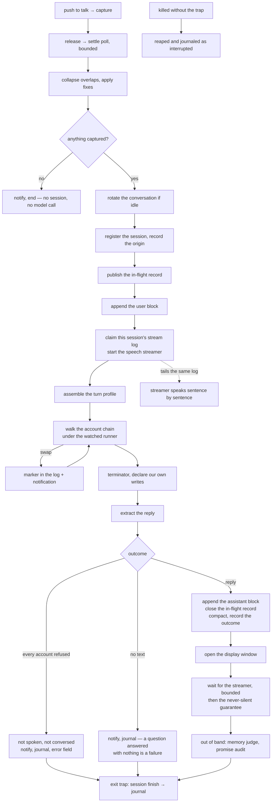

# Spec: turn pipeline

## PURPOSE

One interactive turn, from the moment the user speaks or types to the moment the reply has been
spoken, shown, recorded, and journaled. This spec owns the ordering of that pipeline and the
guarantees a turn makes to the person waiting for it. It covers the desk path and the phone path,
which share every stage except capture and delivery.

## CONTRACT

### Capture

1. `crab start` MUST stop any speech already playing before it opens the microphone.
2. `crab stop` MUST wait for the transcriber to settle before killing it, and MUST bound that wait.
   A transcriber that never settles MUST NOT hold the turn open indefinitely.
3. The captured text MUST pass through the overlap collapser and the configured transcription
   fixes, in that order, before anything else sees it.
4. An empty capture MUST end the turn with a notification and no session, no conversation write,
   and no model call.
5. The overlap collapser MUST NOT remove a phrase the user genuinely repeated. When it cannot tell
   a repeat from an overlap, it MUST keep both copies. Answering a question that was not asked is
   worse than answering one twice.
6. Any argument that is not a subcommand is a text query. A leading dash MUST be rejected as a
   mistyped flag and MUST NEVER reach the spoken channel. `help` and its variants MUST print usage
   and MUST NEVER become a turn.
7. The recorder pid file MUST be overridable per instance, so a scratch instance never reads the
   live desk's recording state.

### Turn ordering

8. A turn MUST register a session before it builds a prompt, and MUST record its origin device.
9. The user's words MUST be written to the conversation before generation starts, so a turn that
   dies mid-reply still leaves the question on the record.
10. The turn MUST publish an in-flight record (`live-turn`) naming the device and the user's text at
    turn start, and MUST close that record at turn end with the spoken reply.
11. The speech streamer MUST be started before the model runs, so speech begins when she starts
    talking rather than when she stops.
12. Generation MUST run under the account chain (see [account-fallback.md](account-fallback.md)) and
    MUST be bounded by a watchdog on every path. A desk or phone turn has someone waiting; an
    unbounded run is a defect, not a slow answer.
13. The stream log MUST be truncated exactly once per turn, at the start. Every retry APPENDS.
    Truncating for a retry strands the reader that is already tailing the file.
14. A "Thinking" style notification MUST be dismissed on every exit path, including the refusal
    path, the empty-reply path, and the watchdog-reap path.

### Delivery

15. A reply MUST be spoken, shown, appended to the conversation, and journaled — in that order of
    guarantee, not of timing. Speech may begin before the reply is complete; the conversation write
    happens once, after the reply text exists.
16. A turn that produced no text MUST report itself: a notification and a session outcome line. It
    MUST NEVER be silent in the way a wake is silent. Answering a question with nothing is a
    failure and is recorded as one.
17. A turn whose every account refused over a usage limit MUST NOT speak the refusal, MUST NOT
    append it to the conversation, and MUST surface it through the notification, the session
    outcome, and the phone's `error` field.
18. A CLI error text MUST NEVER be voiced in her own voice on any path.
19. The display window MUST open as soon as the display half is known, and MUST NOT wait for speech
    to finish.
20. Out-of-band work (memory judge, promise audit) MUST run after the user has their answer, MUST be
    detached, and MUST NOT hold any lock the turn held.
21. Every detached child MUST inherit the full set of instance redirects: config path, state prefix,
    memory directory, jobs directory, wakes directory, account default file, and the current
    login. A child that inherits some of them writes into the live instance from a scratch one.
22. The session's exit trap MUST journal the turn even when the turn was killed. A session killed
    without its trap MUST be reaped and journaled as interrupted, never allowed to vanish.

### Conversation store

23. `convo_append_user` and `convo_append_assistant` MUST be the only writers of a conversation
    block, and every block MUST carry the local time it was written.
24. Every reader MUST treat the timestamp as optional. Existing files and archives are unstamped,
    and a pattern that silently stops matching them loses turns without erroring.
25. Every writer, rotation, and compaction MUST hold the conversation lock.
26. Compaction MUST NOT hold the lock across the summarising model call.
27. Compaction MUST NEVER commit a summary that is a refusal. The limit signature MUST be applied to
    the committed text, not only to the retry decision. A refusal that lands in the summary destroys
    the folded blocks permanently.
28. The summariser MUST capture stderr. A refusal that arrives only on stderr must not break the
    walk.
29. Rotation MUST archive on inactivity, and the archived pair (transcript and summary) MUST move
    together.

## DATA

| Path | Owner | Format |
|---|---|---|
| `/tmp/deskcrab-whisper.txt` | capture | raw transcriber output, deleted after read |
| `${DESKCRAB_PIDFILE:-/tmp/deskcrab.pid}` | capture | recorder pid |
| `${STATE_PREFIX}-convo.txt` | conversation store | `User [YYYY-MM-DD HH:MM]: …` / `Assistant […]: …` blocks |
| `${STATE_PREFIX}-convo-summary.txt` | compaction | condensed prose, opens with its time span |
| `${STATE_PREFIX}-convo.lock` | all writers | flock |
| `${STATE_PREFIX}-debug-<pid>.log` | the turn | stream-json, one file per session |
| `${STATE_PREFIX}-debug.log` | `claim_debuglog` | symlink to the newest session log |
| `${STATE_PREFIX}-live-turn` | turn | `epoch \t device \t status \t user text \t reply` |
| `~/.local/share/deskcrab/sessions/<pid>` | session registry | `kind \t pid \t started \t epoch \t proc-start` |
| `~/.local/share/deskcrab/sessions/<pid>.claim` | `crab claim` | one line, advisory |
| `~/.local/share/deskcrab/sessions/<pid>.ckpt` | `crab checkpoint` | append-only, one line per checkpoint |
| `${STATE_PREFIX}-sessions.log` | `session_finish`, `session_reap` | append-only journal |
| `~/.local/share/deskcrab/journal/<date>.jsonl` | `day_journal_append` | one JSON object per finished turn |
| `~/.local/share/deskcrab/last-origin` | `record_origin` | `desk` or `phone`, durable |
| `voice-claude-archive/` | rotation | archived transcript and summary pairs |

## The pipeline

## INTERACTIONS

**The turn pipeline may call:** prompt assembly, the account chain, the speech streamer, the display
window spawner, the conversation store, the memory recall block, the memory judge, the promise
audit, the session registry, the day journal, the self-change write declaration.

**The turn pipeline may be called by:** the push-to-talk binding (`crab start` / `crab stop`), the
catch-all text query, `crab remote` (phone), and the phone server.

**It must not be called by:** the wake path. A wake has its own delivery rules
(see [wake-queue.md](wake-queue.md)) and shares only generation and the conversation store.

## VERIFIED-CORRECT RULES

- **A reply enters the conversation only if it was delivered.** The append happens at the end of the
  delivery section, past every gate. A session whose output was suppressed leaves the conversation
  exactly as it found it, and its words survive in the session journal. The phone follows the
  conversation file, so an append before the gates posts a monologue into the user's chat that he
  did not ask for and cannot answer.
- **One stream log per session, with a symlink for "whatever is talking now".** A shared log meant a
  desk turn starting mid-wake truncated the wake's output, a wake starting mid-turn wiped the desk's
  reply before it was read, and whichever read second read both streams as one.
- **No process-wide kill of "any prior streamer" when a turn starts.** That existed only because the
  log was shared. With a log per session it silences another turn's reply mid-sentence.
- **Conversation stamps are read with the stamp optional, using bracket character classes, not
  backslash escapes.** The pattern is handed to awk as a dynamic regex as well as to grep. Escaped
  brackets are stripped back by awk and the stamp group silently stops matching, which makes
  compaction fold the whole conversation in one pass instead of the oldest half.
- **Compaction takes the lock twice and drops the oldest lines on the second pass**, rather than
  swapping in a file captured before the model call. Appends only ever go to the end, so those first
  lines are still the block that was summarised, and turns that landed meanwhile survive.
- **The registry and the journal are both needed and they fail differently.** The registry alone
  lets a session conclude no work is in progress moments after an earlier session finished the work
  and exited.
- **Registry entries carry the pid and its process start time**, so a recycled pid cannot keep a
  dead session looking alive.
- **Regrouping is evidence, not a mute.** A session that starts while another of her voices has the
  floor is shown what is being said and asked to fold both into one reply. Nothing reads that record
  to decide whether a reply may be spoken.
- **"The user is busy" means the user, never another of her own sessions.** That test used to count
  her own voice, and it is exactly how a wake beside a desk reply lost its whole output.

## KNOWN DEFECTS

| Id | What implementation must fix |
|---|---|
| `H3` / `RC-1` | The interactive and phone generation path has no stall watchdog while the wake path does. The desk turn's only bound sits downstream of an unbounded loop. |
| `H3` / `RC-4` | Nothing the turn writes records that the chain was walked. The session outcome records only what was asked and replied. |
| `MAJ-10` | Compaction can overwrite the summary with a refusal and drop the folded blocks permanently. The limit signature is never applied to a zero-exit run. |
| `MAJ-31` | The conversation block is bounded in turn count only, never in bytes. Archives have been measured at 29,936 bytes. |
| `MIN-2` | The recorder pid file is read by the library but defined only in the entry script, so anything else sourcing the library gets an unset variable. |
| `MIN-13` | The no-reply branch never waits for the streamer or verifies the receipt, orphaning the streamer and leaving stale receipt files a recycled pid can misread as this turn's evidence. |
| `MIN-17` | The overlap collapser can swallow a genuinely repeated phrase; it tolerates a quarter of the words mismatching and caps its hypothesis at thirty words. |
| Recommendation §4.2 | The "Thinking" notification is dismissed only after generation returns, so a stalled turn leaves it stuck on screen. |
| Recommendation §4.6 | Detached children do not inherit the current login, so they always fire at the ambient account and fail quietly. |

## TESTS

**Existing:** `tests/test_convo_compaction.sh`, `tests/test_convo_stamps.sh`,
`tests/test_regroup.sh`, `tests/test_silent_wake.sh`, `tests/test_turn_reinforce.sh`,
`tests/test_no_project_memory.sh`.

**To be written:**

- `tests/test_capture.sh` — the whole input half, with the transcriber and the recorder stubbed:
  the settle poll and its bound, the fixes, the empty-capture exit, the leading-dash rejection, the
  repeated-phrase case for the overlap collapser.
- `tests/test_turn_delivery.sh` — the three delivery branches (reply, no reply, every account
  refused), each asserting what was spoken, what entered the conversation, what was journaled, and
  that the notification was dismissed.
- `tests/test_convo_compaction.sh` — extend with a refusal-shaped summariser reply and assert the
  summary is unchanged and the blocks survive (`MAJ-10`), and with a byte cap case (`MAJ-31`).
- `tests/test_child_env.sh` — every detached child inherits every instance redirect and the current
  login.
