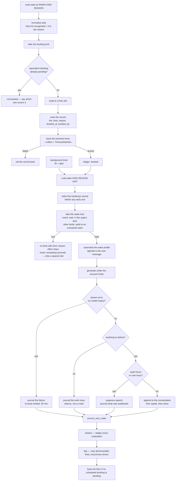

# Spec: wake queue

## PURPOSE

Autonomous wakes are how she works unattended: a booking record, a transient timer, a session with
its own agenda, and a chain that keeps going. This spec owns booking, cancellation, restoration,
tidying, and the discipline that keeps one queue from becoming a storm. Her autonomy is not in scope
for reduction here — every rule below makes the queue **visible and bounded**, never smaller.

## CONTRACT

### The wake queue is a module

1. There MUST be exactly one module that touches the wakes directory and the systemd user manager
   for wake units. It exposes `list()`, `book()`, `cancel()`, `restore()`, and `tidy()`.
2. No other code may read the wakes directory, mint a unit name, call `systemd-run` for a wake, or
   stop a wake timer. Every booker goes through `book()`.
3. `list()` MUST enumerate the records and join timers onto them, never the reverse. See
   [self-awareness.md](self-awareness.md) rules 1 to 4.
3a. A transient timer whose SERVICE is active or activating is a wake firing right now — it
   retired its own record first thing (rule 19) — and `list()` MUST skip it exactly as tidy and
   restore do (rules 31 and 36), never report it as a timer with no booking record. The running
   session is already visible in the session registry. On 2026-08-10 every fired event wake spent
   up to `WAKE_EVENT_LOCK_WAIT` at the run lock with its record correctly retired, and the state
   block rendered each of them as an orphan: three to six "timers with no booking record" stood
   in front of her all evening, every one of them a wake mid-fire that nothing had lost.

### Booking

4. The record MUST be written before the timer is booked. A crash between the two leaves a record
   the reconciler honours; the other order leaves a timer nothing remembers.
5. A booking that fails to arm its timer MUST roll its record back.
6. Booking MUST hold the single booking lock for the whole check-then-act sequence. Several sessions
   book at once, and two wakes finishing in the same second each found no pending floor and each
   booked one.
   - **Every operation that writes the queue takes that lock**, not booking alone: cancel, restore
     and tidy all mutate records and systemd units. A cancellation racing a restore re-arms the
     record the cancellation is about to delete, leaving an armed timer with no booking record —
     which tidy will not purge, because it has never fired — and it fires a wake that was called
     off.
   - The lock's own **exit status is the answer**. A `flock -w` whose timeout is discarded runs the
     entire check-then-act unlocked, which is the one thing this rule forbids. An operation that
     could not take the lock MUST report that and change nothing.
7. Unit names MUST be minted by the module's own collision-avoiding namer. No caller may build a
   unit name inline.
8. Every booking MUST be made as a **delay**, never by passing a calendar specification through to
   systemd. A bare calendar specification makes a timer that returns every day while the record
   covers only the next firing.
9. Every booking MUST snap to a moment no pending booking already holds. Two wakes cannot run at
   once, so two bookings on one second are one wake and one deferral.
10. A near-duplicate booking MUST NOT be stacked: a scheduled booking with the same reason firing
    within the coalescing window of a pending one is not added. Event wakes coalesce only against a
    byte-identical reason — two different events are two wakes, while the same event re-booked by
    its own deferral is one. The comparison MUST be made against the reason **as the record holds
    it**: the store squashes newlines and tabs, so a raw multi-line reason — every builder's task
    description — can never equal its own stored copy, and an event re-booked by its own deferral
    stacks a fresh wake every time.
10a. A record MUST be written atomically — a temp file and a rename, never a truncate in place.
    Readers hold no lock and a zero-length record does not exist as far as any of them is
    concerned, so an in-place write makes the booking vanish from the state block, the spacing
    search and the coalescing test for as long as it takes.
11. Every wake unit MUST be booked with the collect option, so a failed unit does not leak into the
    user manager.
12. Every wake unit MUST carry a runtime ceiling. The in-process stall watchdog cannot by
    construction reap a session that keeps emitting output; the unit-level ceiling is the backstop.
12a. Every wake unit MUST be booked at background CPU priority — a CPU weight and a niceness,
    configurable (`BACKGROUND_CPU_WEIGHT`, `BACKGROUND_NICE`) — so a wake never competes at par
    for the processor with a turn somebody is standing there waiting on. Nobody is waiting on a
    wake; that is the whole difference between the two. Priority is the ONLY thing lowered:
    nothing may pause, kill, defer or mute a running wake because a turn arrived — an idle
    machine still gives a wake everything it has.
13. A scratch instance's config path and state prefix MUST travel into the unit, so its wakes fire
    back into the scratch state.
13a. A booking MAY carry an **effort override** — `crab wake-at --effort <level>` — naming the
    reasoning effort the fired session runs at, for a booker that already knows how hard its wake
    will need to think. (The chess bridge's move wakes were the first such booker; the resident
    mover — [chessweb.md](chessweb.md) rule 16 — has since taken chess moves off the queue
    entirely, and the promise checker's unkept-commitment wake — rule 43b, booked at low — is
    the standing hand the mechanism was kept ready for.)
    The override is the record's sixth field and the fired unit's sixth argument, so it survives
    exactly what the record survives: restore re-arms with it, tidy's re-book keeps it, and the
    blocked-lock deferral re-books with it intact. The level MUST be one of the CLI's effort names
    (low, medium, high) — anything else is refused at booking time, not carried into a claude
    invocation that will refuse it later with nobody watching. Absent, the wake runs at
    `WAKE_EFFORT` from config, exactly as before the field existed.

### Argument arity

14. `crab wake-at <when> [kind] [reason]` MUST normalise its arguments on write: if the third
    argument is not a recognised kind, it is the **reason**, and the kind defaults to scheduled.
15. `crab wake <kind> <reason> <unit>` MUST normalise on read, the same way, so a record already on
    disk with its agenda in the kind field recovers that agenda instead of being blanked.
16. A wake whose kind was blanked MUST NEVER be dropped. Every re-booking path — the blocked-lock
    deferral, the post-outage retry, the failure re-book — MUST work for a wake with no kind.
17. A wake that loses the serialisation lock MUST be deferred, never destroyed. Today the record is
    retired before the code decides whether to re-book.

### Running a wake

18. Only one wake runs at a time, guarded by a lock held for the life of the process.
19. A fired wake MUST retire its own record first thing, before any early exit.
20. An active interaction MUST NOT defer the session. The session runs; the output decision is made
    at the end. Deferring the session meant a wake during any conversation did no reading, no want
    work, and no dated thought, and reached the user as an indistinguishable silence.
21. A wake blocked by the lock MUST be re-armed with its kind, reason and effort override intact,
    at a spaced slot.
21a. An EVENT wake blocked past its lock wait MUST be re-armed on a short escalating backoff —
    `WAKE_EVENT_DEFER_DELAY` (default 30s), doubling per consecutive deferral of the same kind and
    reason, capped at `WAKE_EVENT_DEFER_MAX` (default 120s) — never at the scheduled deferral
    delay. An event wake has somebody or something waiting on the other end of it, and the flat
    quarter-hour push-back, written for shelf work nobody is waiting on, is a starvation sentence
    there: a chess move wake blocked by one long session came back fifteen minutes later to a
    board an opponent had been sitting at the whole time (2026-08-10) — while the config had
    promised a seconds-scale retry since the day `WAKE_EVENT_DEFER_DELAY` was written, from a
    variable the re-book site never read. The backoff count is ephemeral state under
    `$STATE_PREFIX`, keyed by the kind and the reason as the record holds them, and cleared the
    moment a wake with that identity takes the lock: contention is a property of the running
    instance, and the reboot that clears the lock clears the count that measured it.
21b. An event wake waiting for the run lock — or deferred by it and due straight back — MUST
    stand in an urgent lane: it registers a claim (a marker under `$STATE_PREFIX` carrying the
    moment the claim expires), and a NON-event wake that reaches the lock while an unexpired
    claim stands MUST yield — defer itself under rule 21 without contending — so the event wake
    takes the lock the moment the holder releases it instead of racing the whole queue for the
    next turn. Priority decides only who takes the lock NEXT: nothing may pause, kill, defer or
    mute the wake that already holds it (rule 12a's discipline holds here too). An expired or
    unreadable claim is ignored and removed, never obeyed, and event wakes never yield to their
    own lane — two event wakes settle it at the lock, as they always have.
22. The wake agenda MUST be delivered as the session's user message. See
    [prompt-assembly.md](prompt-assembly.md) rule 12.
23. When the stream held an error and no genuine model output, the wake MUST journal the failure
    with the exit code and error text, append nothing to the conversation, skip the audit and all
    output, and re-book a kinded wake so the agenda survives the outage.
24. A wake that produced no output on a clean exit MUST be journaled as silence, not as a crash.
24a. A wake whose CLI exited **non-zero** with no genuine model output is rule 23's outage in
    different clothes, and MUST be treated the same way: journal the failure and re-book the kinded
    wake so the agenda survives. Rule 23 cannot catch it, because its judgement reads the CLI's own
    error events — and this launcher died before the CLI could write any: bubblewrap unable to
    build the cocoon (it cannot nest inside another namespace), the cocoon-refused note, a loader
    crash, a stall reap. The stream then holds no `is_error` event at all, only the launcher's own
    complaint in plain text. The journal line MUST therefore carry the exit code **and the
    launcher's last words** from the stream — its non-event lines and deskcrab's own notes, never
    the session-registration note — because "claude exit 1" alone sends whoever reads it digging
    through archived streams for a reason the log already held. Until 2026-08-11 this shape kept
    its journal line and silently lost its agenda: reported as a death, never retried, which for a
    wake with a purpose is the same loss the outage re-book exists to prevent.
25. Every wake MUST journal what it did, from its own tool activity, not from its reply. A silent
    reply is a speech decision, not a work record.

### Delivery gates

26. The wake's words enter the conversation only if they were delivered. The append happens past
    every gate, immediately before the voice.
27. Quiet hours and the user-busy check suppress **the speakers, the screen, the notification and
    the bubble** — every channel, not the voice alone. It is stated here once and implemented once,
    and every other statement of it defers to this rule. A window is quieter than a voice and it is
    not nothing: it takes focus, it lights a dark room, and a night of them is a desk covered in
    windows by morning.
    - What is suppressed is the DELIVERY, never the work. By the time either gate is reached the
      wake has finished, journalled what it did, and fired the audit and the memory judge.
    - A wake the night held MUST say so in its journal line, in those words. Journalled as ordinary
      silence, the held words read to the next session — and to the since-your-last-reply anchor,
      which reads the same journal — as an hour in which she had nothing to say.
27a. A wake's output that has **no spoken half** — a `(quiet)` bubble, a display section on its own
     — MUST be held while the conversation is HOT, and MUST come back through the queue once the
     heat has passed. Hot is measurable and is one number: the last message from him is younger
     than `CONVO_HOT_WINDOW`, read from the origin record that every desk and phone turn stamps at
     the moment a message arrives.
     - **Why this is not rule 27 over again.** The user-busy gate asks the sound card a question —
       is the microphone open, is a voice on the speakers *at this instant* — and between two
       messages of an argument the honest answer to both is no. 2026-08-10, 12:32:12: a quiet chess
       note ("Lost browser-006 — mated by a promoted pawn while my knights admired themselves")
       landed in the conversation between "stop assuming I'm wrong" at 12:31:46 and "I'm reporting
       a genuine bug" at 12:33:04. Every gate was working and every gate said the room was quiet,
       because for four seconds it was. A lull between two messages of a fight is not a quiet room,
       and an aside arriving in one reads as her attention being somewhere else.
     - **Why this is not rule 29 either, and the boundary is the whole design.** Nothing here reads
       what the reply SAYS. It reads the clock, and it reads one decision she already made while
       writing: that these words were not worth opening her mouth for. A wake that chose to speak
       has something it judges worth saying out loud and that choice stands whatever the clock
       says — rule 29 is untouched. What is held is a note, and a note keeps.
     - **Held, never dropped.** The words go back through the queue's one door as an event wake
       `WAKE_HOT_RETRY` out — comfortably past the hot window, so the retry is not a second
       interruption — with the held words in the reason, so she meets them again in a quiet minute
       and decides afresh with the conversation in front of her. The booking is capped
       (`WAKE_HOT_HOLD_CAP`, scoped to the held-reason prefix): a stack of held asides all landing
       on the first quiet minute is the same storm one delay later.
     - **Said in those words in the journal**, exactly as the night's hold and the busy hold are,
       and for the same reason — a wake the heat held is not a wake that had nothing to say, and
       the next session and the since-your-last-reply anchor both read that line.
28. A wake that regrouped against a live turn MUST carry the other reply forward as one reply, never
    restate it, never queue its own thought for later, and never default to silence.
29. No mechanism may judge a wake's written reply after the fact and decide it is not worth voicing.
    Silence is chosen while writing or not at all.
29a. The one standing exception, on the user's instruction (2026-08-07, reaffirmed 2026-08-10): a
     spoken reply whose ENTIRE content is the announcement that there is nothing to say is muted
     whole, on every channel. That includes the announcement wearing a reason — "No message — the
     other session already said its piece", "Nothing to add; nothing has changed" — and the reason
     standing alone as the whole reply ("The other session already covered it."). This is not a
     judgement of worth, which rule 29 forbids: the reply names ITSELF contentless, and voicing it
     is the exact interruption the silence existed to prevent, wearing the words of the thing that
     was supposed to prevent it.
     - The gate MUST stay narrow: an optional no-op core, an optional silence-justification clause
       (the other session already said/covered/answered it; nothing changed; he already heard it),
       and nothing else, matched whole and anchored. A reply carrying real content alongside the
       announcement ("Nothing to report on the build, but two tests fail") MUST fall through to
       speech — muting one real reply is a worse failure than voicing one stray no-op.
     - The muted words are never lost: they ride the wake's journal line (rule 25's), which is where
       a wake nobody heard has always belonged.
     - The gate is the backstop, never the instruction. The wake prompt MUST name the silent exit —
       ZERO message text, an empty reply — as the required ending when there is nothing to say, MUST
       state it as the DEFAULT when another session already covered it or nothing has changed, and
       MUST name the announcement shapes (reason-bearing form included) as forbidden.

### Restore and tidy

30. `restore()` MUST rebuild still-future timers at their original moment and fire overdue ones
    once, promptly, staggered.
31. `restore()` MUST log every restoration to the durable ledger. Its output MUST NOT go to
    `/dev/null`. A bulk restore means a cancellation was undone or the machine rebooted, and that is
    a fact she has to be able to read.
    - A re-arm that FAILS MUST roll the record back to the moment it held, ledger the failure, and
      say so. A pass that armed nothing MUST NOT end on the sentence that says every booking has its
      timer.
    - `restore()` MUST skip a unit whose **service** is active, exactly as tidy does (rule 36). A
      one-shot timer goes inactive the instant it fires, so a timer-only check reads a wake that is
      running right now as an overdue booking and re-arms it underneath itself.
32. Overdue collapsing MUST cover event wakes as well as scheduled ones, so a queue of identical
    overdue promises does not come back in full.
33. `cancel()` MUST be the only real cancellation, and MUST clear the record as well as stopping the
    timer. Stopping a timer alone leaves a record that restore brings back.
34. There MUST be a way to cancel the whole queue in one command.
35. `tidy()` MUST purge only transient timers that have **demonstrably fired** and have no booking
    record.
36. `tidy()` MUST skip any unit whose service is active. That is a wake firing right now, which
    cleared its own record first thing.
37. `tidy()` MUST collapse bookings that are the same promise, and re-book any that share a second.
38. `ensure_next_wake` MUST run at the end of every wake: restore, then tidy, then book a floor wake
    if no scheduled-kind booking is pending, judged from the records and never from systemd.
39. The floor is a floor, not a schedule. A wake that booked its own follow-up is left alone.
40. Only a wake that will come back to the wants counts towards the floor. An event wake is pending
    for its event, and counting it lets one unrelated long-dated booking suppress every floor
    booking and end the chain.

### The autonomous bookers

41. The promise auditor (`promise-audit`), the promise checker (`promise-check`), the job runner
    (`job-runner`), the self-change watcher
    (`notice-selfchange`), the new-file watcher (`notice-newfiles`), the watcher's canary
    (`canary`), the nightly claudism review (`claudism-review`) and the chain floor
    (`wake-chain-floor`) all book wakes in her name. Each MUST pass its own
    identity as `booked_by`. Three further identities reach a record without being subsystems:
    `outage-retry`, when a wake that failed before the model ran re-books itself and cannot name its
    original booker, `hot-hold`, when a wake's own non-urgent output was held for a hot
    conversation and books itself back past the heat (rule 27a), and `herself`, the default when
    nobody says. Any prose that enumerates the bookers — here, in the other specs, or in the prompt
    — MUST name the whole set, and it is eight hands and eleven names, not four of either.
42. Each MUST route through `book()`, and therefore through the coalescing, spacing, and locking
    rules.
43. The promise auditor MUST use the shared shelf reader. An auditor handed an empty list and told
    the list is complete flags everything.
43a. The auditor books two classes of follow-up, and each opens with its own reason prefix (both
    constants in `lib/common.sh`): the unsaved-want wake, and the **deferred-promise** wake — her
    reply committed to doing a piece of work later and the turn ended with nothing on the queue.
    On 2026-08-09 she told the user a builder would be sent "just before one", booked nothing, and
    the promise died with the turn; the conduct rule ("schedule the wake in that same turn")
    already existed, so the missing piece was a hand, not another sentence. A deferred-promise
    wake MUST fire at the moment she stated when it parses (the plain forms: a clock time, "in an
    hour", "tonight"), and twenty minutes out when she gave none or the parse fails. A stated
    clock time that resolves more than half a day away is a moment already slipped past, and takes
    the twenty-minute floor too. Its reason MUST brief her on what she promised, when she said it,
    and that the audit caught it because nothing was booked — never the wants-shelf wording. The
    wake path MUST skip its own audit for BOTH prefixes, or each follow-up audits itself into an
    endless chain. And the auditor MUST NOT book the deferred wake when a record booked by her own
    hand already stands from the same turn: the catcher exists for the promise with no body, not
    to accuse the kept one.
43b. The promise checker (`lib/promise-check`, [turn-pipeline.md](turn-pipeline.md) rules 32a-32d)
    books a third class beside the auditor's two: the **unkept-commitment** wake — her reply
    claimed a concrete action in the first person and nothing in the turn's evidence shows it
    performed or durably scheduled. The turn's evidence is wider than the turn's own hands, by
    design: she runs several sessions at once and the work a reply announces is often performed
    by a dispatched builder or a parallel session minutes later, so a judge shown only the
    announcing turn's record manufactures false accusations (twenty in one night, 2026-08-10/11,
    every adjudicated one false). The live judge MUST therefore be handed, as separately
    labelled records: the turn's own tool record, the tool records other sessions' and builders'
    stream logs hold from the last `PROMISE_CHECK_EVIDENCE_WINDOW` (default 30) minutes, and the
    jobs ledger's dispatches and finishes from that same window — and a commitment ANYTHING in
    that wider evidence plausibly performed counts as KEPT, exactly as the night sweep has
    always ruled a promise fulfilled by a later session's record. Each pasted record MUST be
    bounded (bounded per call and per file, with any clip marked — never a raw byte cut, per
    the DATA section's one-trim rule). Two backed short-circuits spare the model entirely: a
    `crab job` dispatched during the turn or within `PROMISE_CHECK_JOB_BACKED_WINDOW` (default
    15 minutes) before it backs every action-claim by definition, and a reply whose only
    commitment is announcing a chess move that the mover's own play record shows played around
    the turn is the mover's work landing as designed. Evidence gathering that fails MUST fall
    back to judging on the turn's own record alone — the pre-widening behaviour, an accusation
    rather than a silence — and MUST name the failure on the check log: the widening may make
    the checker fairer, never quietly absent. Its reason MUST open with the unkept-commitment prefix (a
    constant in `lib/common.sh` beside the auditor's two), MUST quote the promise exactly and
    instruct her to do the work now or book it deliberately, and MUST fire minutes out, never
    hours — the point is to catch her while the context is still warm. It MUST be booked with
    the effort override **low** (rule 13a), so the fired session runs at the wake path's own
    model — opus — at low effort: enough hands to do one named piece of work, cheap enough to
    fire for every catch. The checker fires on every channel, wakes included, so its own
    follow-up is not exempt from the evidence test — a wake that claims again and again does
    nothing is caught again — and the chain is bounded instead of exempted: the wake path MUST
    skip the promise AUDIT for this prefix exactly as for the auditor's two (the agenda quotes
    the promise, and an audited quote books deferred wakes forever), one verbatim promise may
    earn at most `PROMISE_CHECK_REBOOK_MAX` wakes a day past which the ledger line lands and the
    night sweep takes it, and the class carries its own scoped cap (rule 44), so unkept
    commitments neither fill nor drain the auditor's classes. The checker's sweep
    ([nightly.md](nightly.md) rules 51-53) books through the same door under the same identity:
    one morning event wake naming the day's genuine misses, none on a clean day.
44. Any cap on the number of pending wakes a booker may hold MUST be counted from the records under
    the booking lock, and MUST **drain** as well as gate. A cap that only gates new bookings lets a
    queue five times its own size stand for hours. The drain MUST let go of the **furthest-out**
    bookings and keep the nearest: draining from the near end cancels the work about to happen and
    keeps hours of stale promises, which is the inversion of what a cap is for. A cap MAY be scoped
    to a reason prefix — `--cap-prefix` on the one door — so one booker holds separately-capped
    classes of follow-up; a scoped cap counts and drains only its own class. The auditor's two
    classes MUST be capped separately, so a night of want-flags cannot starve caught promises of
    their bookings, nor the reverse.

## DATA

| Path | Format |
|---|---|
| `~/.local/share/deskcrab/wakes/<unit>.wake` | `fire \t kind \t reason \t booked_at \t booked_by [\t effort]` |
| `~/.local/share/deskcrab/wakes/ledger.log` | append-only: epoch, action, unit, kind, reason, actor |
| `${STATE_PREFIX}-wake.lock` | one wake at a time, held for the life of the process |
| `${STATE_PREFIX}-wake-book.lock` | the booking queue, held across check-then-act |
| `${STATE_PREFIX}-wake-urgent` | the urgent lane's claim: the epoch until which an event wake is waiting for the run lock or due back for it (rule 21b) |
| `${STATE_PREFIX}-wake-defer-<key>` | consecutive blocked-lock deferrals of one kind-and-reason; cleared when that wake takes the lock (rule 21a) |
| transient units `deskcrab-wake-<epoch>-<pid>[.timer]` | systemd user manager; the record's shadow |
| `systemd/deskcrab-wake.timer` | the random background interval |
| `systemd/deskcrab-wake-restore.service` | restore at login |

Record fields are tab separated with a fixed order. A reader MUST tolerate a record with only the
first three fields — every record already on disk has that shape — and MUST fill the missing fields
with "unknown" rather than shifting the ones it has. The sixth field, the effort override, is
optional and empty on every record booked without one; a reader treats absent and empty alike.

The ledger MUST stay valid UTF-8, every line, whole. Its reason column is bounded at 200
characters, and the bound MUST fall on a character boundary, never a byte one: a byte cut
(`head -c`) splits a multibyte character, and one stray continuation byte on one line makes grep
classify the ENTIRE file as binary — every query on every record answers nothing and exits 0,
which reads as bookings that never happened. Found live on 2026-08-11: a split em-dash on a single
hot-hold line hid all 958 records at once, in the exact file read to adjudicate promise flags. A
trim that may have cut into a multibyte character MUST drop the partial character rather than
write its leading bytes. There MUST be exactly ONE implementation of that trim — `utf8_trim` in
lib/common.sh — and every bounded cut of a one-line text field goes through it: this ledger's
reason, the sessions log outcome, checkpoints, the account log reason, the held-note words, the
stream last-words tail, notification bodies. The incident above was fixed here first and found
five more unguarded copies of the same byte cut the same night; a private copy of the pipeline is
how the next one appears.

## The lifecycle

## INTERACTIONS

**The wake queue may call:** prompt assembly (wake profile), the account chain, speech output, the
display window spawner, the conversation store, the session registry, the day journal, the memory
recall block and judge.

**The wake queue may be called by:** `crab wake`, `crab wake-at`, `crab wake-cancel`,
`crab wake-restore`, `crab wake-tidy`, the promise auditor, the job runner, the self-change watcher,
the canary, and the login restore unit.

**The wake queue must never be called by:** the state block, which reads the queue and must not
change it.

## VERIFIED-CORRECT RULES

- **Record before timer, with rollback.** A crash between the two leaves a record the reconciler
  honours rather than a timer nothing remembers. If the timer cannot be armed, the record is
  removed, so a failed booking does not become a phantom promise.
- **A timer that has never fired and has no booking record is a pending wake whose record was lost,
  never a ghost.** The janitor only purges timers that have demonstrably fired. Killing a
  never-fired record-less timer cancels a wake nobody asked to cancel. Emptiness in the last-trigger
  field means never fired, and that is the load-bearing safety rule of the whole tidy pass.
- **A unit whose service is active is skipped everywhere.** That is a wake firing right now, and it
  has already cleared its own record.
- **One booker at a time, for the whole check-then-act.** Two wakes finishing in the same second
  each found no pending floor and each booked one.
- **Every booking asks for a free slot, not just the retries.** Spacing the retries alone was
  measurably not enough: within a minute of that fix, two concurrent sessions booking different
  wakes had rebuilt the collision from the front. A nudge of a few minutes costs a promise to
  herself nothing; landing on another wake's second costs it a quarter of an hour.
- **A deferred wake keeps the kind and reason it started with**, so an event wake pushed back past a
  recording still arrives knowing why.
- **The fired wake retires its own record first thing**, before any early exit, or restore
  resurrects a wake that already ran.
- **A busy user is a reason to hold the tongue, not the mind.** The session runs regardless; the
  output decision is made at the end.
- **Silence is an empty reply; `(quiet)` is the one authorized held-thought form.** (Corrected
  2026-08-07: the earlier "never a marker" statement predated the user reinstating the marker.) A
  wake with nothing to say writes nothing. A wake with a thought worth leaving but not voicing
  opens with `(quiet)` — the reply is SHOWN as a "(quiet) …" bubble in the conversation, never
  spoken, even when it has no display section. A bare marker with no thought is plain silence.
  The square-bracket spelling is normalised, and no path may voice the marker.
- **The floor counts only scheduled-kind bookings, judged from the records.** Counting any wake
  timer let one unrelated long-dated booking end the chain.

## KNOWN DEFECTS

| Id | What implementation must fix |
|---|---|
| `C4` | Nothing enumerates the records. `list()` does not exist; the report reads systemd. |
| `C5` | `wake-at` accepts arbitrary text as the kind and `wake` then discards it, destroying the agenda. Such a record never coalesces, never satisfies the floor, and is dropped rather than deferred if it loses the lock. |
| `C7` | Restore re-books every surviving record, event wakes are never collapsed, and the restore output goes to `/dev/null`. Twenty-two cancelled reasons came back verbatim. |
| `MAJ-13` | Transient wake units are booked without the collect option, leaking failed units into the live user manager. |
| `MAJ-14` | Only the random background timer has a runtime ceiling. Every self-scheduled wake, deferral, retry, floor booking and job-completion wake runs with only an in-process watchdog. |
| `MAJ-15` | The promise-wake cap gates new bookings only, never drains, counts systemd descriptions rather than records, and takes no lock. Observed at five to six times its own value. |
| `MIN-5` | A kind-less wake that loses the lock is destroyed, not deferred: the record is cleared before the re-book decision. |
| `MIN-6` | `wake-at` mints unit names inline instead of using the collision-avoiding namer. A collision truncates the earlier booking silently. |
| `MAJ-34` | Bookings are not gated on the wakes directory being the live one, so a test books a real transient unit into the live user manager. See [test-harness.md](test-harness.md). |
| Recommendation §3 | Records carry no provenance and no booked-at, so "scheduled by me" is unanswerable. |

## TESTS

**Existing:** `tests/test_wake_queue.sh` (spacing, coalescing, tidy semantics, with systemd stubbed),
`tests/test_silent_wake.sh` (the delivery gates), `tests/test_regroup.sh` (a whole wake beside a live
voice), `tests/test_wake_filler.sh` (measured from the speaker side), `tests/test_wake_reinforce.sh`,
`tests/test_wake_lock_priority.sh` (rules 21a and 21b: the event backoff — short, escalating, capped,
reset by a taken lock — and the urgent lane's yield, expiry and event-exemption),
`tests/test_promise_deferred.sh` (rules 43a and the scoped cap of 44: a reply that commits to later
work books the alarm, an already-done reply books nothing, a kept promise is left alone, and neither
audit class counts or drains the other's bookings),
`tests/test_promise_check.sh` (rule 43b: the unkept-commitment wake is an event wake in the
checker's own name, effort low on the record, prefix on the reason and the promise quoted verbatim;
the audit skips the prefix; the rebook bound and the auditor's deferred wake each stop a duplicate
booking; the widened evidence — a job dispatched in the turn's window and a mover-played chess
announcement each short-circuit the model, another session's record and the jobs ledger reach the
judge as labelled sections, an empty window still flags, and a gathering failure falls back to the
own-record judgement with the failure on the trace),
`tests/test_wake_hot_hold.sh` (rule 27a: a quiet bubble into a hot conversation reaches no bubble,
no notifier and no conversation and books itself back with its words in the reason; the same wake
into a cold one is delivered; a SPOKEN wake is delivered hot, which is where rule 29's boundary
sits; `CONVO_HOT_WINDOW=0` restores the old behaviour; the cap bounds the held queue),
`tests/test_wake_ledger_utf8.sh` (the ledger's UTF-8 guarantee: a reason whose em-dash straddles
the 200-character trim boundary lands as valid UTF-8 with the partial character dropped whole,
plain grep — no `-a` — still finds the record, an em-dash short of the boundary survives intact,
and the 200 limit itself still holds),
`tests/test_utf8_trim.sh` (the one shared trim behind every bounded field: a character straddling
the byte budget is dropped whole, the result is valid UTF-8, a file built from such trims stays
text to a plain grep, characters clear of the boundary survive, newlines and tabs flatten to
spaces, and the budget itself still holds),
`tests/test_wake_no_model.sh` (rule 24a beside 23 and 24, and account-fallback rule 4a's wake half:
with no account variable set anywhere the wake still invokes the CLI exactly once; a CLI that dies
writing nothing is journaled with its exit code and its agenda is re-booked; the launcher's own
last words — a bwrap complaint in the stream — reach the journal line; a clean silent wake books
no failure retry).

**To be written:**

- `tests/test_wake_restore.sh` — the resurrection loop at the heart of the headline bug: a cancelled
  queue must stay cancelled; an overdue queue must collapse; every restoration must appear in the
  ledger.
- `tests/test_wake_arity.sh` — a booking whose third argument is prose recovers its agenda on write
  and on read; a kind-less wake is deferred, re-booked, and satisfies the floor.
- `tests/test_wake_queue.sh` — extend with the record-versus-timer divergence, provenance round-trip,
  the collect option, the runtime ceiling, and a three-field legacy record.
- `tests/test_quiet_hours.sh` — **written.** A wake inside quiet hours reaches no speaker, no
  renderer, no notifier and no conversation, and says in its journal line that the night held it;
  the same wake outside quiet hours is heard and shown, which is what makes the silence mean
  something. The window arithmetic is covered at unit level, wrap included.
- `tests/test_wake_bookers.sh` — each autonomous booker routes through `book()` and
  stamps its own identity.
