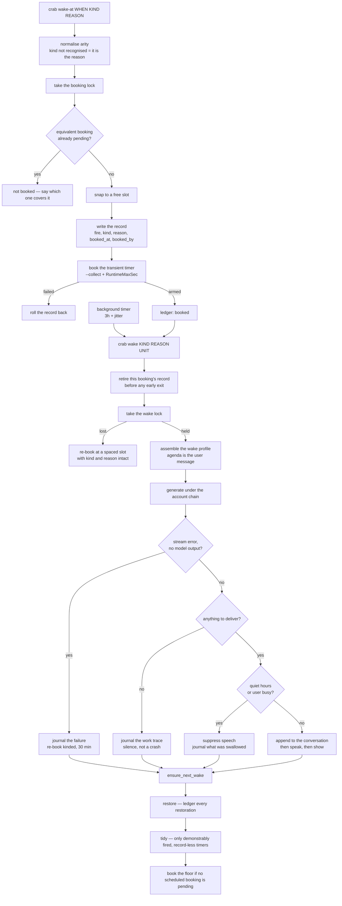

# Spec: wake queue

## PURPOSE

Autonomous wakes are how she works unattended: a booking record, a transient timer, a session with
its own agenda, and a chain that keeps going. This spec owns booking, cancellation, restoration,
tidying, and the discipline that keeps one queue from becoming a storm. Her autonomy is not in scope
for reduction here — every rule below makes the queue **visible and bounded**, never smaller.

## CONTRACT

### The wake queue is a module

1. There MUST be exactly one module that touches the wakes directory and the systemd user manager
   for wake units. It exposes `list()`, `book()`, `cancel()`, `restore()`, and `tidy()`.
2. No other code may read the wakes directory, mint a unit name, call `systemd-run` for a wake, or
   stop a wake timer. Every booker goes through `book()`.
3. `list()` MUST enumerate the records and join timers onto them, never the reverse. See
   [self-awareness.md](self-awareness.md) rules 1 to 4.

### Booking

4. The record MUST be written before the timer is booked. A crash between the two leaves a record
   the reconciler honours; the other order leaves a timer nothing remembers.
5. A booking that fails to arm its timer MUST roll its record back.
6. Booking MUST hold the single booking lock for the whole check-then-act sequence. Several sessions
   book at once, and two wakes finishing in the same second each found no pending floor and each
   booked one.
7. Unit names MUST be minted by the module's own collision-avoiding namer. No caller may build a
   unit name inline.
8. Every booking MUST be made as a **delay**, never by passing a calendar specification through to
   systemd. A bare calendar specification makes a timer that returns every day while the record
   covers only the next firing.
9. Every booking MUST snap to a moment no pending booking already holds. Two wakes cannot run at
   once, so two bookings on one second are one wake and one deferral.
10. A near-duplicate booking MUST NOT be stacked: a scheduled booking with the same reason firing
    within the coalescing window of a pending one is not added. Event wakes coalesce only against a
    byte-identical reason — two different events are two wakes, while the same event re-booked by
    its own deferral is one.
11. Every wake unit MUST be booked with the collect option, so a failed unit does not leak into the
    user manager.
12. Every wake unit MUST carry a runtime ceiling. The in-process stall watchdog cannot by
    construction reap a session that keeps emitting output; the unit-level ceiling is the backstop.
13. A scratch instance's config path and state prefix MUST travel into the unit, so its wakes fire
    back into the scratch state.

### Argument arity

14. `crab wake-at <when> [kind] [reason]` MUST normalise its arguments on write: if the third
    argument is not a recognised kind, it is the **reason**, and the kind defaults to scheduled.
15. `crab wake <kind> <reason> <unit>` MUST normalise on read, the same way, so a record already on
    disk with its agenda in the kind field recovers that agenda instead of being blanked.
16. A wake whose kind was blanked MUST NEVER be dropped. Every re-booking path — the blocked-lock
    deferral, the post-outage retry, the failure re-book — MUST work for a wake with no kind.
17. A wake that loses the serialisation lock MUST be deferred, never destroyed. Today the record is
    retired before the code decides whether to re-book.

### Running a wake

18. Only one wake runs at a time, guarded by a lock held for the life of the process.
19. A fired wake MUST retire its own record first thing, before any early exit.
20. An active interaction MUST NOT defer the session. The session runs; the output decision is made
    at the end. Deferring the session meant a wake during any conversation did no reading, no want
    work, and no dated thought, and reached the user as an indistinguishable silence.
21. A wake blocked by the lock MUST be re-armed with its kind and reason intact, at a spaced slot.
22. The wake agenda MUST be delivered as the session's user message. See
    [prompt-assembly.md](prompt-assembly.md) rule 12.
23. When the stream held an error and no genuine model output, the wake MUST journal the failure
    with the exit code and error text, append nothing to the conversation, skip the audit and all
    output, and re-book a kinded wake so the agenda survives the outage.
24. A wake that produced no output on a clean exit MUST be journaled as silence, not as a crash.
25. Every wake MUST journal what it did, from its own tool activity, not from its reply. A silent
    reply is a speech decision, not a work record.

### Delivery gates

26. The wake's words enter the conversation only if they were delivered. The append happens past
    every gate, immediately before the voice.
27. Quiet hours and the user-busy check suppress speech. They MUST NOT suppress the display window
    as well unless that is stated as the intent — a window is not a noise.
28. A wake that regrouped against a live turn MUST carry the other reply forward as one reply, never
    restate it, never queue its own thought for later, and never default to silence.
29. No mechanism may judge a wake's written reply after the fact and decide it is not worth voicing.
    Silence is chosen while writing or not at all.

### Restore and tidy

30. `restore()` MUST rebuild still-future timers at their original moment and fire overdue ones
    once, promptly, staggered.
31. `restore()` MUST log every restoration to the durable ledger. Its output MUST NOT go to
    `/dev/null`. A bulk restore means a cancellation was undone or the machine rebooted, and that is
    a fact she has to be able to read.
32. Overdue collapsing MUST cover event wakes as well as scheduled ones, so a queue of identical
    overdue promises does not come back in full.
33. `cancel()` MUST be the only real cancellation, and MUST clear the record as well as stopping the
    timer. Stopping a timer alone leaves a record that restore brings back.
34. There MUST be a way to cancel the whole queue in one command.
35. `tidy()` MUST purge only transient timers that have **demonstrably fired** and have no booking
    record.
36. `tidy()` MUST skip any unit whose service is active. That is a wake firing right now, which
    cleared its own record first thing.
37. `tidy()` MUST collapse bookings that are the same promise, and re-book any that share a second.
38. `ensure_next_wake` MUST run at the end of every wake: restore, then tidy, then book a floor wake
    if no scheduled-kind booking is pending, judged from the records and never from systemd.
39. The floor is a floor, not a schedule. A wake that booked its own follow-up is left alone.
40. Only a wake that will come back to the wants counts towards the floor. An event wake is pending
    for its event, and counting it lets one unrelated long-dated booking suppress every floor
    booking and end the chain.

### The four autonomous bookers

41. The promise auditor, the job runner, the self-change watcher, and the watcher's canary all book
    wakes in her name. Each MUST pass its own identity as `booked_by`.
42. Each MUST route through `book()`, and therefore through the coalescing, spacing, and locking
    rules.
43. The promise auditor MUST use the shared shelf reader. An auditor handed an empty list and told
    the list is complete flags everything.
44. Any cap on the number of pending wakes a booker may hold MUST be counted from the records under
    the booking lock, and MUST **drain** as well as gate. A cap that only gates new bookings lets a
    queue five times its own size stand for hours.

## DATA

| Path | Format |
|---|---|
| `~/.local/share/deskcrab/wakes/<unit>.wake` | `fire \t kind \t reason \t booked_at \t booked_by` |
| `~/.local/share/deskcrab/wakes/ledger.log` | append-only: epoch, action, unit, kind, reason, actor |
| `${STATE_PREFIX}-wake.lock` | one wake at a time, held for the life of the process |
| `${STATE_PREFIX}-wake-book.lock` | the booking queue, held across check-then-act |
| transient units `deskcrab-wake-<epoch>-<pid>[.timer]` | systemd user manager; the record's shadow |
| `systemd/deskcrab-wake.timer` | the random background interval |
| `systemd/deskcrab-wake-restore.service` | restore at login |

Record fields are tab separated with a fixed order. A reader MUST tolerate a record with only the
first three fields — every record already on disk has that shape — and MUST fill the missing fields
with "unknown" rather than shifting the ones it has.

## The lifecycle

## INTERACTIONS

**The wake queue may call:** prompt assembly (wake profile), the account chain, speech output, the
display window spawner, the conversation store, the session registry, the day journal, the memory
recall block and judge.

**The wake queue may be called by:** `crab wake`, `crab wake-at`, `crab wake-cancel`,
`crab wake-restore`, `crab wake-tidy`, the promise auditor, the job runner, the self-change watcher,
the canary, and the login restore unit.

**The wake queue must never be called by:** the state block, which reads the queue and must not
change it.

## VERIFIED-CORRECT RULES

- **Record before timer, with rollback.** A crash between the two leaves a record the reconciler
  honours rather than a timer nothing remembers. If the timer cannot be armed, the record is
  removed, so a failed booking does not become a phantom promise.
- **A timer that has never fired and has no booking record is a pending wake whose record was lost,
  never a ghost.** The janitor only purges timers that have demonstrably fired. Killing a
  never-fired record-less timer cancels a wake nobody asked to cancel. Emptiness in the last-trigger
  field means never fired, and that is the load-bearing safety rule of the whole tidy pass.
- **A unit whose service is active is skipped everywhere.** That is a wake firing right now, and it
  has already cleared its own record.
- **One booker at a time, for the whole check-then-act.** Two wakes finishing in the same second
  each found no pending floor and each booked one.
- **Every booking asks for a free slot, not just the retries.** Spacing the retries alone was
  measurably not enough: within a minute of that fix, two concurrent sessions booking different
  wakes had rebuilt the collision from the front. A nudge of a few minutes costs a promise to
  herself nothing; landing on another wake's second costs it a quarter of an hour.
- **A deferred wake keeps the kind and reason it started with**, so an event wake pushed back past a
  recording still arrives knowing why.
- **The fired wake retires its own record first thing**, before any early exit, or restore
  resurrects a wake that already ran.
- **A busy user is a reason to hold the tongue, not the mind.** The session runs regardless; the
  output decision is made at the end.
- **Silence is an empty reply, never a marker.** No prompt authors a silence marker. A stray marker
  is still handled defensively, and the words are kept for the journal.
- **The floor counts only scheduled-kind bookings, judged from the records.** Counting any wake
  timer let one unrelated long-dated booking end the chain.

## KNOWN DEFECTS

| Id | What implementation must fix |
|---|---|
| `C4` | Nothing enumerates the records. `list()` does not exist; the report reads systemd. |
| `C5` | `wake-at` accepts arbitrary text as the kind and `wake` then discards it, destroying the agenda. Such a record never coalesces, never satisfies the floor, and is dropped rather than deferred if it loses the lock. |
| `C7` | Restore re-books every surviving record, event wakes are never collapsed, and the restore output goes to `/dev/null`. Twenty-two cancelled reasons came back verbatim. |
| `MAJ-13` | Transient wake units are booked without the collect option, leaking failed units into the live user manager. |
| `MAJ-14` | Only the random background timer has a runtime ceiling. Every self-scheduled wake, deferral, retry, floor booking and job-completion wake runs with only an in-process watchdog. |
| `MAJ-15` | The promise-wake cap gates new bookings only, never drains, counts systemd descriptions rather than records, and takes no lock. Observed at five to six times its own value. |
| `MIN-5` | A kind-less wake that loses the lock is destroyed, not deferred: the record is cleared before the re-book decision. |
| `MIN-6` | `wake-at` mints unit names inline instead of using the collision-avoiding namer. A collision truncates the earlier booking silently. |
| `MAJ-34` | Bookings are not gated on the wakes directory being the live one, so a test books a real transient unit into the live user manager. See [test-harness.md](test-harness.md). |
| Recommendation §3 | Records carry no provenance and no booked-at, so "scheduled by me" is unanswerable. |

## TESTS

**Existing:** `tests/test_wake_queue.sh` (spacing, coalescing, tidy semantics, with systemd stubbed),
`tests/test_silent_wake.sh` (the delivery gates), `tests/test_regroup.sh` (a whole wake beside a live
voice), `tests/test_wake_filler.sh` (measured from the speaker side), `tests/test_wake_reinforce.sh`.

**To be written:**

- `tests/test_wake_restore.sh` — the resurrection loop at the heart of the headline bug: a cancelled
  queue must stay cancelled; an overdue queue must collapse; every restoration must appear in the
  ledger.
- `tests/test_wake_arity.sh` — a booking whose third argument is prose recovers its agenda on write
  and on read; a kind-less wake is deferred, re-booked, and satisfies the floor.
- `tests/test_wake_queue.sh` — extend with the record-versus-timer divergence, provenance round-trip,
  the collect option, the runtime ceiling, and a three-field legacy record.
- `tests/test_quiet_hours.sh` — a wake inside quiet hours goes silent, and its display behaviour
  matches rule 27. Every scratch config currently sets quiet hours to empty, so nothing proves this.
- `tests/test_wake_bookers.sh` — each of the four autonomous bookers routes through `book()` and
  stamps its own identity.
